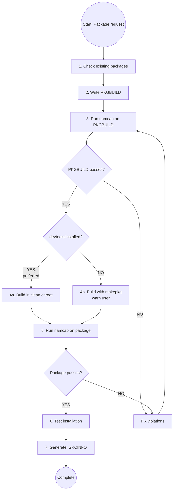

# Arch Linux PKGBUILD Creation

## Overview

**PKGBUILD files are Arch Linux package build scripts with strict validation requirements.** This skill ensures compliance with Arch package guidelines, FHS (Filesystem Hierarchy Standard), and mandatory namcap testing.

**Core principle:** Every PKGBUILD MUST pass namcap validation for both the PKGBUILD file AND the generated package before deployment.

## Sub-Skills Available

This skill is split into specialized sub-skills for different package types:

| Sub-Skill | Use When |
|-----------|----------|
| **archlinux-pkgbuild/vcs-packages** | Creating VCS packages (Git, SVN, CVS, Mercurial, Bazaar) with pkgver() functions |
| **archlinux-pkgbuild/systemd-services** | Working with systemd services, user management (DynamicUser vs sysusers.d), tmpfiles.d cleanup, service sandboxing, converting non-systemd init scripts |
| **archlinux-pkgbuild/compiled-languages** | Packaging compiled languages (Go, Rust, Haskell, OCaml, Free Pascal, Java) with language-specific build flags and installation patterns |
| **archlinux-pkgbuild/interpreted-languages** | Packaging interpreted languages (Node.js, Python, Ruby, PHP, Perl, R, Shell scripts, Lisp) with package managers and module installations |
| **archlinux-pkgbuild/build-systems** | Working with CMake or Meson build systems - CMAKE_INSTALL_PREFIX, CMAKE_BUILD_TYPE, RPATH handling, meson setup/compile patterns |
| **archlinux-pkgbuild/cross-platform** | Packaging cross-platform compatibility layers (Wine, MinGW, Electron, CLR/.NET) with WINEPREFIX, mingw-w64, electron-builder, Mono runtime |
| **archlinux-pkgbuild/desktop-integration** | Packaging desktop environment integrations (GNOME, KDE, Eclipse, Font packages) with GSettings schemas, KDE frameworks, fontconfig |
| **archlinux-pkgbuild/system-packages** | Packaging system-level components (DKMS modules, kernel modules, lib32, nonfree software, web apps, split packages) with specialized installation requirements |

**Load sub-skills as needed** using the skill tool when working with these specialized package types.

## Mandatory Workflow



## Building Methods: Clean Chroot vs Direct makepkg

**PREFERRED METHOD: Clean Chroot Building**

Building in a clean chroot prevents:
- Missing dependencies (unwanted linking from your system)
- Incomplete `depends=()` arrays
- Building for stable repos while having testing packages installed

**When to use each method:**

| Method | When to Use | Requirements |
|--------|-------------|--------------|
| **Clean chroot** (PREFERRED) | AUR submissions, official packaging, ensuring correct dependencies | `devtools` package installed |
| **Direct makepkg** (FALLBACK) | Quick local builds, prototyping, when devtools unavailable | Just `base-devel` |

**CRITICAL: If using direct makepkg, ALWAYS warn the user that the package was NOT built in a clean chroot and may have incorrect dependencies.**

### Clean Chroot Quick Start

**One-command build (recommended for most users):**

```bash
# For AUR/extra packages (most common)
extra-x86_64-build

# The script automatically:
# - Creates chroot in /var/lib/archbuild/ (if needed)
# - Updates the chroot
# - Builds your package in isolation
# - Use -c flag to reset chroot if needed
```

**Available build scripts:**

| Target Repository | Command | When to Use |
|-------------------|---------|-------------|
| extra (stable) | `extra-x86_64-build` | Most AUR packages, stable builds |
| extra-testing | `extra-testing-x86_64-build` | Testing pre-release packages |
| multilib (32-bit) | `multilib-build` | 32-bit compatibility packages |
| multilib-testing | `multilib-testing-build` | Testing 32-bit packages |

**Common flags:**
- `-c` : Clean/reset the chroot before building (use after breakage)
- `-I package.pkg.tar.zst` : Pre-install custom dependencies

**Example with custom dependencies:**
```bash
# Build package that depends on another custom package
extra-x86_64-build -- -I ~/custom-dep-1.0-1-x86_64.pkg.tar.zst
```


For advanced manual chroot setup, see clean-chroot-reference.md (custom location, custom configs).


### Fallback: Direct makepkg Build

**Use ONLY when clean chroot is not available.**

```bash
# Build package
makepkg -f

# CRITICAL: After building, ALWAYS inform user:
echo "⚠️  WARNING: Package built with direct makepkg (NOT in clean chroot)"
echo "⚠️  Dependencies may be incomplete or incorrect"
echo "⚠️  For production use, install 'devtools' and rebuild in clean chroot"
```

**When this is acceptable:**
- Local development/testing
- Quick prototyping
- No plans to distribute package

**When this is NOT acceptable:**
- AUR submission
- Distribution to others
- Official packaging

## PKGBUILD Structure Template

**See @pkgbuild-template.sh in this directory for a complete annotated template.**

**Quick structure overview:**
- **Variables**: pkgname, pkgver, pkgrel, pkgdesc, arch, url, license, depends, makedepends
- **prepare()**: Patching, fixing paths (optional)
- **build()**: Compile sources (usually required)
- **check()**: Run test suite (optional but recommended)
- **package()**: Install to $pkgdir (MANDATORY)

## Quick Reference: Critical Requirements

| Requirement | Rule | Violation Example |
|-------------|------|-------------------|
| **Paths** | NEVER /usr/local/, ALWAYS /usr/ | /usr/local/bin → /usr/bin |
| **System locations** | Vendor config to /usr/lib/, NOT /etc/ | /etc/sysusers.d/ → /usr/lib/sysusers.d/ |
| **File naming** | Use package name in system configs | device.rules → 99-$pkgname.rules |
| **Dependencies** | List ALL direct deps (no transitives) | Missing runtime library dep |
| **Architecture** | 'x86_64' or 'any' | Missing arch= field |
| **Checksums** | Use sha256sums or sha512sums | Using md5sums only |
| **optdepends** | Format: 'pkg: description' | 'pkg' without description |
| **pkgdesc** | ~80 chars, no package name | "example is a tool..." |
| **Validation** | namcap PKGBUILD + package (required), namcap -i (recommended) | Skipping namcap tests |
| **Variables** | Quote: "$pkgdir" "$srcdir" | $pkgdir/usr (unquoted) |
| **License** | SPDX format | 'GPLv3' instead of 'GPL3' |
| **Email** | Obfuscate in comments | user@domain.com → user at domain dot com |
| **Config files** | List in backup=() array | User modifications get overwritten on upgrade |
| **Desktop files** | GUI apps need .desktop in /usr/share/applications/ | App won't appear in menus |

## Step-by-Step Implementation

### Step 1: Check for Existing Packages

**BEFORE creating any PKGBUILD:**

```bash
# Check official repositories
pacman -Ss package-name

# Check AUR
yay -Ss package-name  # or paru -Ss
# Or visit: https://aur.archlinux.org/packages/?K=package-name
```

**If package exists:**
- Official repo: DO NOT create PKGBUILD (use existing)
- AUR exists: Check if you can improve it or use different name with conflicts=()

### Step 2: Create PKGBUILD

**Mandatory fields:**
- pkgname, pkgver, pkgrel, arch, pkgdesc, url, license
- source, checksums (sha256sums or sha512sums)
- depends (if any runtime dependencies)
- package() function

**Optional but recommended fields:**
- install="$pkgname.install" : Specifies a post-install script with user instructions

**Package naming conventions:**
- VCS packages: suffix -git, -svn, -hg, -bzr, -cvs, -darcs (see **archlinux-pkgbuild/vcs-packages** sub-skill)
- Prebuilt binaries: suffix -bin (when sources available)
- Python packages: python-pkgname (see **archlinux-pkgbuild/language-ecosystems** sub-skill)
- Language-specific: See **archlinux-pkgbuild/language-ecosystems** sub-skill for naming conventions
- All lowercase, no leading hyphen/dot

**Dependency types:**
- `depends=()` : Runtime requirements (libraries, interpreters)
- `makedepends=()` : Build-time only (compilers, build tools)
- `checkdepends=()` : Test suite requirements
- `optdepends=()` : Optional features ('package: what it enables')

**Use tools to find dependencies:**
```bash
# Find library dependencies
find-libdeps /path/to/built/files

# Alternative: check with ldd
ldd /path/to/binary

# Find provided libraries
find-libprovides /path/to/built/files
```

**CRITICAL: Validate Package Availability**

Before finalizing your PKGBUILD, **MUST** verify all dependencies exist:

```bash
# Check official repos
pacman -Ss package-name

# Check AUR (using yay or paru)
yay -Ss package-name
# OR
paru -Ss package-name

# Validate all dependencies at once
for pkg in depend1 depend2 makedepend1 optdepend1; do
    pacman -Ss "^$pkg$" || yay -Ss "^$pkg$" || echo "MISSING: $pkg"
done
```

**Rules:**
- Every `depends=()`, `makedepends=()`, and `optdepends=()` entry MUST exist in official repos or AUR
- Use exact package names (check `pacman -Ss` or `aur.archlinux.org`)
- For AUR dependencies, document in comments (AUR packages can't auto-install)
- Invalid dependencies = namcap errors + installation failures


### Step 3: FHS Compliance and System Package Locations

**For detailed FHS paths and vendor config rules**, see **fhs-and-vendor-config.md** in this directory.

**Critical Quick Reference:**

| Type | Correct | WRONG |
|------|---------|-------|
| Binaries | `/usr/bin` | `/usr/local/bin` |
| System services | `/usr/lib/systemd/system/` | `/etc/systemd/system/` |
| Sysusers/tmpfiles | `/usr/lib/{sysusers,tmpfiles}.d/` | `/etc/{sysusers,tmpfiles}.d/` |
| Udev rules | `/usr/lib/udev/rules.d/` | `/etc/udev/rules.d/` |

**Key Rule:** Vendor configs go to `/usr/lib/`, user overrides go to `/etc/`.

### Step 4: Checksums

**Generate checksums:**
```bash
# Easy way: auto-update checksums
updpkgsums

# Manual way: download and compute
makepkg -g >> PKGBUILD  # Append checksums
```

**Checksum types (prefer stronger):**
- `sha512sums` (best)
- `sha256sums` (good)
- `b2sums` (Blake2, also good)
- ~~`md5sums`~~ (weak, avoid)

**Use SKIP for VCS sources:**
```bash
source=("git+https://github.com/user/repo.git")
sha256sums=('SKIP')
```

### Step 5: Build Package

**Choose build method based on availability:**

```bash
# Check if devtools is installed
if command -v extra-x86_64-build &> /dev/null; then
    # PREFERRED: Clean chroot build
    extra-x86_64-build
    echo "✓ Built in clean chroot (dependencies verified)"
else
    # FALLBACK: Direct build with warning
    makepkg -f
    echo "⚠️  WARNING: Built with direct makepkg (NOT in clean chroot)"
    echo "⚠️  Dependencies may be incomplete. Install 'devtools' for clean builds."
fi
```

**For custom dependencies (clean chroot only):**
```bash
extra-x86_64-build -- -I custom-package-1.0-1-x86_64.pkg.tar.zst
```

### Step 6: Validation with namcap

**MANDATORY validation steps:**

```bash
# 1. Check PKGBUILD
namcap PKGBUILD

# 2. Check generated package
namcap *.pkg.tar.zst

# 3. Detailed analysis (RECOMMENDED)
namcap -i PKGBUILD
namcap -i *.pkg.tar.zst
```

**CRITICAL: DO NOT proceed if namcap reports errors.**

**For comprehensive validation procedures, error explanations, and fixes:**
See validation-guide.md

### Step 7: Test Installation

```bash
# Install locally
sudo pacman -U *.pkg.tar.zst

# Test functionality
$pkgname --version
$pkgname --help

# Check installed files
pacman -Ql $pkgname

# Verify dependencies (clean chroot builds should be correct)
pacman -Qi $pkgname | grep Depends

# Remove after testing
sudo pacman -R $pkgname
```

### Step 8: AUR Submission (if applicable)

**Generate .SRCINFO:**
```bash
makepkg --printsrcinfo > .SRCINFO
```

**Set up AUR SSH:**
```bash
# Add to ~/.ssh/config
Host aur.archlinux.org
    IdentityFile ~/.ssh/aur
    User aur
```

**Set up .gitignore:**
```bash
# Create .gitignore for PKGBUILD repository
cat > .gitignore << 'EOF'
# Build artifacts
*.pkg.tar.zst
*.pkg.tar.xz
*.pkg.tar.gz

# Source tarballs
*.tar.gz
*.tar.bz2
*.tar.xz
*.zip

# Build directories
pkg/
src/

# makepkg metadata (build-time only)
.BUILDINFO
.PKGINFO
.MTREE
.INSTALL

# Temporary files
*.log
*~
*.swp
EOF
```

**CRITICAL .gitignore rules:**

| File | Track? | Why |
|------|--------|-----|
| **PKGBUILD** | ✅ YES | Mandatory source file |
| **.SRCINFO** | ✅ YES | Required for AUR (machine-readable metadata) |
| **\*.install** | ✅ YES | Post-install script source |
| **\*.patch** | ✅ YES | Source patches |
| **Supplementary configs** | ✅ YES | .tmpfiles, .service, example configs |
| **.INSTALL** | ❌ NO | Build artifact (generated from .install) |
| **pkg/, src/** | ❌ NO | Build directories |
| **\*.pkg.tar.*** | ❌ NO | Built packages |
| **.BUILDINFO, .PKGINFO, .MTREE** | ❌ NO | makepkg metadata |

**Two scenarios for AUR submission:**

**Scenario A: Existing local git repository with PKGBUILD files already tracked**

If you already have a git repository with PKGBUILD, .SRCINFO, and related files:

```bash
# Add AUR as a remote to existing repository
cd /path/to/existing/pkgname
git remote add aur ssh://aur@aur.archlinux.org/pkgname.git

# Push to AUR
git push aur master
```

**Benefits:**
- Keeps existing git history
- Single repository for both local development and AUR
- Directory name matches package name
- No file copying needed

**Scenario B: Starting from scratch (new package)**

If you don't have a git repository yet:

```bash
# Clone (empty for new packages)
git clone ssh://aur@aur.archlinux.org/pkgname.git
cd pkgname

# Add files
cp /path/to/PKGBUILD .
makepkg --printsrcinfo > .SRCINFO

# Create .gitignore (see above)
cat > .gitignore << 'EOF'
# Build artifacts
*.pkg.tar.zst
*.pkg.tar.xz
*.pkg.tar.gz

# Source tarballs
*.tar.gz
*.tar.bz2
*.tar.xz
*.zip

# Build directories
pkg/
src/

# makepkg metadata (build-time only)
.BUILDINFO
.PKGINFO
.MTREE
.INSTALL

# Temporary files
*.log
*~
*.swp
EOF

# Commit
git add PKGBUILD .SRCINFO .gitignore
git commit -m "Initial commit: pkgname $pkgver-$pkgrel"

# Push
git push origin master
```

**Decision rule:** If you have an existing git repository with the required files (PKGBUILD, .SRCINFO, .gitignore, patches, configs), use **Scenario A**. Only use **Scenario B** when starting completely fresh.

## Tracking Upstream Releases with nvchecker

**nvchecker** automates checking for new upstream releases. Use **pkgctl version** commands for integration.

### Quick Start

```bash
# Auto-generate .nvchecker.toml from PKGBUILD source array
pkgctl version setup

# Check for new upstream releases
pkgctl version check

# Update PKGBUILD to new version
pkgctl version upgrade
```

### .nvchecker.toml Configuration

Place `.nvchecker.toml` in the same directory as PKGBUILD. The `pkgctl version setup` command auto-creates this by analyzing your `source=()` array.

**Example for GitHub releases:**
```toml
[pkgname]
source = "github"
github = "owner/repo"
```

**Example for PyPI:**
```toml
[python-package]
source = "pypi"
pypi = "package-name"
```

**Example for GitLab:**
```toml
[pkgname]
source = "gitlab"
gitlab = "group/project"
```

**See also:**
- pkgctl-version(1) man page for full documentation
- Example configs in official packages (e.g., https://gitlab.archlinux.org/archlinux/packaging/packages/pacman/-/blob/main/.nvchecker.toml)
- nvchecker documentation: https://nvchecker.readthedocs.io/

### Workflow

1. Initial setup: `pkgctl version setup` (creates .nvchecker.toml)
2. Periodically check: `pkgctl version check`
3. When new version found: `pkgctl version upgrade` (updates pkgver)
4. Review changes, update pkgrel=1, rebuild, test
5. Commit to AUR

**Note:** nvchecker is particularly useful for maintaining multiple packages or tracking fast-moving projects.

## Common Mistakes and Red Flags

### Critical Errors (MUST FIX)

| Mistake | Why It's Wrong | Correct Approach |
|---------|---------------|------------------|
| Building with direct makepkg for distribution | Missing/incorrect dependencies, system pollution | Build in clean chroot using `extra-x86_64-build` |
| Skipping namcap | Violates Arch packaging standards | Always run namcap on PKGBUILD and .pkg.tar.zst (required), plus namcap -i (recommended) |
| Using /usr/local/ | Breaks FHS compliance | Use /usr/ paths only |
| Vendor config in /etc/ | Wrong separation of concerns, conflict risk | Use /usr/lib/sysusers.d/, /usr/lib/tmpfiles.d/, /usr/lib/udev/rules.d/ |
| Generic filenames in system dirs | Package conflicts, unclear ownership | Always use package name: /usr/lib/sysusers.d/$pkgname.conf |
| Missing direct dependencies | Runtime failures | Build in clean chroot OR use find-libdeps, ldd to find all direct deps |
| Including transitive deps | Violates packaging policy | Only list direct dependencies |
| Using 'SKIP' for non-VCS | Security risk | Generate real checksums with updpkgsums |
| Unquoted $pkgdir/$srcdir | Shell expansion errors | Always quote: "$pkgdir" "$srcdir" |
| Self-referencing pkgdesc | Redundant | "Tool for X" not "pkgname is a tool for X" |
| Missing .desktop file for GUI apps | App won't appear in menus | Install to /usr/share/applications/, validate with desktop-file-validate (see archlinux-pkgbuild/cross-platform sub-skill for examples) |
| Hardcoded paths in source | Version bump requires edit | Use variables: $pkgname-$pkgver |

### Warning Signs (CHECK CAREFULLY)

| Pattern | Potential Issue | Investigation |
|---------|----------------|---------------|
| Custom configure flags | May override Arch defaults | Check Arch guidelines for standard flags |
| Stripping disabled | Debug symbols bloat | Only if upstream requires |
| Empty prepare() | May need path fixes | Check for /usr/local in build output |
| No check() function | Untested package | Run upstream tests if available |
| Many optdepends | Are they all optional? | Some may be required for core functionality |
| Version pinned deps | May break on updates | Use >= only when truly required |

## PKGBUILD Functions Reference

| Function | Required? | Purpose | Common Commands |
|----------|-----------|---------|-----------------|
| **prepare()** | Optional | Patch sources, fix paths | sed, patch, find |
| **pkgver()** | VCS only | Auto-update version | git rev-list, svnversion |
| **build()** | Usually | Compile sources | ./configure, make, cmake |
| **check()** | Optional | Run test suite | make test, make check |
| **package()** | **MANDATORY** | Install to $pkgdir | make install, install |

## Installation Commands Reference

```bash
# Install files with correct permissions
install -Dm644 file.txt "$pkgdir/usr/share/doc/$pkgname/file.txt"  # Regular file
install -Dm755 binary "$pkgdir/usr/bin/binary"                      # Executable
install -Dm644 LICENSE "$pkgdir/usr/share/licenses/$pkgname/LICENSE"  # License

# Create directories
install -dm755 "$pkgdir/usr/share/$pkgname"

# Copy entire directories
cp -r dir "$pkgdir/usr/share/$pkgname/"

# Remove unwanted files
rm -rf "$pkgdir/usr/share/doc"  # If upstream installs docs incorrectly
```

## Configuration File Handling

**User-modifiable config files MUST be listed in backup=() to prevent pacman from overwriting user changes.**

### Quick Rules

```bash
backup=(
    'etc/myapp/main.conf'     # Relative to root, NO leading slash
)
```

**Include in backup=():** All /etc files users might customize, especially credential files  
**Exclude:** Templates in /usr/share, generated files, service files

**Pacman behavior:** Modified files → Creates .pacnew (user merges manually)

### Security: Sensitive Configuration Files

**If config files contain credentials/secrets (database passwords, API keys):**
- Use `0660` permissions (not world-readable)
- Set ownership via tmpfiles.d type `z`
- Example: `z /etc/webapps/app/database.php 0660 root http - -`

**If application writes to config (web installers):**
- Files owned by root, group set to app user (e.g., root:http)
- Use `0660` for group-writable, not world-readable (security)
- Directory can remain root:root (only files need group access)

**Detailed reference:** See config-file-handling.md for:
- backup=() rules and .pacnew workflow
- Sensitive config file permissions (0660 vs 0640 vs 0644)
- Using tmpfiles.d type `z` for ownership/permission changes
- Security patterns for web applications

## Post-Install Scripts (.install files)

**Use .install files to provide post-installation instructions, perform setup tasks, or notify users of manual configuration requirements.**

### When to Use .install Files

| Use Case | Example |
|----------|---------|
| Complex configuration needed | Database setup, web server configuration |
| Manual steps required | Creating config files from templates, setting up credentials |
| Important warnings | Security notices, breaking changes |
| Service activation | Systemd service enable/start instructions |
| First-time setup | Interactive wizards, initial configuration |

### .install File Structure

```bash
# /path/to/pkgname.install
post_install() {
    cat <<EOF

==> Package Name
==> ============

1. First setup step:
   - Detailed instructions
   - Commands to run

2. Second setup step:
   - More instructions

For more information: https://upstream.docs

EOF
}

post_upgrade() {
    # IMPORTANT: Only include upgrade-relevant information
    # DO NOT blindly call post_install() unless ALL instructions apply to upgrades
    
    # If upgrade needs specific instructions (migrations, breaking changes):
    cat <<EOF

==> Upgrade Notes
==> =============

- Review configuration files (check .pacnew files)
- Database migration steps (if applicable)
- Breaking changes in this version
- Service restart commands

EOF
    
    # ANTI-PATTERN: Don't do this unless initial setup truly applies to upgrades
    # post_install  # ❌ Wrong if it contains one-time setup instructions
}

pre_remove() {
    # Optional: cleanup before removal
    # Use sparingly - most cleanup should be manual
}

post_remove() {
    # Optional: notify about leftover data
    cat <<EOF

==> Removal Complete
==> =================

User data remains in /var/lib/pkgname/
Remove manually if needed: sudo rm -rf /var/lib/pkgname

EOF
}
```

### PKGBUILD Integration

**Reference the .install file in PKGBUILD:**

```bash
# In PKGBUILD
pkgname=myapp
install="$pkgname.install"  # Add after optdepends=(), before source=()
```

**The .install file must:**
- Be named `$pkgname.install`
- Be in the same directory as PKGBUILD
- NOT be listed in source=() (it's metadata, not a source file)
- Use proper shell syntax (functions, no syntax errors)

### Best Practices

| Do | Don't |
|----|-------|
| Provide clear, actionable instructions | Dump verbose documentation |
| Use heredoc (cat <<EOF) for formatting | Use multiple echo statements |
| Keep messages concise (< 30 lines) | Write essay-length instructions |
| Separate one-time vs upgrade instructions | Call post_install from post_upgrade blindly |
| Test .install script for syntax errors | Assume it will work without testing |
| Focus on WHAT user must do | Explain package internals in detail |

### CRITICAL: post_install vs post_upgrade Distinction

**post_install()**: One-time initial setup instructions
- Database creation and schema import
- Initial configuration file setup
- Web server configuration from scratch
- User/group creation
- First-time setup wizards
- Installation verification steps

**post_upgrade()**: Upgrade-relevant information ONLY
- Configuration file changes (.pacnew review)
- Database migrations/schema updates
- Breaking changes between versions
- Service restart requirements
- Deprecated feature warnings
- Changelog references

**Decision Rule:**
```
If instruction is ONLY needed on first install → post_install() only
If instruction is ONLY needed on upgrade → post_upgrade() only  
If instruction applies to BOTH → Consider calling post_install() from post_upgrade()

⚠️  ANTI-PATTERN: Always calling post_install() from post_upgrade()
Only do this if ALL post_install instructions genuinely apply to upgrades.
```

**Examples:**

❌ **WRONG** - Upgrade shows unnecessary one-time setup:
```bash
post_install() {
    cat <<EOF
1. Create database and import schema  # ❌ Only needed once
2. Configure web server               # ❌ Only needed once
3. Run installation wizard            # ❌ Only needed once
EOF
}
post_upgrade() {
    post_install  # ❌ Confuses users with irrelevant steps
}
```

✅ **CORRECT** - Clear separation:
```bash
post_install() {
    cat <<EOF
1. Create database: createdb myapp
2. Import schema: psql myapp < /usr/share/myapp/schema.sql
3. Configure: edit /etc/webapps/myapp/config.php
4. Start service: systemctl start myapp
EOF
}

post_upgrade() {
    cat <<EOF
1. Check for new config options (.pacnew files)
2. Run migrations: myapp-migrate --run
3. Restart service: systemctl restart myapp
Changelog: https://github.com/project/releases
EOF
}
```

✅ **ACCEPTABLE** - When instructions truly apply to both:
```bash
post_install() {
    cat <<EOF
Review configuration at /etc/myapp/config.yaml
Restart service: systemctl restart myapp
EOF
}

post_upgrade() {
    post_install  # ✅ OK - these steps apply to upgrades too
}
```

### Example: Web Application

```bash
# webapp.install
post_install() {
    cat <<EOF

==> Webapp Installation
==> ====================

1. Create database:
   $ sudo -u postgres createdb webappdb

2. Configure:
   $ sudo nano /usr/share/webapps/webapp/config.php

3. Set up web server (Apache example):
   $ sudo ln -s /etc/httpd/conf/extra/webapp.conf /etc/httpd/conf/extra/
   $ sudo systemctl restart httpd

4. Complete setup:
   Visit: http://localhost/webapp/install

Documentation: https://webapp.example/docs

EOF
}

post_upgrade() {
    post_install
}
```

### Validation

```bash
# Check .install syntax
bash -n pkgname.install

# Verify it's referenced in PKGBUILD
grep "^install=" PKGBUILD

# Verify it's included in package
namcap *.pkg.tar.zst | grep -i install
```

**Note:** The .install file is automatically included in the package when `install=` is set. Do NOT manually install it in package().

## Specialized Package Types

**For specialized package types, load the appropriate sub-skill:**

- **VCS packages** (-git, -svn, -cvs): Use **archlinux-pkgbuild/vcs-packages**
- **Systemd services** (DynamicUser, tmpfiles.d, sandboxing, init conversion): Use **archlinux-pkgbuild/systemd-services**
- **Compiled languages** (Go, Rust, Haskell, OCaml, Free Pascal, Java): Use **archlinux-pkgbuild/compiled-languages**
- **Interpreted languages** (Node.js, Python, Ruby, PHP, Perl, R, Shell, Lisp): Use **archlinux-pkgbuild/interpreted-languages**
- **Build systems** (CMake, Meson): Use **archlinux-pkgbuild/build-systems**
- **Cross-platform** (Wine, MinGW, Electron, CLR): Use **archlinux-pkgbuild/cross-platform**
- **Desktop integration** (GNOME, KDE, Eclipse, Fonts): Use **archlinux-pkgbuild/desktop-integration**
- **System packages** (DKMS, kernel modules, lib32, nonfree, web apps, split): Use **archlinux-pkgbuild/system-packages**

## Advanced Clean Chroot Techniques

**For advanced clean chroot usage** (tmpfs builds, custom dependencies, major rebuilds, different repositories), see **clean-chroot-reference.md** in this directory.

**Quick troubleshooting:**

| Problem | Solution |
|---------|----------|
| "chroot is locked" | Remove `/var/lib/archbuild/extra-x86_64.lock` |
| Chroot update fails | Reset with `-c` flag: `extra-x86_64-build -c` |
| Permission denied | Run with `sudo` or ensure user in `wheel` group |

## Resources

- Arch Package Guidelines: https://wiki.archlinux.org/title/Arch_package_guidelines
- PKGBUILD(5) man page: https://man.archlinux.org/man/PKGBUILD.5
- FHS specification: https://man.archlinux.org/man/file-hierarchy.7
- AUR submission: https://wiki.archlinux.org/title/AUR_submission_guidelines
- namcap: https://wiki.archlinux.org/title/Namcap
- Clean chroot building: https://wiki.archlinux.org/title/DeveloperWiki:Building_in_a_clean_chroot
- devtools: https://man.archlinux.org/man/extra/devtools/pkgctl-build.1
- nvchecker/pkgctl-version: https://man.archlinux.org/man/extra/devtools/pkgctl-version.1
