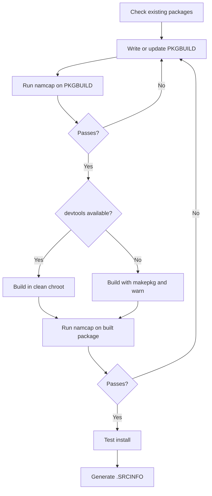
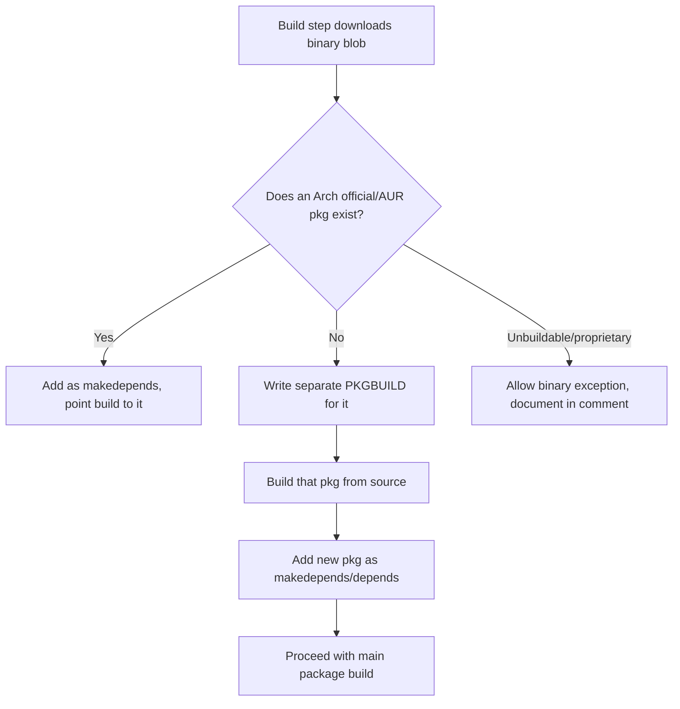

# Arch Linux PKGBUILD Creation

## Overview

Use this skill as the default workflow for PKGBUILD work.  
Core rule: do not claim packaging is complete until `namcap` passes for both `PKGBUILD` and built package artifacts.

This skill is intentionally concise. Load sub-skills and reference docs only when needed.

## When to Use

- Writing a new PKGBUILD from upstream source or binary release.
- Updating package version, dependencies, install behavior, or architecture metadata.
- Debugging `namcap` warnings/errors.
- Preparing `.SRCINFO` and AUR push.

## Sub-Skills

| Sub-skill | Trigger |
|---|---|
| `archlinux-pkgbuild/vcs-packages` | `-git/-svn/-hg/-bzr/-darcs` packages, `pkgver()` logic |
| `archlinux-pkgbuild/systemd-services` | Services, `sysusers.d`, `tmpfiles.d`, sandboxing |
| `archlinux-pkgbuild/compiled-languages` | Go/Rust/Java/Haskell/OCaml/Pascal builds |
| `archlinux-pkgbuild/interpreted-languages` | Python/Node/Ruby/PHP/Perl/R/Shell/Lisp packages |
| `archlinux-pkgbuild/build-systems` | CMake or Meson projects |
| `archlinux-pkgbuild/cross-platform` | Wine/MinGW/Electron/.NET/Mono packaging |
| `archlinux-pkgbuild/desktop-integration` | GNOME/KDE/Eclipse/font integration |
| `archlinux-pkgbuild/system-packages` | DKMS/kernel/lib32/nonfree/webapp/split packages |

## Mandatory Workflow


```mermaid
flowchart TD
    A[Check existing packages] --> B[Write or update PKGBUILD]
    B --> C[Run namcap on PKGBUILD]
    C --> D{Passes?}
    D -->|No| B
    D -->|Yes| E{devtools available?}
    E -->|Yes| F[Build in clean chroot]
    E -->|No| G[Build with makepkg and warn]
    F --> H[Run namcap on built package]
    G --> H
    H --> I{Passes?}
    I -->|No| B
    I -->|Yes| J[Test install]
    J --> K[Generate .SRCINFO]
```

## Quick Reference

### 0. Package split decision

| Scenario | Rule |
|----------|------|
| Multiple packages built from **same source** | Use **split packages** in a single PKGBUILD (`pkgbase` + `pkgname=()` array) |
| Each package comes from **different source** | Create **separate PKGBUILDs**, one per package |

Use `archlinux-pkgbuild/system-packages` for the split-package mechanics (`pkgbase`, `package_name()` functions).

### 1. Existence check

```bash
pacman -Ss '^pkgname$'
yay -Ss '^pkgname$'   # or paru -Ss
```

If official repo has it, do not create duplicate AUR package.

### 2. Source vs binary build strategy

| Package type | Strategy |
|---|---|
| Has buildable source (most packages) | **Build from source — mandatory** |
| Named `-bin` or upstream ships binaries only | Prebuilt binary acceptable |
| Closed-source / proprietary | Prebuilt binary acceptable |
If fallback is used, explicitly warn that dependencies may be incomplete due to non-chroot build.
**If the build process fetches prebuilt binary blobs** (e.g., npm native addons, Maven artifacts, Electron pre-bundled binaries):


```mermaid
flowchart TD
    A[Build step downloads binary blob] --> B{Does an Arch official/AUR pkg exist?}
    B -->|Yes| C[Add as makedepends, point build to it]
    B -->|No| D[Write separate PKGBUILD for it]
    D --> E[Build that pkg from source]
    E --> F[Add new pkg as makedepends/depends]
    F --> G[Proceed with main package build]
    B -->|Unbuildable/proprietary| H[Allow binary exception, document in comment]
```

**Concrete checks:**

1. Audit every binary fetched during `build()` — look for `.node`, `.so`, `.dll`, `.exe`, `.jar` downloads.
2. For each: `pacman -Ss '^libname$'` and `yay -Ss`. If found, use existing package.
3. If not found and source is available: create a separate `libname` PKGBUILD, build it from source, add as `makedepends`.
4. Patch the build system (`prepare()`) to skip re-downloading: set env vars (`npm_config_cache`, `ELECTRON_SKIP_BINARY_DOWNLOAD=1`, etc.) or replace download calls with symlinks.
5. Only accept a prebuilt blob when there is genuinely no source available — add a comment explaining why.

### 3. Build method

### 4. Validation (required)

```bash
namcap PKGBUILD
namcap *.pkg.tar.zst
```

Recommended deep checks:

```bash
namcap -i PKGBUILD
namcap -i *.pkg.tar.zst
```

### 5. Minimum PKGBUILD quality gates

| Item | Rule |
|---|---|
| Paths | Never install to `/usr/local`; package files go under `/usr` |
| Vendor config | Put package-owned defaults in `/usr/lib`, not `/etc` |
| Dependencies | List direct runtime/build deps only; no transitive padding. Do not include packages from `base` in `depends`/`optdepends` or `base-devel` in `makedepends` — both groups are assumed present |
| Checksums | Use `sha256sums`/`sha512sums`/`b2sums`; `SKIP` only for VCS sources |
| Arch field | `any` only for architecture-independent packages |
| Shell vars | Quote `"$pkgdir"` and `"$srcdir"` |
| Config files | User-editable `/etc` files must be in `backup=()` |

### 6. Architecture policy

- Source-built packages: prefer `x86_64` + `aarch64` when both can be validated.
- Binary packages: only declare architectures that upstream actually publishes.
- If only one architecture is tested, keep `arch=()` limited to tested architectures.

### 7. AUR finalization

```bash
makepkg --printsrcinfo > .SRCINFO
```

Track: `PKGBUILD`, `.SRCINFO`, patches, `.install`, service/tmpfiles/sysusers files.  
Ignore build artifacts (`pkg/`, `src/`, `*.pkg.tar.*`, `.BUILDINFO`, `.PKGINFO`, `.MTREE`, `.INSTALL`).

## Supporting References

- `advanced-workflow-and-build.md`: detailed workflow, dependency, architecture, build, and validation execution
- `aur-publishing-and-release-tracking.md`: detailed AUR push workflow, `.SRCINFO`/`.gitignore`, and nvchecker/pkgctl usage
- `policy-quality-and-install-scripts.md`: red flags, quality gates, configuration handling, and `.install` script patterns
- `pkgbuild-template.sh`: annotated baseline template
- `validation-guide.md`: `namcap` interpretation and fix patterns
- `fhs-and-vendor-config.md`: correct install destinations
- `config-file-handling.md`: `backup=()` and sensitive file permissions
- `clean-chroot-reference.md`: advanced `devtools`/chroot workflows

## Common Mistakes

- Submitting packages built only with local `makepkg` without warning.
- Using `/etc` for vendor defaults that belong in `/usr/lib`.
- Forgetting to regenerate `.SRCINFO` after dependency/version updates.
- Declaring unsupported architectures in binary packages.
- Bundling prebuilt binary blobs instead of building from source (or using an existing Arch package).
- Using `npm install` / `cargo fetch` / `gradle build` without auditing for binary downloads.
- Accepting a build that silently downloads `.node`/`.so`/`.exe` files without documenting or replacing them.

## Resources

- https://wiki.archlinux.org/title/Arch_package_guidelines
- https://man.archlinux.org/man/PKGBUILD.5
- https://wiki.archlinux.org/title/Namcap
- https://wiki.archlinux.org/title/AUR_submission_guidelines
- https://wiki.archlinux.org/title/DeveloperWiki:Building_in_a_clean_chroot
