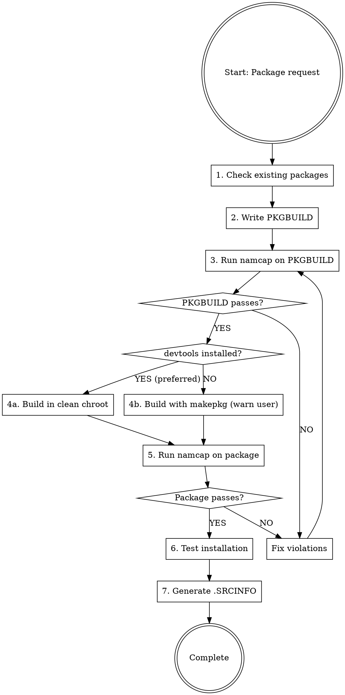

# Arch Linux PKGBUILD 创建指南

## 概述

**PKGBUILD 文件是 Arch Linux 软件包构建脚本，具有严格的验证要求。** 本技能确保符合 Arch 软件包指南、FHS（文件系统层次结构标准）以及强制的 namcap 测试。

**核心原则：** 每个 PKGBUILD 在部署前 MUST（必须）通过 PKGBUILD 文件和生成的软件包的 namcap 验证。

## 可用的子技能

本技能针对不同软件包类型拆分为专门的子技能：

| 子技能 | 使用场景 |
|-----------|----------|
| **archlinux-pkgbuild/vcs-packages** | 创建 VCS 软件包（Git、SVN、CVS、Mercurial、Bazaar），包含 pkgver() 函数 |
| **archlinux-pkgbuild/systemd-services** | 处理 systemd 服务、用户管理（DynamicUser 与 sysusers.d 对比）、tmpfiles.d 清理、服务沙盒化、转换非 systemd 启动脚本 |
| **archlinux-pkgbuild/compiled-languages** | 打包编译型语言（Go、Rust、Haskell、OCaml、Free Pascal、Java），包含语言特定的构建标志和安装模式 |
| **archlinux-pkgbuild/interpreted-languages** | 打包解释型语言（Node.js、Python、Ruby、PHP、Perl、R、Shell 脚本、Lisp），包含包管理器和模块安装 |
| **archlinux-pkgbuild/build-systems** | 使用 CMake 或 Meson 构建系统 - CMAKE_INSTALL_PREFIX、CMAKE_BUILD_TYPE、RPATH 处理、meson setup/compile 模式 |
| **archlinux-pkgbuild/cross-platform** | 打包跨平台兼容层（Wine、MinGW、Electron、CLR/.NET），包含 WINEPREFIX、mingw-w64、electron-builder、Mono 运行时 |
| **archlinux-pkgbuild/desktop-integration** | 打包桌面环境集成（GNOME、KDE、Eclipse、字体软件包），包含 GSettings schemas、KDE 框架、fontconfig |
| **archlinux-pkgbuild/system-packages** | 打包系统级组件（DKMS 模块、内核模块、lib32、非自由软件、Web 应用、分割软件包），包含专门的安装要求 |

**根据需要加载子技能** 使用技能工具处理这些专门的软件包类型。

## 强制工作流程



## 构建方法：Clean Chroot 与直接 makepkg 对比

**首选方法：Clean Chroot 构建**

在 clean chroot 中构建可以防止：
- 缺少依赖（系统中不需要的链接）
- 不完整的 `depends=()` 数组
- 在已安装测试软件包的情况下为稳定仓库构建

**何时使用每种方法：**

| 方法 | 使用场景 | 要求 |
|--------|-------------|--------------|
| **Clean chroot**（首选） | AUR 提交、官方打包、确保正确的依赖 | 已安装 `devtools` 软件包 |
| **直接 makepkg**（后备） | 快速本地构建、原型设计、devtools 不可用时 | 仅需 `base-devel` |

**重要：如果使用直接 makepkg，ALWAYS（始终）警告用户该软件包 NOT（未）在 clean chroot 中构建，可能包含不正确的依赖。**

### Clean Chroot 快速入门

**一键构建（推荐大多数用户使用）：**

```bash
# 用于 AUR/extra 软件包（最常见）
extra-x86_64-build

# 脚本会自动：
# - 在 /var/lib/archbuild/ 中创建 chroot（如需要）
# - 更新 chroot
# - 在隔离环境中构建软件包
# - 需要时使用 -c 标志重置 chroot
```

**可用的构建脚本：**

| 目标仓库 | 命令 | 使用场景 |
|-------------------|---------|-------------|
| extra (稳定版) | `extra-x86_64-build` | 大多数 AUR 软件包、稳定构建 |
| extra-testing | `extra-testing-x86_64-build` | 测试预发布软件包 |
| multilib (32位) | `multilib-build` | 32位兼容软件包 |
| multilib-testing | `multilib-testing-build` | 测试 32位软件包 |

**常用标志：**
- `-c` : 构建前清理/重置 chroot（在损坏后使用）
- `-I package.pkg.tar.zst` : 预安装自定义依赖

**使用自定义依赖的示例：**
```bash
# 构建依赖于另一个自定义软件包的软件包
extra-x86_64-build -- -I ~/custom-dep-1.0-1-x86_64.pkg.tar.zst
```


有关高级手动 chroot 设置，请参阅 @clean-chroot-reference.zh-CN.md（自定义位置、自定义配置）。


### 后备方案：直接 makepkg 构建

**仅在 clean chroot 不可用时使用。**

```bash
# 构建软件包
makepkg -f

# 重要：构建后，ALWAYS（始终）通知用户：
echo "⚠️  警告：使用直接 makepkg 构建（NOT（未）在 clean chroot 中）"
echo "⚠️  依赖可能不完整或不正确"
echo "⚠️  用于生产用途时，请安装 'devtools' 并在 clean chroot 中重新构建"
```

**何时可以接受：**
- 本地开发/测试
- 快速原型设计
- 无分发软件包的计划

**何时不能接受：**
- AUR 提交
- 分发给他人
- 官方打包

## PKGBUILD 结构模板

**有关完整的注释模板，请参阅本目录中的 @pkgbuild-template.sh。**

**快速结构概述：**
- **变量**：pkgname、pkgver、pkgrel、pkgdesc、arch、url、license、depends、makedepends
- **prepare()**：打补丁、修复路径（可选）
- **build()**：编译源代码（通常必需）
- **check()**：运行测试套件（可选但推荐）
- **package()**：安装到 $pkgdir（强制）

## 快速参考：关键要求

| 要求 | 规则 | 违规示例 |
|-------------|------|-------------------|
| **路径** | NEVER（绝不）使用 /usr/local/，ALWAYS（始终）使用 /usr/ | /usr/local/bin → /usr/bin |
| **系统位置** | 供应商配置放到 /usr/lib/，NOT（不要放到）/etc/ | /etc/sysusers.d/ → /usr/lib/sysusers.d/ |
| **文件命名** | 在系统配置中使用软件包名称 | device.rules → 99-$pkgname.rules |
| **依赖** | 列出 ALL（所有）直接依赖（不包括传递性依赖） | 缺少运行时库依赖 |
| **架构** | 'x86_64' 或 'any' | 缺少 arch= 字段 |
| **校验和** | 使用 sha256sums 或 sha512sums | 仅使用 md5sums |
| **optdepends** | 格式：'pkg: description' | 'pkg' 缺少描述 |
| **pkgdesc** | 约 80 个字符，不包含软件包名称 | "example is a tool..." |
| **验证** | namcap PKGBUILD + 软件包（必需），namcap -i（推荐） | 跳过 namcap 测试 |
| **变量** | 引用："$pkgdir" "$srcdir" | $pkgdir/usr（未引用） |
| **License** | SPDX 格式 | 'GPLv3' 而不是 'GPL3' |
| **Email** | 在注释中混淆 | user@domain.com → user at domain dot com |
| **配置文件** | 在 backup=() 数组中列出 | 用户修改在升级时被覆盖 |
| **Desktop 文件** | GUI 应用需要在 /usr/share/applications/ 中的 .desktop | 应用不会出现在菜单中 |

## 分步实现

### 步骤 1：检查现有软件包

**在创建任何 PKGBUILD 之前：**

```bash
# 检查官方仓库
pacman -Ss package-name

# 检查 AUR
yay -Ss package-name  # 或 paru -Ss
# 或访问：https://aur.archlinux.org/packages/?K=package-name
```

**如果软件包存在：**
- 官方仓库：DO NOT（不要）创建 PKGBUILD（使用现有的）
- AUR 存在：检查是否可以改进或使用不同的名称并添加 conflicts=()

### 步骤 2：创建 PKGBUILD

**强制字段：**
- pkgname、pkgver、pkgrel、arch、pkgdesc、url、license
- source、checksums（sha256sums 或 sha512sums）
- depends（如果有运行时依赖）
- package() 函数

**可选但推荐的字段：**
- install="$pkgname.install" : 指定包含用户说明的安装后脚本

**软件包命名约定：**
- VCS 软件包：后缀 -git、-svn、-hg、-bzr、-cvs、-darcs（请参阅 **archlinux-pkgbuild/vcs-packages** 子技能）
- 预构建二进制文件：后缀 -bin（当源代码可用时）
- Python 软件包：python-pkgname（请参阅 **archlinux-pkgbuild/language-ecosystems** 子技能）
- 语言特定：有关命名约定，请参阅 **archlinux-pkgbuild/language-ecosystems** 子技能
- 全部小写，无前导连字符/点

**依赖类型：**
- `depends=()` : 运行时要求（库、解释器）
- `makedepends=()` : 仅构建时（编译器、构建工具）
- `checkdepends=()` : 测试套件要求
- `optdepends=()` : 可选功能 ('package: what it enables')

**使用工具查找依赖：**
```bash
# 查找库依赖
find-libdeps /path/to/built/files

# 替代方案：使用 ldd 检查
ldd /path/to/binary

# 查找提供的库
find-libprovides /path/to/built/files
```

**重要：验证软件包可用性**

在最终确定 PKGBUILD 之前，**MUST（必须）**验证所有依赖是否存在：

```bash
# 检查官方仓库
pacman -Ss package-name

# 检查 AUR（使用 yay 或 paru）
yay -Ss package-name
# 或
paru -Ss package-name

# 一次性验证所有依赖
for pkg in depend1 depend2 makedepend1 optdepend1; do
    pacman -Ss "^$pkg$" || yay -Ss "^$pkg$" || echo "MISSING: $pkg"
done
```

**规则：**
- 每个 `depends=()`、`makedepends=()` 和 `optdepends=()` 条目 MUST（必须）存在于官方仓库或 AUR 中
- 使用确切的软件包名称（检查 `pacman -Ss` 或 `aur.archlinux.org`）
- 对于 AUR 依赖，请在注释中记录（AUR 软件包无法自动安装）
- 无效的依赖 = namcap 错误 + 安装失败


### 步骤 3：FHS 合规性和系统软件包位置

**有关详细的 FHS 路径和供应商配置规则**，请参阅本目录中的 **@fhs-and-vendor-config.zh-CN.md**。

**关键快速参考：**

| 类型 | 正确 | 错误 |
|------|---------|-------|
| 二进制文件 | `/usr/bin` | `/usr/local/bin` |
| 系统服务 | `/usr/lib/systemd/system/` | `/etc/systemd/system/` |
| Sysusers/tmpfiles | `/usr/lib/{sysusers,tmpfiles}.d/` | `/etc/{sysusers,tmpfiles}.d/` |
| Udev 规则 | `/usr/lib/udev/rules.d/` | `/etc/udev/rules.d/` |

**关键规则：** 供应商配置放到 `/usr/lib/`，用户覆盖放到 `/etc/`。

### 步骤 4：校验和

**生成校验和：**
```bash
# 简单方法：自动更新校验和
updpkgsums

# 手动方法：下载并计算
makepkg -g >> PKGBUILD  # 追加校验和
```

**校验和类型（优先使用更强的）：**
- `sha512sums`（最佳）
- `sha256sums`（良好）
- `b2sums`（Blake2，也不错）
- ~~`md5sums`~~（弱，避免使用）

**对 VCS 源使用 SKIP：**
```bash
source=("git+https://github.com/user/repo.git")
sha256sums=('SKIP')
```

### 步骤 5：构建软件包

**根据可用性选择构建方法：**

```bash
# 检查是否安装了 devtools
if command -v extra-x86_64-build &> /dev/null; then
    # 首选：Clean chroot 构建
    extra-x86_64-build
    echo "✓ 在 clean chroot 中构建（依赖已验证）"
else
    # 后备：直接构建并警告
    makepkg -f
    echo "⚠️  警告：使用直接 makepkg 构建（NOT（未）在 clean chroot 中）"
    echo "⚠️  依赖可能不完整。安装 'devtools' 以进行 clean 构建。"
fi
```

**对于自定义依赖（仅限 clean chroot）：**
```bash
extra-x86_64-build -- -I custom-package-1.0-1-x86_64.pkg.tar.zst
```

### 步骤 6：使用 namcap 验证

**强制验证步骤：**

```bash
# 1. 检查 PKGBUILD
namcap PKGBUILD

# 2. 检查生成的软件包
namcap *.pkg.tar.zst

# 3. 详细分析（推荐）
namcap -i PKGBUILD
namcap -i *.pkg.tar.zst
```

**重要：如果 namcap 报告错误，DO NOT（不要）继续。**

**有关全面的验证程序、错误解释和修复：**
请参阅 @validation-guide.zh-CN.md

### 步骤 7：测试安装

```bash
# 本地安装
sudo pacman -U *.pkg.tar.zst

# 测试功能
$pkgname --version
$pkgname --help

# 检查已安装的文件
pacman -Ql $pkgname

# 验证依赖（clean chroot 构建应该是正确的）
pacman -Qi $pkgname | grep Depends

# 测试后移除
sudo pacman -R $pkgname
```

### 步骤 8：AUR 提交（如适用）

**生成 .SRCINFO：**
```bash
makepkg --printsrcinfo > .SRCINFO
```

**设置 AUR SSH：**
```bash
# 添加到 ~/.ssh/config
Host aur.archlinux.org
    IdentityFile ~/.ssh/aur
    User aur
```

**设置 .gitignore：**
```bash
# 为 PKGBUILD 仓库创建 .gitignore
cat > .gitignore << 'EOF'
# 构建产物
*.pkg.tar.zst
*.pkg.tar.xz
*.pkg.tar.gz

# 源码压缩包
*.tar.gz
*.tar.bz2
*.tar.xz
*.zip

# 构建目录
pkg/
src/

# makepkg 元数据（仅构建时）
.BUILDINFO
.PKGINFO
.MTREE
.INSTALL

# 临时文件
*.log
*~
*.swp
EOF
```

**重要的 .gitignore 规则：**

| 文件 | 跟踪？ | 原因 |
|------|--------|-----|
| **PKGBUILD** | ✅ 是 | 强制源文件 |
| **.SRCINFO** | ✅ 是 | AUR 所需（机器可读元数据） |
| **\*.install** | ✅ 是 | 安装后脚本源 |
| **\*.patch** | ✅ 是 | 源码补丁 |
| **补充配置** | ✅ 是 | .tmpfiles、.service、示例配置 |
| **.INSTALL** | ❌ 否 | 构建产物（从 .install 生成） |
| **pkg/, src/** | ❌ 否 | 构建目录 |
| **\*.pkg.tar.*** | ❌ 否 | 已构建的软件包 |
| **.BUILDINFO, .PKGINFO, .MTREE** | ❌ 否 | makepkg 元数据 |

**AUR 提交的两种场景：**

**场景 A：已跟踪 PKGBUILD 文件的现有本地 git 仓库**

如果您已经有包含 PKGBUILD、.SRCINFO 和相关文件的 git 仓库：

```bash
# 将 AUR 添加为现有仓库的远程
cd /path/to/existing/pkgname
git remote add aur ssh://aur@aur.archlinux.org/pkgname.git

# 推送到 AUR
git push aur master
```

**优点：**
- 保留现有的 git 历史
- 单个仓库用于本地开发和 AUR
- 目录名称与软件包名称匹配
- 无需文件复制

**场景 B：从头开始（新软件包）**

如果您还没有 git 仓库：

```bash
# 克隆（新软件包为空）
git clone ssh://aur@aur.archlinux.org/pkgname.git
cd pkgname

# 添加文件
cp /path/to/PKGBUILD .
makepkg --printsrcinfo > .SRCINFO

# 创建 .gitignore（见上文）
cat > .gitignore << 'EOF'
# 构建产物
*.pkg.tar.zst
*.pkg.tar.xz
*.pkg.tar.gz

# 源码压缩包
*.tar.gz
*.tar.bz2
*.tar.xz
*.zip

# 构建目录
pkg/
src/

# makepkg 元数据（仅构建时）
.BUILDINFO
.PKGINFO
.MTREE
.INSTALL

# 临时文件
*.log
*~
*.swp
EOF

# 提交
git add PKGBUILD .SRCINFO .gitignore
git commit -m "Initial commit: pkgname $pkgver-$pkgrel"

# 推送
git push origin master
```

**决策规则：** 如果您有包含所需文件（PKGBUILD、.SRCINFO、.gitignore、补丁、配置）的现有 git 仓库，请使用 **场景 A**。仅在完全从头开始时才使用 **场景 B**。

## 使用 nvchecker 跟踪上游版本

**nvchecker** 自动检查新的上游版本。使用 **pkgctl version** 命令进行集成。

### 快速入门

```bash
# 从 PKGBUILD source 数组自动生成 .nvchecker.toml
pkgctl version setup

# 检查新的上游版本
pkgctl version check

# 更新 PKGBUILD 到新版本
pkgctl version upgrade
```

### .nvchecker.toml 配置

将 `.nvchecker.toml` 放在与 PKGBUILD 相同的目录中。`pkgctl version setup` 命令通过分析您的 `source=()` 数组自动创建此文件。

**GitHub releases 示例：**
```toml
[pkgname]
source = "github"
github = "owner/repo"
```

**PyPI 示例：**
```toml
[python-package]
source = "pypi"
pypi = "package-name"
```

**GitLab 示例：**
```toml
[pkgname]
source = "gitlab"
gitlab = "group/project"
```

**另请参阅：**
- pkgctl-version(1) 手册页获取完整文档
- 官方软件包中的示例配置（例如 https://gitlab.archlinux.org/archlinux/packaging/packages/pacman/-/blob/main/.nvchecker.toml）
- nvchecker 文档：https://nvchecker.readthedocs.io/

### 工作流程

1. 初始设置：`pkgctl version setup`（创建 .nvchecker.toml）
2. 定期检查：`pkgctl version check`
3. 发现新版本时：`pkgctl version upgrade`（更新 pkgver）
4. 审查更改，更新 pkgrel=1，重新构建，测试
5. 提交到 AUR

**注意：** nvchecker 对于维护多个软件包或跟踪快速变化的项目特别有用。

## 常见错误和红旗

### 关键错误（MUST（必须）修复）

| 错误 | 错误原因 | 正确方法 |
|---------|---------------|------------------|
| 使用直接 makepkg 进行分发构建 | 缺少/不正确的依赖、系统污染 | 使用 `extra-x86_64-build` 在 clean chroot 中构建 |
| 跳过 namcap | 违反 Arch 打包标准 | 始终在 PKGBUILD 和 .pkg.tar.zst 上运行 namcap（必需），以及 namcap -i（推荐） |
| 使用 /usr/local/ | 违反 FHS 合规性 | 仅使用 /usr/ 路径 |
| 供应商配置在 /etc/ 中 | 错误的关注点分离、冲突风险 | 使用 /usr/lib/sysusers.d/、/usr/lib/tmpfiles.d/、/usr/lib/udev/rules.d/ |
| 系统目录中的通用文件名 | 软件包冲突、所有权不明确 | 始终使用软件包名称：/usr/lib/sysusers.d/$pkgname.conf |
| 缺少直接依赖 | 运行时失败 | 在 clean chroot 中构建或使用 find-libdeps、ldd 查找所有直接依赖 |
| 包含传递性依赖 | 违反打包策略 | 仅列出直接依赖 |
| 对非 VCS 使用 'SKIP' | 安全风险 | 使用 updpkgsums 生成真实校验和 |
| 未引用的 $pkgdir/$srcdir | Shell 扩展错误 | 始终引用："$pkgdir" "$srcdir" |
| 自引用 pkgdesc | 冗余 | "Tool for X" 而不是 "pkgname is a tool for X" |
| GUI 应用缺少 .desktop 文件 | 应用不会出现在菜单中 | 安装到 /usr/share/applications/，使用 desktop-file-validate 验证（示例请参阅 archlinux-pkgbuild/cross-platform 子技能） |
| 源中的硬编码路径 | 版本升级需要编辑 | 使用变量：$pkgname-$pkgver |

### 警告信号（仔细检查）

| 模式 | 潜在问题 | 调查 |
|---------|----------------|-------------|
| 自定义 configure 标志 | 可能覆盖 Arch 默认值 | 检查 Arch 指南以获取标准标志 |
| 禁用剥离 | 调试符号膨胀 | 仅当上游需要时 |
| 空的 prepare() | 可能需要路径修复 | 检查构建输出中的 /usr/local |
| 没有 check() 函数 | 未测试的软件包 | 如果可用，运行上游测试 |
| 许多 optdepends | 它们都是可选的吗？ | 某些可能是核心功能必需的 |
| 版本固定的依赖 | 可能在更新时损坏 | 仅在真正需要时使用 >= |

## PKGBUILD 函数参考

| 函数 | 必需？ | 目的 | 常用命令 |
|----------|-----------|---------|-----------------|
| **prepare()** | 可选 | 打补丁源、修复路径 | sed、patch、find |
| **pkgver()** | 仅 VCS | 自动更新版本 | git rev-list、svnversion |
| **build()** | 通常 | 编译源 | ./configure、make、cmake |
| **check()** | 可选 | 运行测试套件 | make test、make check |
| **package()** | **强制** | 安装到 $pkgdir | make install、install |

## 安装命令参考

```bash
# 使用正确的权限安装文件
install -Dm644 file.txt "$pkgdir/usr/share/doc/$pkgname/file.txt"  # 普通文件
install -Dm755 binary "$pkgdir/usr/bin/binary"                      # 可执行文件
install -Dm644 LICENSE "$pkgdir/usr/share/licenses/$pkgname/LICENSE"  # License

# 创建目录
install -dm755 "$pkgdir/usr/share/$pkgname"

# 复制整个目录
cp -r dir "$pkgdir/usr/share/$pkgname/"

# 删除不需要的文件
rm -rf "$pkgdir/usr/share/doc"  # 如果上游错误地安装了文档
```

## 配置文件处理

**用户可修改的配置文件 MUST（必须）在 backup=() 中列出，以防止 pacman 覆盖用户更改。**

### 快速规则

```bash
backup=(
    'etc/myapp/main.conf'     # 相对于根目录，NO（无）前导斜杠
)
```

**包含在 backup=() 中：** 所有用户可能自定义的 /etc 文件，特别是凭据文件  
**排除：** /usr/share 中的模板、生成的文件、服务文件

**Pacman 行为：** 修改的文件 → 创建 .pacnew（用户手动合并）

### 安全：敏感配置文件

**如果配置文件包含凭据/机密（数据库密码、API 密钥）：**
- 使用 `0660` 权限（不是 world-readable）
- 通过 tmpfiles.d 类型 `z` 设置所有权
- 示例：`z /etc/webapps/app/database.php 0660 root http - -`

**如果应用写入配置（Web 安装程序）：**
- 文件由 root 拥有，组设置为应用用户（例如 root:http）
- 对 group-writable 使用 `0660`，不是 world-readable（安全）
- 目录可以保持 root:root（只有文件需要组访问）

**详细参考：** 有关以下内容的详细信息，请参阅 @config-file-handling.zh-CN.md：
- backup=() 规则和 .pacnew 工作流程
- 敏感配置文件权限（0660 vs 0640 vs 0644）
- 使用 tmpfiles.d 类型 `z` 进行所有权/权限更改
- Web 应用的安全模式

## 安装后脚本（.install 文件）

**使用 .install 文件提供安装后说明、执行设置任务或通知用户手动配置要求。**

### 何时使用 .install 文件

| 使用场景 | 示例 |
|----------|---------|
| 需要复杂配置 | 数据库设置、Web 服务器配置 |
| 需要手动步骤 | 从模板创建配置文件、设置凭据 |
| 重要警告 | 安全通知、重大更改 |
| 服务激活 | Systemd 服务启用/启动说明 |
| 首次设置 | 交互式向导、初始配置 |

### .install 文件结构

```bash
# /path/to/pkgname.install
post_install() {
    cat <<EOF

==> 软件包名称
==> ============

1. 第一个设置步骤：
   - 详细说明
   - 要运行的命令

2. 第二个设置步骤：
   - 更多说明

更多信息：https://upstream.docs

EOF
}

post_upgrade() {
    # 重要：仅包含与升级相关的信息
    # DO NOT（不要）盲目调用 post_install()，除非 ALL（所有）说明都适用于升级
    
    # 如果升级需要特定说明（迁移、重大更改）：
    cat <<EOF

==> 升级说明
==> =============

- 审查配置文件（检查 .pacnew 文件）
- 数据库迁移步骤（如适用）
- 此版本中的重大更改
- 服务重启命令

EOF
    
    # 反模式：不要这样做，除非初始设置真正适用于升级
    # post_install  # ❌ 错误，如果它包含一次性设置说明
}

pre_remove() {
    # 可选：移除前清理
    # 谨慎使用 - 大多数清理应该是手动的
}

post_remove() {
    # 可选：通知剩余数据
    cat <<EOF

==> 移除完成
==> =================

用户数据保留在 /var/lib/pkgname/
如果需要，手动移除：sudo rm -rf /var/lib/pkgname

EOF
}
```

### PKGBUILD 集成

**在 PKGBUILD 中引用 .install 文件：**

```bash
# 在 PKGBUILD 中
pkgname=myapp
install="$pkgname.install"  # 在 optdepends=() 之后添加，在 source=() 之前
```

**.install 文件必须：**
- 命名为 `$pkgname.install`
- 与 PKGBUILD 在同一目录中
- NOT（不要）在 source=() 中列出（它是元数据，不是源文件）
- 使用正确的 shell 语法（函数，无语法错误）

### 最佳实践

| 应该 | 不应该 |
|----|-------|
| 提供清晰、可操作的说明 | 转储冗长的文档 |
| 使用 heredoc（cat <<EOF）进行格式化 | 使用多个 echo 语句 |
| 保持消息简洁（< 30 行） | 写入论文长度的说明 |
| 区分一次性与升级说明 | 盲目地从 post_upgrade 调用 post_install |
| 测试 .install 脚本语法错误 | 假设它会工作而不进行测试 |
| 关注用户 MUST（必须）做什么 | 详细解释软件包内部结构 |

### 重要：post_install 与 post_upgrade 的区别

**post_install()**：一次性初始设置说明
- 数据库创建和架构导入
- 初始配置文件设置
- 从头开始的 Web 服务器配置
- 用户/组创建
- 首次设置向导
- 安装验证步骤

**post_upgrade()**：仅与升级相关的信息
- 配置文件更改（.pacnew 审查）
- 数据库迁移/架构更新
- 版本之间的重大更改
- 服务重启要求
- 弃用功能警告
- 变更日志引用

**决策规则：**
```
如果说明仅在首次安装时需要 → 仅 post_install()
如果说明仅在升级时需要 → 仅 post_upgrade()  
如果说明适用于 BOTH（两者）→ 考虑从 post_upgrade() 调用 post_install()

⚠️  反模式：始终从 post_upgrade() 调用 post_install()
仅当 ALL（所有）post_install 说明真正适用于升级时才这样做。
```

**示例：**

❌ **错误** - 升级显示不必要的一次性设置：
```bash
post_install() {
    cat <<EOF
1. 创建数据库并导入架构  # ❌ 只需要一次
2. 配置 Web 服务器               # ❌ 只需要一次
3. 运行安装向导            # ❌ 只需要一次
EOF
}
post_upgrade() {
    post_install  # ❌ 用不相关的步骤混淆用户
}
```

✅ **正确** - 清晰分离：
```bash
post_install() {
    cat <<EOF
1. 创建数据库：createdb myapp
2. 导入架构：psql myapp < /usr/share/myapp/schema.sql
3. 配置：编辑 /etc/webapps/myapp/config.php
4. 启动服务：systemctl start myapp
EOF
}

post_upgrade() {
    cat <<EOF
1. 检查新配置选项（.pacnew 文件）
2. 运行迁移：myapp-migrate --run
3. 重启服务：systemctl restart myapp
变更日志：https://github.com/project/releases
EOF
}
```

✅ **可接受** - 当说明真正适用于两者时：
```bash
post_install() {
    cat <<EOF
在 /etc/myapp/config.yaml 审查配置
重启服务：systemctl restart myapp
EOF
}

post_upgrade() {
    post_install  # ✅ 可以 - 这些步骤也适用于升级
}
```

### 示例：Web 应用

```bash
# webapp.install
post_install() {
    cat <<EOF

==> Webapp 安装
==> ====================

1. 创建数据库：
   $ sudo -u postgres createdb webappdb

2. 配置：
   $ sudo nano /usr/share/webapps/webapp/config.php

3. 设置 Web 服务器（Apache 示例）：
   $ sudo ln -s /etc/httpd/conf/extra/webapp.conf /etc/httpd/conf/extra/
   $ sudo systemctl restart httpd

4. 完成设置：
   访问：http://localhost/webapp/install

文档：https://webapp.example/docs

EOF
}

post_upgrade() {
    post_install
}
```

### 验证

```bash
# 检查 .install 语法
bash -n pkgname.install

# 验证它在 PKGBUILD 中被引用
grep "^install=" PKGBUILD

# 验证它包含在软件包中
namcap *.pkg.tar.zst | grep -i install
```

**注意：** 当设置了 `install=` 时，.install 文件会自动包含在软件包中。Do NOT（不要）在 package() 中手动安装它。

## 专门软件包类型

**对于专门的软件包类型，加载适当的子技能：**

- **VCS 软件包**（-git、-svn、-cvs）：使用 **archlinux-pkgbuild/vcs-packages**
- **Systemd 服务**（DynamicUser、tmpfiles.d、沙盒化、init 转换）：使用 **archlinux-pkgbuild/systemd-services**
- **编译型语言**（Go、Rust、Haskell、OCaml、Free Pascal、Java）：使用 **archlinux-pkgbuild/compiled-languages**
- **解释型语言**（Node.js、Python、Ruby、PHP、Perl、R、Shell、Lisp）：使用 **archlinux-pkgbuild/interpreted-languages**
- **构建系统**（CMake、Meson）：使用 **archlinux-pkgbuild/build-systems**
- **跨平台**（Wine、MinGW、Electron、CLR）：使用 **archlinux-pkgbuild/cross-platform**
- **桌面集成**（GNOME、KDE、Eclipse、Fonts）：使用 **archlinux-pkgbuild/desktop-integration**
- **系统软件包**（DKMS、内核模块、lib32、非自由软件、Web 应用、分割）：使用 **archlinux-pkgbuild/system-packages**

## 高级 Clean Chroot 技术

**有关高级 clean chroot 用法**（tmpfs 构建、自定义依赖、主要重建、不同仓库），请参阅本目录中的 **@clean-chroot-reference.zh-CN.md**。

**快速故障排除：**

| 问题 | 解决方案 |
|---------|----------|
| "chroot is locked" | 移除 `/var/lib/archbuild/extra-x86_64.lock` |
| Chroot 更新失败 | 使用 `-c` 标志重置：`extra-x86_64-build -c` |
| 权限被拒绝 | 使用 `sudo` 运行或确保用户在 `wheel` 组中 |

## 资源

- Arch Package Guidelines：https://wiki.archlinux.org/title/Arch_package_guidelines
- PKGBUILD(5) 手册页：https://man.archlinux.org/man/PKGBUILD.5
- FHS 规范：https://man.archlinux.org/man/file-hierarchy.7
- AUR 提交：https://wiki.archlinux.org/title/AUR_submission_guidelines
- namcap：https://wiki.archlinux.org/title/Namcap
- Clean chroot 构建：https://wiki.archlinux.org/title/DeveloperWiki:Building_in_a_clean_chroot
- devtools：https://man.archlinux.org/man/extra/devtools/pkgctl-build.1
- nvchecker/pkgctl-version：https://man.archlinux.org/man/extra/devtools/pkgctl-version.1
