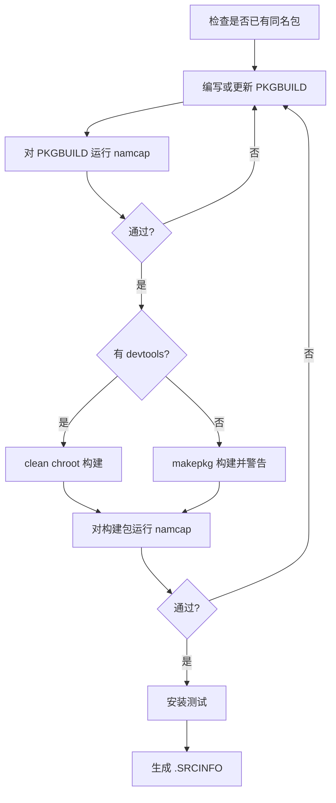

# Arch Linux PKGBUILD 创建指南

## 概述

把本技能作为 PKGBUILD 的默认流程。  
核心规则：只有当 `PKGBUILD` 与构建产物都通过 `namcap` 时，才能宣称打包完成。

本文件保持精简；复杂场景通过子技能与参考文档展开。

## 何时使用

- 从上游源码或二进制发布创建新 PKGBUILD。
- 更新版本、依赖、安装逻辑或架构元数据。
- 修复 `namcap` 警告/错误。
- 生成 `.SRCINFO` 并准备提交 AUR。

## 子技能

| 子技能 | 触发条件 |
|---|---|
| `archlinux-pkgbuild/vcs-packages` | `-git/-svn/-hg/-bzr/-darcs` 包，`pkgver()` 逻辑 |
| `archlinux-pkgbuild/systemd-services` | 服务包、`sysusers.d`、`tmpfiles.d`、沙箱化 |
| `archlinux-pkgbuild/compiled-languages` | Go/Rust/Java/Haskell/OCaml/Pascal 编译包 |
| `archlinux-pkgbuild/interpreted-languages` | Python/Node/Ruby/PHP/Perl/R/Shell/Lisp 包 |
| `archlinux-pkgbuild/build-systems` | CMake 或 Meson 工程 |
| `archlinux-pkgbuild/cross-platform` | Wine/MinGW/Electron/.NET/Mono 打包 |
| `archlinux-pkgbuild/desktop-integration` | GNOME/KDE/Eclipse/字体集成 |
| `archlinux-pkgbuild/system-packages` | DKMS/内核/lib32/非自由/WebApp/拆分包 |

## 强制流程


```mermaid
flowchart TD
    A[检查是否已有同名包] --> B[编写或更新 PKGBUILD]
    B --> C[对 PKGBUILD 运行 namcap]
    C --> D{通过?}
    D -->|否| B
    D -->|是| E{有 devtools?}
    E -->|是| F[clean chroot 构建]
    E -->|否| G[makepkg 构建并警告]
    F --> H[对构建包运行 namcap]
    G --> H
    H --> I{通过?}
    I -->|否| B
    I -->|是| J[安装测试]
    J --> K[生成 .SRCINFO]
```

## 速查

### 1. 查重

```bash
pacman -Ss '^pkgname$'
yay -Ss '^pkgname$'   # 或 paru -Ss
```

官方仓库已存在时，不应再创建重复 AUR 包。

### 2. 构建方式

| 方式 | 适用场景 |
|---|---|
| `extra-x86_64-build`（首选） | AUR 提交、依赖准确性验证 |
| `makepkg -f`（后备） | 仅限本地原型验证 |

使用后备方案时，必须显式警告：非 chroot 构建可能导致依赖不完整。

### 3. 验证（必须）

```bash
namcap PKGBUILD
namcap *.pkg.tar.zst
```

推荐补充：

```bash
namcap -i PKGBUILD
namcap -i *.pkg.tar.zst
```

### 4. PKGBUILD 最低质量门槛

| 项目 | 规则 |
|---|---|
| 路径 | 不要装到 `/usr/local`，应安装到 `/usr` |
| Vendor 配置 | 包自带默认配置放 `/usr/lib`，不是 `/etc` |
| 依赖 | 只列直接依赖；不要填充传递依赖。`depends`/`optdepends` 不得包含 `base` 组的包；`makedepends` 不得包含 `base-devel` 组的包——两个组均被假定已安装 |
| 校验和 | 用 `sha256sums`/`sha512sums`/`b2sums`；`SKIP` 仅用于 VCS source |
| `arch=()` | 仅架构无关包可用 `any` |
| Shell 变量 | 引用 `"$pkgdir"` 与 `"$srcdir"` |
| 配置文件 | 用户可改的 `/etc` 文件必须进 `backup=()` |

### 5. 架构策略

- 源码编译包：能验证时优先 `x86_64` + `aarch64`。
- 二进制包：只声明上游实际提供的架构。
- 只测试了单架构时，`arch=()` 只保留已测试架构。

### 6. AUR 收尾

```bash
makepkg --printsrcinfo > .SRCINFO
```

需要跟踪：`PKGBUILD`、`.SRCINFO`、patch、`.install`、service/tmpfiles/sysusers 文件。  
需要忽略：`pkg/`、`src/`、`*.pkg.tar.*`、`.BUILDINFO`、`.PKGINFO`、`.MTREE`、`.INSTALL`。

## 参考文件

- `advanced-workflow-and-build.zh-CN.md`：完整流程、依赖与架构策略、构建与验证执行细节
- `aur-publishing-and-release-tracking.zh-CN.md`：AUR 提交、仓库清单规则、nvchecker/pkgctl 细节
- `policy-quality-and-install-scripts.zh-CN.md`：质量红旗、规范参考、配置文件处理与 `.install` 脚本模式
- `pkgbuild-template.sh`：注释版模板
- `validation-guide.md`：`namcap` 结果解读与修复模式
- `fhs-and-vendor-config.md`：安装路径与 FHS 规则
- `config-file-handling.md`：`backup=()` 与敏感配置权限
- `clean-chroot-reference.md`：高级 chroot/devtools 工作流

## 常见错误

- 仅用本机 `makepkg` 构建后直接提交，且没有风险提示。
- 把 vendor 默认配置放进 `/etc`，而不是 `/usr/lib`。
- 修改版本或依赖后忘记更新 `.SRCINFO`。
- 二进制包声明了上游不存在的架构。

## 资源

- https://wiki.archlinux.org/title/Arch_package_guidelines
- https://man.archlinux.org/man/PKGBUILD.5
- https://wiki.archlinux.org/title/Namcap
- https://wiki.archlinux.org/title/AUR_submission_guidelines
- https://wiki.archlinux.org/title/DeveloperWiki:Building_in_a_clean_chroot
