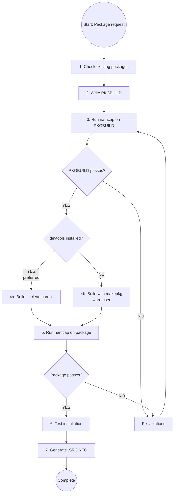

# Arch Linux PKGBUILD Advanced Workflow and Build

Detailed reference for end-to-end workflow, dependency/architecture handling, and build/validation execution.


# Arch Linux PKGBUILD Creation

## Overview

**PKGBUILD files are Arch Linux package build scripts with strict validation requirements.** This skill ensures compliance with Arch package guidelines, FHS (Filesystem Hierarchy Standard), and mandatory namcap testing.

**Core principle:** Every PKGBUILD MUST pass namcap validation for both the PKGBUILD file AND the generated package before deployment.

## Sub-Skills Available

This skill is split into specialized sub-skills for different package types:

| Sub-Skill | Use When |
|-----------|----------|
| **archlinux-pkgbuild/vcs-packages** | Creating VCS packages (Git, SVN, CVS, Mercurial, Bazaar) with pkgver() functions |
| **archlinux-pkgbuild/systemd-services** | Working with systemd services, user management (DynamicUser vs sysusers.d), tmpfiles.d cleanup, service sandboxing, converting non-systemd init scripts |
| **archlinux-pkgbuild/compiled-languages** | Packaging compiled languages (Go, Rust, Haskell, OCaml, Free Pascal, Java) with language-specific build flags and installation patterns |
| **archlinux-pkgbuild/interpreted-languages** | Packaging interpreted languages (Node.js, Python, Ruby, PHP, Perl, R, Shell scripts, Lisp) with package managers and module installations |
| **archlinux-pkgbuild/build-systems** | Working with CMake or Meson build systems - CMAKE_INSTALL_PREFIX, CMAKE_BUILD_TYPE, RPATH handling, meson setup/compile patterns |
| **archlinux-pkgbuild/cross-platform** | Packaging cross-platform compatibility layers (Wine, MinGW, Electron, CLR/.NET) with WINEPREFIX, mingw-w64, electron-builder, Mono runtime |
| **archlinux-pkgbuild/desktop-integration** | Packaging desktop environment integrations (GNOME, KDE, Eclipse, Font packages) with GSettings schemas, KDE frameworks, fontconfig |
| **archlinux-pkgbuild/system-packages** | Packaging system-level components (DKMS modules, kernel modules, lib32, nonfree software, web apps, split packages) with specialized installation requirements |

**Load sub-skills as needed** using the skill tool when working with these specialized package types.

## Mandatory Workflow



## Building Methods: Clean Chroot vs Direct makepkg

**PREFERRED METHOD: Clean Chroot Building**

Building in a clean chroot prevents:
- Missing dependencies (unwanted linking from your system)
- Incomplete `depends=()` arrays
- Building for stable repos while having testing packages installed

**When to use each method:**

| Method | When to Use | Requirements |
|--------|-------------|--------------|
| **Clean chroot** (PREFERRED) | AUR submissions, official packaging, ensuring correct dependencies | `devtools` package installed |
| **Direct makepkg** (FALLBACK) | Quick local builds, prototyping, when devtools unavailable | Just `base-devel` |

**CRITICAL: If using direct makepkg, ALWAYS warn the user that the package was NOT built in a clean chroot and may have incorrect dependencies.**

### Clean Chroot Quick Start

**One-command build (recommended for most users):**

```bash
# For AUR/extra packages (most common)
extra-x86_64-build

# The script automatically:
# - Creates chroot in /var/lib/archbuild/ (if needed)
# - Updates the chroot
# - Builds your package in isolation
# - Use -c flag to reset chroot if needed
```

**Available build scripts:**

| Target Repository | Command | When to Use |
|-------------------|---------|-------------|
| extra (stable) | `extra-x86_64-build` | Most AUR packages, stable builds |
| extra-testing | `extra-testing-x86_64-build` | Testing pre-release packages |
| multilib (32-bit) | `multilib-build` | 32-bit compatibility packages |
| multilib-testing | `multilib-testing-build` | Testing 32-bit packages |

**Common flags:**
- `-c` : Clean/reset the chroot before building (use after breakage)
- `-I package.pkg.tar.zst` : Pre-install custom dependencies

**Example with custom dependencies:**
```bash
# Build package that depends on another custom package
extra-x86_64-build -- -I ~/custom-dep-1.0-1-x86_64.pkg.tar.zst
```


For advanced manual chroot setup, see clean-chroot-reference.md (custom location, custom configs).


### Fallback: Direct makepkg Build

**Use ONLY when clean chroot is not available.**

```bash
# Build package
makepkg -f

# CRITICAL: After building, ALWAYS inform user:
echo "⚠️  WARNING: Package built with direct makepkg (NOT in clean chroot)"
echo "⚠️  Dependencies may be incomplete or incorrect"
echo "⚠️  For production use, install 'devtools' and rebuild in clean chroot"
```

**When this is acceptable:**
- Local development/testing
- Quick prototyping
- No plans to distribute package

**When this is NOT acceptable:**
- AUR submission
- Distribution to others
- Official packaging

## PKGBUILD Structure Template

**See `pkgbuild-template.sh` in this directory for a complete annotated template.**

**Quick structure overview:**
- **Variables**: pkgname, pkgver, pkgrel, pkgdesc, arch, url, license, depends, makedepends
- **prepare()**: Patching, fixing paths (optional)
- **build()**: Compile sources (usually required)
- **check()**: Run test suite (optional but recommended)
- **package()**: Install to $pkgdir (MANDATORY)

## Quick Reference: Critical Requirements

| Requirement | Rule | Violation Example |
|-------------|------|-------------------|
| **Paths** | NEVER /usr/local/, ALWAYS /usr/ | /usr/local/bin → /usr/bin |
| **System locations** | Vendor config to /usr/lib/, NOT /etc/ | /etc/sysusers.d/ → /usr/lib/sysusers.d/ |
| **File naming** | Use package name in system configs | device.rules → 99-$pkgname.rules |
| **Dependencies** | List ALL direct deps (no transitives) | Missing runtime library dep |
| **Architecture** | Compiled: 'x86_64 aarch64' (test both), Binary: all available arches | 'x86_64' only when multiple supported |
| **Checksums** | Use sha256sums or sha512sums | Using md5sums only |
| **optdepends** | Format: 'pkg: description' | 'pkg' without description |
| **pkgdesc** | ~80 chars, no package name | "example is a tool..." |
| **Validation** | namcap PKGBUILD + package (required), namcap -i (recommended) | Skipping namcap tests |
| **Variables** | Quote: "$pkgdir" "$srcdir" | $pkgdir/usr (unquoted) |
| **License** | SPDX format | 'GPLv3' instead of 'GPL3' |
| **Email** | Obfuscate in comments | user@domain.com → user at domain dot com |
| **Config files** | List in backup=() array | User modifications get overwritten on upgrade |
| **Desktop files** | GUI apps need .desktop in /usr/share/applications/ | App won't appear in menus |
| **Multi-arch** | Compiled packages: provide x86_64 + aarch64 if possible | Single arch without reason |
| **Binary arch** | Match upstream binary availability | Claiming arch support without binaries |

## Step-by-Step Implementation

### Step 1: Check for Existing Packages

**BEFORE creating any PKGBUILD:**

```bash
# Check official repositories
pacman -Ss package-name

# Check AUR
yay -Ss package-name  # or paru -Ss
# Or visit: https://aur.archlinux.org/packages/?K=package-name
```

**If package exists:**
- Official repo: DO NOT create PKGBUILD (use existing)
- AUR exists: Check if you can improve it or use different name with conflicts=()

### Step 2: Create PKGBUILD

**Mandatory fields:**
- pkgname, pkgver, pkgrel, arch, pkgdesc, url, license
- source, checksums (sha256sums or sha512sums)
- depends (if any runtime dependencies)
- package() function

**Optional but recommended fields:**
- install="$pkgname.install" : Specifies a post-install script with user instructions

**Package naming conventions:**
- VCS packages: suffix -git, -svn, -hg, -bzr, -cvs, -darcs (see **archlinux-pkgbuild/vcs-packages** sub-skill)
- Prebuilt binaries: suffix -bin (when sources available)
- Python packages: python-pkgname (see **archlinux-pkgbuild/interpreted-languages or archlinux-pkgbuild/compiled-languages** sub-skill)
- Language-specific: See **archlinux-pkgbuild/interpreted-languages or archlinux-pkgbuild/compiled-languages** sub-skill for naming conventions
- All lowercase, no leading hyphen/dot

**Dependency types:**
- `depends=()` : Runtime requirements (libraries, interpreters)
- `makedepends=()` : Build-time only (compilers, build tools)
- `checkdepends=()` : Test suite requirements
- `optdepends=()` : Optional features ('package: what it enables')

**Use tools to find dependencies:**
```bash
# Find library dependencies
find-libdeps /path/to/built/files

# Alternative: check with ldd
ldd /path/to/binary

# Find provided libraries
find-libprovides /path/to/built/files
```

**CRITICAL: Validate Package Availability**

Before finalizing your PKGBUILD, **MUST** verify all dependencies exist:

```bash
# Check official repos
pacman -Ss package-name

# Check AUR (using yay or paru)
yay -Ss package-name
# OR
paru -Ss package-name

# Validate all dependencies at once
for pkg in depend1 depend2 makedepend1 optdepend1; do
    pacman -Ss "^$pkg$" || yay -Ss "^$pkg$" || echo "MISSING: $pkg"
done
```

**Rules:**

### Architecture Support

**For COMPILED packages (building from source):**

Provide both `x86_64` and `aarch64` support when possible:

```bash
# PKGBUILD for compiled package
arch=('x86_64' 'aarch64')

# Architecture-specific sources (if needed)
source_x86_64=("https://example.com/deps-x86_64.tar.gz")
source_aarch64=("https://example.com/deps-aarch64.tar.gz")
sha256sums_x86_64=('...')
sha256sums_aarch64=('...')
```

**CRITICAL for compiled packages:**
- You can only test on your current architecture during development
- **ALWAYS ask the user to test on the OTHER architecture before AUR submission**
- Include a note in your response: "⚠️ Please test this PKGBUILD on [other-arch] before submitting to AUR"
- If the user cannot test both architectures, use only the tested arch (e.g., `arch=('x86_64')`)

**For BINARY packages (prebuilt binaries):**

Provide ALL architectures that upstream distributes binaries for:

```bash
# PKGBUILD for binary package (example: Visual Studio Code)
arch=('x86_64' 'aarch64' 'armv7h')  # All arches with upstream binaries

# Architecture-specific source URLs
source_x86_64=("https://update.code.visualstudio.com/latest/linux-x64/stable")
source_aarch64=("https://update.code.visualstudio.com/latest/linux-arm64/stable")
source_armv7h=("https://update.code.visualstudio.com/latest/linux-armhf/stable")

# Architecture-specific checksums
sha256sums_x86_64=('SKIP')  # or actual checksum
sha256sums_aarch64=('SKIP')
sha256sums_armv7h=('SKIP')
```

**Real-world binary package example:**
- See: https://aur.archlinux.org/cgit/aur.git/tree/PKGBUILD?h=visual-studio-code-bin
- Demonstrates multi-arch binary packaging with arch-specific sources

**Architecture selection rules:**

| Package Type | arch=() Value | When to Use |
|--------------|---------------|-------------|
| **Scripts/Interpreted** | `arch=('any')` | Shell scripts, Python, Node.js, pure data packages |
| **Compiled (source)** | `arch=('x86_64' 'aarch64')` | PREFERRED - test both arches before AUR submission |
| **Compiled (tested single arch)** | `arch=('x86_64')` | When only one arch tested/available |
| **Binary (upstream distributes)** | `arch=('x86_64' 'aarch64' ...)` | ALL architectures with upstream binaries |
| **Binary (single arch only)** | `arch=('x86_64')` | Upstream only provides one arch |

**Testing workflow for multi-arch compiled packages:**
1. Develop PKGBUILD on your primary architecture (e.g., x86_64)
2. Build and test: `extra-x86_64-build` or `extra-aarch64-build`
3. **BEFORE AUR submission**: Ask user to test on other architecture
4. If user cannot test: Remove untested arch from `arch=()` array
5. Document architecture limitation in comments if needed
- Every `depends=()`, `makedepends=()`, and `optdepends=()` entry MUST exist in official repos or AUR
- Use exact package names (check `pacman -Ss` or `aur.archlinux.org`)
- For AUR dependencies, document in comments (AUR packages can't auto-install)
- Invalid dependencies = namcap errors + installation failures


### Step 3: FHS Compliance and System Package Locations

**For detailed FHS paths and vendor config rules**, see **fhs-and-vendor-config.md** in this directory.

**Critical Quick Reference:**

| Type | Correct | WRONG |
|------|---------|-------|
| Binaries | `/usr/bin` | `/usr/local/bin` |
| System services | `/usr/lib/systemd/system/` | `/etc/systemd/system/` |
| Sysusers/tmpfiles | `/usr/lib/{sysusers,tmpfiles}.d/` | `/etc/{sysusers,tmpfiles}.d/` |
| Udev rules | `/usr/lib/udev/rules.d/` | `/etc/udev/rules.d/` |

**Key Rule:** Vendor configs go to `/usr/lib/`, user overrides go to `/etc/`.

### Step 4: Checksums

**Generate checksums:**
```bash
# Easy way: auto-update checksums
updpkgsums

# Manual way: download and compute
makepkg -g >> PKGBUILD  # Append checksums
```

**Checksum types (prefer stronger):**
- `sha512sums` (best)
- `sha256sums` (good)
- `b2sums` (Blake2, also good)
- ~~`md5sums`~~ (weak, avoid)

**Use SKIP for VCS sources:**
```bash
source=("git+https://github.com/user/repo.git")
sha256sums=('SKIP')
```

### Step 5: Build Package

**Choose build method based on availability:**

```bash
# Check if devtools is installed
if command -v extra-x86_64-build &> /dev/null; then
    # PREFERRED: Clean chroot build
    extra-x86_64-build
    echo "✓ Built in clean chroot (dependencies verified)"
else
    # FALLBACK: Direct build with warning
    makepkg -f
    echo "⚠️  WARNING: Built with direct makepkg (NOT in clean chroot)"
    echo "⚠️  Dependencies may be incomplete. Install 'devtools' for clean builds."
fi
```

**For custom dependencies (clean chroot only):**
```bash
extra-x86_64-build -- -I custom-package-1.0-1-x86_64.pkg.tar.zst
```

### Step 6: Validation with namcap

**MANDATORY validation steps:**

```bash
# 1. Check PKGBUILD
namcap PKGBUILD

# 2. Check generated package
namcap *.pkg.tar.zst

# 3. Detailed analysis (RECOMMENDED)
namcap -i PKGBUILD
namcap -i *.pkg.tar.zst
```

**CRITICAL: DO NOT proceed if namcap reports errors.**

**For comprehensive validation procedures, error explanations, and fixes:**
See validation-guide.md

### Step 7: Test Installation

```bash
# Install locally
sudo pacman -U *.pkg.tar.zst

# Test functionality
$pkgname --version
$pkgname --help

# Check installed files
pacman -Ql $pkgname

# Verify dependencies (clean chroot builds should be correct)
pacman -Qi $pkgname | grep Depends

# Remove after testing
sudo pacman -R $pkgname
```

