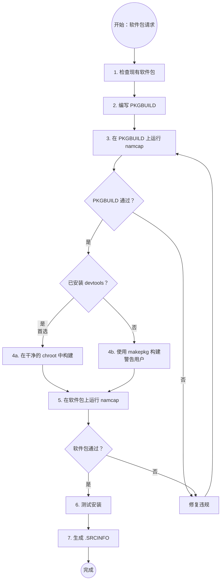

# Arch Linux PKGBUILD 高级流程与构建

面向完整打包流程、依赖与架构处理、构建与验证执行的详细参考。


# Arch Linux PKGBUILD 创建指南

## 概述

**PKGBUILD 文件是 Arch Linux 软件包构建脚本，具有严格的验证要求。** 本技能确保符合 Arch 软件包指南、FHS（文件系统层次结构标准）以及强制的 namcap 测试。

**核心原则：** 每个 PKGBUILD 在部署前 MUST（必须）通过 PKGBUILD 文件和生成的软件包的 namcap 验证。

## 可用的子技能

本技能针对不同软件包类型拆分为专门的子技能：

| 子技能 | 使用场景 |
|-----------|----------|
| **archlinux-pkgbuild/vcs-packages** | 创建 VCS 软件包（Git、SVN、CVS、Mercurial、Bazaar），包含 pkgver() 函数 |
| **archlinux-pkgbuild/systemd-services** | 处理 systemd 服务、用户管理（DynamicUser 与 sysusers.d 对比）、tmpfiles.d 清理、服务沙盒化、转换非 systemd 启动脚本 |
| **archlinux-pkgbuild/compiled-languages** | 打包编译型语言（Go、Rust、Haskell、OCaml、Free Pascal、Java），包含语言特定的构建标志和安装模式 |
| **archlinux-pkgbuild/interpreted-languages** | 打包解释型语言（Node.js、Python、Ruby、PHP、Perl、R、Shell 脚本、Lisp），包含包管理器和模块安装 |
| **archlinux-pkgbuild/build-systems** | 使用 CMake 或 Meson 构建系统 - CMAKE_INSTALL_PREFIX、CMAKE_BUILD_TYPE、RPATH 处理、meson setup/compile 模式 |
| **archlinux-pkgbuild/cross-platform** | 打包跨平台兼容层（Wine、MinGW、Electron、CLR/.NET），包含 WINEPREFIX、mingw-w64、electron-builder、Mono 运行时 |
| **archlinux-pkgbuild/desktop-integration** | 打包桌面环境集成（GNOME、KDE、Eclipse、字体软件包），包含 GSettings schemas、KDE 框架、fontconfig |
| **archlinux-pkgbuild/system-packages** | 打包系统级组件（DKMS 模块、内核模块、lib32、非自由软件、Web 应用、分割软件包），包含专门的安装要求 |

**根据需要加载子技能** 使用技能工具处理这些专门的软件包类型。

## 强制工作流程



## 构建方法：Clean Chroot 与直接 makepkg 对比

**首选方法：Clean Chroot 构建**

在 clean chroot 中构建可以防止：
- 缺少依赖（系统中不需要的链接）
- 不完整的 `depends=()` 数组
- 在已安装测试软件包的情况下为稳定仓库构建

**何时使用每种方法：**

| 方法 | 使用场景 | 要求 |
|--------|-------------|--------------|
| **Clean chroot**（首选） | AUR 提交、官方打包、确保正确的依赖 | 已安装 `devtools` 软件包 |
| **直接 makepkg**（后备） | 快速本地构建、原型设计、devtools 不可用时 | 仅需 `base-devel` |

**重要：如果使用直接 makepkg，ALWAYS（始终）警告用户该软件包 NOT（未）在 clean chroot 中构建，可能包含不正确的依赖。**

### Clean Chroot 快速入门

**一键构建（推荐大多数用户使用）：**

```bash
# 用于 AUR/extra 软件包（最常见）
extra-x86_64-build

# 脚本会自动：
# - 在 /var/lib/archbuild/ 中创建 chroot（如需要）
# - 更新 chroot
# - 在隔离环境中构建软件包
# - 需要时使用 -c 标志重置 chroot
```

**可用的构建脚本：**

| 目标仓库 | 命令 | 使用场景 |
|-------------------|---------|-------------|
| extra (稳定版) | `extra-x86_64-build` | 大多数 AUR 软件包、稳定构建 |
| extra-testing | `extra-testing-x86_64-build` | 测试预发布软件包 |
| multilib (32位) | `multilib-build` | 32位兼容软件包 |
| multilib-testing | `multilib-testing-build` | 测试 32位软件包 |

**常用标志：**
- `-c` : 构建前清理/重置 chroot（在损坏后使用）
- `-I package.pkg.tar.zst` : 预安装自定义依赖

**使用自定义依赖的示例：**
```bash
# 构建依赖于另一个自定义软件包的软件包
extra-x86_64-build -- -I ~/custom-dep-1.0-1-x86_64.pkg.tar.zst
```


有关高级手动 chroot 设置，请参阅 clean-chroot-reference.zh-CN.md（自定义位置、自定义配置）。


### 后备方案：直接 makepkg 构建

**仅在 clean chroot 不可用时使用。**

```bash
# 构建软件包
makepkg -f

# 重要：构建后，ALWAYS（始终）通知用户：
echo "⚠️  警告：使用直接 makepkg 构建（NOT（未）在 clean chroot 中）"
echo "⚠️  依赖可能不完整或不正确"
echo "⚠️  用于生产用途时，请安装 'devtools' 并在 clean chroot 中重新构建"
```

**何时可以接受：**
- 本地开发/测试
- 快速原型设计
- 无分发软件包的计划

**何时不能接受：**
- AUR 提交
- 分发给他人
- 官方打包

## PKGBUILD 结构模板

**有关完整的注释模板，请参阅本目录中的 `pkgbuild-template.sh`。**

**快速结构概述：**
- **变量**：pkgname、pkgver、pkgrel、pkgdesc、arch、url、license、depends、makedepends
- **prepare()**：打补丁、修复路径（可选）
- **build()**：编译源代码（通常必需）
- **check()**：运行测试套件（可选但推荐）
- **package()**：安装到 $pkgdir（强制）

## 快速参考：关键要求

| 要求 | 规则 | 违规示例 |
|-------------|------|-------------------|
| **路径** | NEVER（绝不）使用 /usr/local/，ALWAYS（始终）使用 /usr/ | /usr/local/bin → /usr/bin |
| **系统位置** | 供应商配置放到 /usr/lib/，NOT（不要放到）/etc/ | /etc/sysusers.d/ → /usr/lib/sysusers.d/ |
| **文件命名** | 在系统配置中使用软件包名称 | device.rules → 99-$pkgname.rules |
| **依赖** | 列出 ALL（所有）直接依赖（不包括传递性依赖） | 缺少运行时库依赖 |
| **架构** | 编译包：'x86_64 aarch64'（测试两个），二进制包：所有可用架构 | 仅 'x86_64'，当支持多个架构时 |
| **校验和** | 使用 sha256sums 或 sha512sums | 仅使用 md5sums |
| **optdepends** | 格式：'pkg: description' | 'pkg' 缺少描述 |
| **pkgdesc** | 约 80 个字符，不包含软件包名称 | "example is a tool..." |
| **验证** | namcap PKGBUILD + 软件包（必需），namcap -i（推荐） | 跳过 namcap 测试 |
| **变量** | 引用："$pkgdir" "$srcdir" | $pkgdir/usr（未引用） |
| **License** | SPDX 格式 | 'GPLv3' 而不是 'GPL3' |
| **Email** | 在注释中混淆 | user@domain.com → user at domain dot com |
| **配置文件** | 在 backup=() 数组中列出 | 用户修改在升级时被覆盖 |
| **Desktop 文件** | GUI 应用需要在 /usr/share/applications/ 中的 .desktop | 应用不会出现在菜单中 |
| **多架构** | 编译包：尽可能提供 x86_64 + aarch64 | 无理由只支持单一架构 |
| **二进制架构** | 匹配上游二进制包的可用性 | 声称架构支持但没有对应二进制 |

## 分步实现

### 步骤 1：检查现有软件包

**在创建任何 PKGBUILD 之前：**

```bash
# 检查官方仓库
pacman -Ss package-name

# 检查 AUR
yay -Ss package-name  # 或 paru -Ss
# 或访问：https://aur.archlinux.org/packages/?K=package-name
```

**如果软件包存在：**
- 官方仓库：DO NOT（不要）创建 PKGBUILD（使用现有的）
- AUR 存在：检查是否可以改进或使用不同的名称并添加 conflicts=()

### 步骤 2：创建 PKGBUILD

**强制字段：**
- pkgname、pkgver、pkgrel、arch、pkgdesc、url、license
- source、checksums（sha256sums 或 sha512sums）
- depends（如果有运行时依赖）
- package() 函数

**可选但推荐的字段：**
- install="$pkgname.install" : 指定包含用户说明的安装后脚本

**软件包命名约定：**
- VCS 软件包：后缀 -git、-svn、-hg、-bzr、-cvs、-darcs（请参阅 **archlinux-pkgbuild/vcs-packages** 子技能）
- 预构建二进制文件：后缀 -bin（当源代码可用时）
- Python 软件包：python-pkgname（请参阅 **archlinux-pkgbuild/interpreted-languages 或 archlinux-pkgbuild/compiled-languages** 子技能）
- 语言特定：有关命名约定，请参阅 **archlinux-pkgbuild/interpreted-languages 或 archlinux-pkgbuild/compiled-languages** 子技能
- 全部小写，无前导连字符/点

**依赖类型：**
- `depends=()` : 运行时要求（库、解释器）
- `makedepends=()` : 仅构建时（编译器、构建工具）
- `checkdepends=()` : 测试套件要求
- `optdepends=()` : 可选功能 ('package: what it enables')

**使用工具查找依赖：**
```bash
# 查找库依赖
find-libdeps /path/to/built/files

# 替代方案：使用 ldd 检查
ldd /path/to/binary

# 查找提供的库
find-libprovides /path/to/built/files
```

**重要：验证软件包可用性**

在最终确定 PKGBUILD 之前，**MUST（必须）**验证所有依赖是否存在：

```bash
# 检查官方仓库
pacman -Ss package-name

# 检查 AUR（使用 yay 或 paru）
yay -Ss package-name
# 或
paru -Ss package-name

# 一次性验证所有依赖
for pkg in depend1 depend2 makedepend1 optdepend1; do
    pacman -Ss "^$pkg$" || yay -Ss "^$pkg$" || echo "MISSING: $pkg"
done
```

**规则：**

### 架构支持

**对于编译包（从源代码构建）：**

尽可能提供 `x86_64` 和 `aarch64` 支持：

```bash
# 编译包的 PKGBUILD
arch=('x86_64' 'aarch64')

# 特定架构的源代码（如需要）
source_x86_64=("https://example.com/deps-x86_64.tar.gz")
source_aarch64=("https://example.com/deps-aarch64.tar.gz")
sha256sums_x86_64=('...')
sha256sums_aarch64=('...')
```

**编译包的关键注意事项：**
- 在开发过程中，你只能测试当前架构
- **务必在提交到 AUR 之前，请求用户在另一架构上测试**
- 在你的响应中包含提示："⚠️ 请在提交到 AUR 之前在 [其他架构] 上测试此 PKGBUILD"
- 如果用户无法测试两个架构，仅使用已测试的架构（例如 `arch=('x86_64')`）

**对于二进制包（预构建的二进制文件）：**

提供上游分发的所有架构的二进制文件：

```bash
# 二进制包的 PKGBUILD（示例：Visual Studio Code）
arch=('x86_64' 'aarch64' 'armv7h')  # 所有有上游二进制的架构

# 特定架构的源 URL
source_x86_64=("https://update.code.visualstudio.com/latest/linux-x64/stable")
source_aarch64=("https://update.code.visualstudio.com/latest/linux-arm64/stable")
source_armv7h=("https://update.code.visualstudio.com/latest/linux-armhf/stable")

# 特定架构的校验和
sha256sums_x86_64=('SKIP')  # 或实际校验和
sha256sums_aarch64=('SKIP')
sha256sums_armv7h=('SKIP')
```

**真实世界的二进制包示例：**
- 参见：https://aur.archlinux.org/cgit/aur.git/tree/PKGBUILD?h=visual-studio-code-bin
- 展示了带有特定架构源的多架构二进制打包

**架构选择规则：**

| 包类型 | arch=() 值 | 何时使用 |
|--------|------------|----------|
| **脚本/解释型** | `arch=('any')` | Shell 脚本、Python、Node.js、纯数据包 |
| **编译型（源代码）** | `arch=('x86_64' 'aarch64')` | 推荐 - 提交到 AUR 之前测试两个架构 |
| **编译型（仅测试单一架构）** | `arch=('x86_64')` | 仅测试/可用一个架构时 |
| **二进制（上游分发）** | `arch=('x86_64' 'aarch64' ...)` | 所有有上游二进制的架构 |
| **二进制（仅单一架构）** | `arch=('x86_64')` | 上游仅提供一个架构 |

**多架构编译包的测试工作流：**
1. 在你的主要架构上开发 PKGBUILD（例如 x86_64）
2. 构建并测试：`extra-x86_64-build` 或 `extra-aarch64-build`
3. **提交到 AUR 之前**：请求用户在其他架构上测试
4. 如果用户无法测试：从 `arch=()` 数组中删除未测试的架构
5. 如需要，在注释中记录架构限制
- 每个 `depends=()`、`makedepends=()` 和 `optdepends=()` 条目 MUST（必须）存在于官方仓库或 AUR 中
- 使用确切的软件包名称（检查 `pacman -Ss` 或 `aur.archlinux.org`）
- 对于 AUR 依赖，请在注释中记录（AUR 软件包无法自动安装）
- 无效的依赖 = namcap 错误 + 安装失败


### 步骤 3：FHS 合规性和系统软件包位置

**有关详细的 FHS 路径和供应商配置规则**，请参阅本目录中的 **fhs-and-vendor-config.zh-CN.md**。

**关键快速参考：**

| 类型 | 正确 | 错误 |
|------|---------|-------|
| 二进制文件 | `/usr/bin` | `/usr/local/bin` |
| 系统服务 | `/usr/lib/systemd/system/` | `/etc/systemd/system/` |
| Sysusers/tmpfiles | `/usr/lib/{sysusers,tmpfiles}.d/` | `/etc/{sysusers,tmpfiles}.d/` |
| Udev 规则 | `/usr/lib/udev/rules.d/` | `/etc/udev/rules.d/` |

**关键规则：** 供应商配置放到 `/usr/lib/`，用户覆盖放到 `/etc/`。

### 步骤 4：校验和

**生成校验和：**
```bash
# 简单方法：自动更新校验和
updpkgsums

# 手动方法：下载并计算
makepkg -g >> PKGBUILD  # 追加校验和
```

**校验和类型（优先使用更强的）：**
- `sha512sums`（最佳）
- `sha256sums`（良好）
- `b2sums`（Blake2，也不错）
- ~~`md5sums`~~（弱，避免使用）

**对 VCS 源使用 SKIP：**
```bash
source=("git+https://github.com/user/repo.git")
sha256sums=('SKIP')
```

### 步骤 5：构建软件包

**根据可用性选择构建方法：**

```bash
# 检查是否安装了 devtools
if command -v extra-x86_64-build &> /dev/null; then
    # 首选：Clean chroot 构建
    extra-x86_64-build
    echo "✓ 在 clean chroot 中构建（依赖已验证）"
else
    # 后备：直接构建并警告
    makepkg -f
    echo "⚠️  警告：使用直接 makepkg 构建（NOT（未）在 clean chroot 中）"
    echo "⚠️  依赖可能不完整。安装 'devtools' 以进行 clean 构建。"
fi
```

**对于自定义依赖（仅限 clean chroot）：**
```bash
extra-x86_64-build -- -I custom-package-1.0-1-x86_64.pkg.tar.zst
```

### 步骤 6：使用 namcap 验证

**强制验证步骤：**

```bash
# 1. 检查 PKGBUILD
namcap PKGBUILD

# 2. 检查生成的软件包
namcap *.pkg.tar.zst

# 3. 详细分析（推荐）
namcap -i PKGBUILD
namcap -i *.pkg.tar.zst
```

**重要：如果 namcap 报告错误，DO NOT（不要）继续。**

**有关全面的验证程序、错误解释和修复：**
请参阅 validation-guide.zh-CN.md

### 步骤 7：测试安装

```bash
# 本地安装
sudo pacman -U *.pkg.tar.zst

# 测试功能
$pkgname --version
$pkgname --help

# 检查已安装的文件
pacman -Ql $pkgname

# 验证依赖（clean chroot 构建应该是正确的）
pacman -Qi $pkgname | grep Depends

# 测试后移除
sudo pacman -R $pkgname
```

