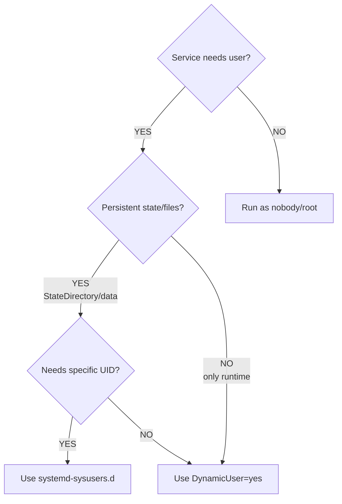

# Systemd Services for Arch Packages

**Comprehensive systemd integration for Arch Linux packages.**

## Overview

This skill covers systemd-specific packaging concerns:
- User management (DynamicUser vs sysusers.d)
- tmpfiles.d for directory management and automatic cleanup
- Comprehensive service sandboxing checklist
- Converting OpenRC/sysvinit/runit scripts to systemd

## When to Use This Skill

- Packaging daemons/services that need systemd units
- Services requiring dedicated users or dynamic users
- Services needing directory management or automatic cleanup
- Converting non-systemd init scripts
- Services requiring comprehensive sandboxing
- Packages with user-modifiable configuration files in /etc

## Quick Reference

| Task | Solution | Tool |
|------|----------|------|
| Runtime-only service | DynamicUser=yes + RuntimeDirectory= | systemd service |
| Persistent state service | systemd-sysusers.d + StateDirectory= | /usr/lib/sysusers.d/ |
| Directory + automatic cleanup | tmpfiles.d with Age field | /usr/lib/tmpfiles.d/ |
| Service hardening | Apply sandboxing checklist | systemd service [Service] section |
| OpenRC conversion | Map directives + add sandboxing | systemd service |
| User config files | backup=() array in PKGBUILD | PKGBUILD |

---

## Systemd User Management

**When packaging services that need dedicated users, prefer DynamicUser over manual user creation.**

### Decision: DynamicUser vs sysusers.d



**Use DynamicUser=yes when:**
- Service only needs runtime directories (/run, /tmp, /var/cache)
- No persistent state across reboots
- UID can be dynamically allocated
- Service doesn't need to own files created outside systemd

**Use systemd-sysusers.d when:**
- Service needs to own persistent files (data, logs across reboots)
- Specific UID/GID required for file ownership
- Service interacts with files created by other tools
- Pre-existing files need ownership assigned during install

### DynamicUser Example

```bash
# In systemd service file
[Service]
DynamicUser=yes
StateDirectory=myapp        # Creates /var/lib/myapp with dynamic UID
CacheDirectory=myapp        # Creates /var/cache/myapp with dynamic UID
LogsDirectory=myapp         # Creates /var/log/myapp with dynamic UID
RuntimeDirectory=myapp      # Creates /run/myapp with dynamic UID
```

**No .install script needed!** Systemd handles everything.

### systemd-sysusers.d Example

**When DynamicUser is insufficient**, use systemd-sysusers.d:

```bash
# In PKGBUILD
package() {
    # Install sysusers.d config (CORRECT PATH: /usr/lib/, not /etc/)
    install -Dm644 "$srcdir/myapp.sysusers" "$pkgdir/usr/lib/sysusers.d/myapp.conf"
    
    # Install service
    install -Dm644 myapp.service "$pkgdir/usr/lib/systemd/system/myapp.service"
}
```

**Create myapp.sysusers file:**
```
#Type Name     ID    GECOS              Home directory    Shell
u     myapp    198   "MyApp Daemon"     /var/lib/myapp    /usr/bin/nologin
```

**Corresponding service file:**
```ini
[Service]
User=myapp
Group=myapp
StateDirectory=myapp        # Creates /var/lib/myapp owned by myapp:myapp
RuntimeDirectory=myapp      # Creates /run/myapp owned by myapp:myapp
```

**DO NOT create .install scripts** for user management when using systemd-sysusers.d. The system handles it automatically.

**Resources:**
- DynamicUser: https://man.archlinux.org/man/systemd.exec.5#DynamicUser=
- systemd-sysusers: https://man.archlinux.org/man/systemd-sysusers.8

---

## Systemd tmpfiles.d

**Use systemd-tmpfiles.d for directory management and automatic cleanup, not separate timers or .install scripts.**

### When to Use tmpfiles.d

- Creating runtime directories (/run, /tmp)
- Creating persistent directories with specific permissions
- **Automatic cleanup** of old files (cache, logs, temp files)
- Setting permissions/ownership on boot

### tmpfiles.d Syntax Reference

```
# Type  Path                Mode  User   Group  Age          Argument
d       /run/myapp          0755  myapp  myapp  -            -
d       /var/cache/myapp    0750  myapp  myapp  7d           -
d       /var/log/myapp      0750  myapp  myapp  30d          *.log
L       /usr/bin/app        -     -      -      -            /opt/app/bin/app
```

| Type | Meaning | Use Case |
|------|---------|----------|
| `d` | Create directory | Most common: create dirs with permissions |
| `D` | Create+cleanup dir | Less common: directory that also follows Age cleanup |
| `L` | Create symlink | Create symbolic links |
| `f` | Create file | Create empty files with specific permissions |
| `z` | Adjust permissions | Fix perms without recreating |

**Age field (6th column):**
- `-` : No cleanup
- `7d` : Delete files older than 7 days
- `30d` : Delete files older than 30 days
- `12h` : Delete files older than 12 hours

### CORRECT Approach: Age Field for Cleanup

**BAD - separate timer service:**
```bash
# DON'T DO THIS - creates unnecessary complexity
# cleanup.service + cleanup.timer + cleanup.sh script
```

**GOOD - tmpfiles.d with Age:**
```
#Type  Path                Mode  User   Group  Age     Argument
d      /var/cache/myapp    0750  myapp  myapp  7d      -
d      /var/log/myapp      0750  myapp  myapp  30d     *.log
```

This automatically:
- Creates directories at boot with correct permissions
- Cleans up old files daily (via systemd-tmpfiles-clean.timer)
- No separate service/timer/script needed

### PKGBUILD Integration

```bash
package() {
    # Install tmpfiles.d config (CORRECT PATH: /usr/lib/, not /etc/)
    install -Dm644 "$srcdir/myapp.tmpfiles" \
        "$pkgdir/usr/lib/tmpfiles.d/myapp.conf"
}
```

**Create myapp.tmpfiles:**
```
# Runtime directory
d /run/myapp 0755 myapp myapp - -

# Cache with 7-day cleanup
d /var/cache/myapp 0750 myapp myapp 7d -

# Logs with 30-day cleanup of *.log files
d /var/log/myapp 0750 myapp myapp 30d *.log
```

**DON'T duplicate with RuntimeDirectory/StateDirectory** in service files - choose ONE approach:
- tmpfiles.d: When you need Age-based cleanup or complex permissions
- Service directives (RuntimeDirectory=): When simple directory creation is sufficient

**Resource:** https://man.archlinux.org/man/systemd-tmpfiles.8.en

---

## Systemd Service Sandboxing

**ALWAYS apply comprehensive sandboxing to systemd services.** Use this checklist systematically.

### Sandboxing Checklist

**Apply EVERY applicable option from this checklist:**

```bash
[Service]
# === Filesystem Protection ===
ProtectSystem=strict          # Mount /usr, /boot, /efi read-only
ProtectHome=yes              # Deny access to /home, /root
ReadWritePaths=/var/lib/myapp /var/log/myapp  # Explicit write access only where needed
PrivateTmp=yes               # Private /tmp and /var/tmp
PrivateDevices=yes           # Deny access to physical devices

# === Kernel Protection ===
ProtectKernelTunables=yes    # Read-only /proc/sys, /sys
ProtectKernelModules=yes     # Block kernel module loading
ProtectKernelLogs=yes        # Block kernel log access
ProtectControlGroups=yes     # Read-only cgroup filesystem

# === Process Restrictions ===
NoNewPrivileges=yes          # Prevent privilege escalation
PrivateMounts=yes            # Private mount namespace
RestrictRealtime=yes         # Block realtime scheduling
RestrictSUIDSGID=yes         # Ignore SUID/SGID on binaries
LockPersonality=yes          # Prevent personality() syscall

# === Network Restrictions ===
RestrictAddressFamilies=AF_INET AF_INET6 AF_UNIX  # Only allow needed address families
# For local-only services: RestrictAddressFamilies=AF_UNIX

# === Syscall Filtering ===
SystemCallFilter=@system-service  # Only allow safe syscalls for services
SystemCallFilter=~@privileged @resources  # Block privileged/resource-intensive syscalls
SystemCallErrorNumber=EPERM      # Return EPERM for blocked syscalls

# === Capability Restrictions ===
CapabilityBoundingSet=          # Drop ALL capabilities (if none needed)
# OR if specific capability needed:
CapabilityBoundingSet=CAP_NET_BIND_SERVICE  # Only if binding to port <1024
AmbientCapabilities=CAP_NET_BIND_SERVICE    # Same as CapabilityBoundingSet

# === Miscellaneous Hardening ===
RestrictNamespaces=yes          # Block namespace creation
UMask=0077                      # Restrictive default file permissions
```

### Sandboxing Decision Tree

**For web services (HTTP/HTTPS):**
```ini
RestrictAddressFamilies=AF_INET AF_INET6 AF_UNIX
CapabilityBoundingSet=CAP_NET_BIND_SERVICE  # If port <1024
ReadWritePaths=/var/lib/myapp /var/log/myapp
```

**For local-only services (no network):**
```ini
RestrictAddressFamilies=AF_UNIX  # Unix sockets only
PrivateNetwork=yes               # Completely isolate network
```

**For services that write files:**
```ini
ProtectSystem=strict
ReadWritePaths=/var/lib/myapp /var/log/myapp /var/cache/myapp
# Do NOT use ProtectSystem=full if service needs to write anywhere
```

### Common Pitfalls

| Mistake | Impact | Fix |
|---------|--------|-----|
| Forgetting ReadWritePaths= with ProtectSystem=strict | Service can't write logs/data | Add explicit ReadWritePaths= |
| Using @system-service + @privileged | Allows dangerous syscalls | Use ~@privileged to deny |
| Granting CAP_SYS_ADMIN | Nearly full root access | Find specific capability needed |
| No RestrictAddressFamilies | Service can use any network protocol | Restrict to needed families only |

### Testing Sandboxing

```bash
# Analyze service security
systemd-analyze security myapp.service

# Check what the service can actually access
sudo -u myapp ls /home  # Should fail if ProtectHome=yes
```

**Resource:** https://wiki.archlinux.org/title/Systemd/Sandboxing

---

## Converting Non-Systemd Init Scripts

**When upstream provides sysvinit/OpenRC/runit scripts but NO systemd service, convert them.**

### OpenRC → systemd Conversion Table

| OpenRC Directive | systemd Equivalent | Notes |
|------------------|-------------------|-------|
| `command=` | `ExecStart=` | Direct mapping |
| `command_args=` | Append to ExecStart= | Combine: `ExecStart=/usr/bin/app --arg1 --arg2` |
| `pidfile=` | `PIDFile=` | Use with `Type=forking` |
| `command_user=` | `User=` / `Group=` | Split into two directives |
| `directory=` | `WorkingDirectory=` | Direct mapping |
| `need net` | `Wants=network-online.target After=network-online.target` | Soft dependency (preferred) |
| `need net` (critical) | `Requires=network-online.target After=network-online.target` | Hard dependency (rare) |
| `use dns` | `After=nss-lookup.target` | Name resolution available |
| `after firewall` | `After=firewall.service` (if applicable) | Check firewall package |
| `checkpath --directory` | `RuntimeDirectory=` / `StateDirectory=` | Automatic creation with correct perms |

### Conversion Workflow

1. **Map dependencies:**
   - `need X` → `Wants=X After=X` (soft, preferred) OR `Requires=X After=X` (hard, avoid unless critical)
   - `use X` → `After=X` (ordering only)
   - Network: ALWAYS use `Wants=network-online.target After=network-online.target` (not `After=network.target`)

2. **Replace checkpath with systemd directives:**
   ```bash
   # OpenRC:
   checkpath --directory --mode 0755 --owner myapp:myapp /run/myapp
   
   # systemd:
   RuntimeDirectory=myapp  # Automatically creates /run/myapp with User/Group ownership
   RuntimeDirectoryMode=0755
   ```

3. **Determine service Type:**
   - `Type=simple` - Process doesn't fork (most common)
   - `Type=forking` - Process forks to background (if pidfile= present)
   - `Type=oneshot` - Runs once and exits (scripts, not daemons)

4. **Add sandboxing:** Apply full sandboxing checklist (see previous section)

### Example Conversion

**OpenRC init script:**
```bash
#!/sbin/openrc-run
name="myapp"
command="/usr/bin/myapp"
command_args="--config /etc/myapp/config.conf"
pidfile="/run/myapp.pid"
command_user="myapp:myapp"

depend() {
    need net
    use dns
    after firewall
}

start_pre() {
    checkpath --directory --mode 0755 --owner myapp:myapp /run/myapp
    checkpath --directory --mode 0750 --owner myapp:myapp /var/lib/myapp
}
```

**Converted systemd service:**
```ini
[Unit]
Description=MyApp Daemon
After=network-online.target nss-lookup.target
Wants=network-online.target

[Service]
Type=forking
PIDFile=/run/myapp/myapp.pid
User=myapp
Group=myapp
ExecStart=/usr/bin/myapp --config /etc/myapp/config.conf
RuntimeDirectory=myapp
RuntimeDirectoryMode=0755
StateDirectory=myapp
StateDirectoryMode=0750

# Sandboxing
ProtectSystem=strict
ProtectHome=yes
PrivateTmp=yes
NoNewPrivileges=yes
ReadWritePaths=/var/lib/myapp
RestrictAddressFamilies=AF_INET AF_INET6 AF_UNIX

[Install]
WantedBy=multi-user.target
```

**Key improvements over direct conversion:**
- Soft network dependency (Wants= not Requires=)
- Automatic directory management (no manual checkpath)
- Comprehensive sandboxing applied

---

