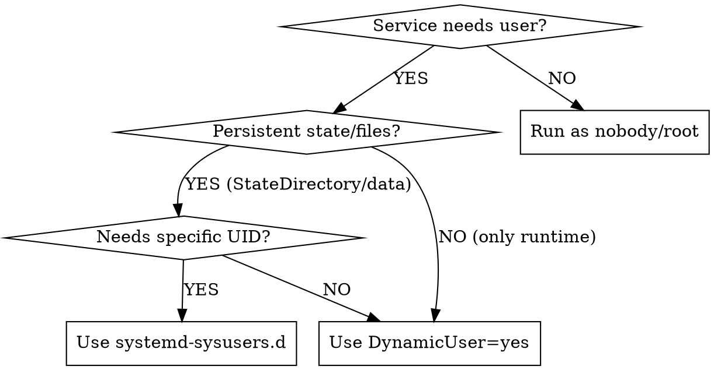

# Arch 软件包的 Systemd 服务

**Arch Linux 软件包的全面 systemd 集成。**

## 概述

本技能涵盖 systemd 特定的打包问题：
- 用户管理（DynamicUser 与 sysusers.d 对比）
- 用于目录管理和自动清理的 tmpfiles.d
- 全面的服务沙盒化检查清单
- 将 OpenRC/sysvinit/runit 脚本转换为 systemd

## 何时使用本技能

- 打包需要 systemd 单元的守护进程/服务
- 需要专用用户或动态用户的服务
- 需要目录管理或自动清理的服务
- 转换非 systemd 启动脚本
- 需要全面沙盒化的服务
- 在 /etc 中具有用户可修改配置文件的软件包

## 快速参考

| 任务 | 解决方案 | 工具 |
|------|----------|------|
| 仅运行时服务 | DynamicUser=yes + RuntimeDirectory= | systemd 服务 |
| 持久状态服务 | systemd-sysusers.d + StateDirectory= | /usr/lib/sysusers.d/ |
| 目录 + 自动清理 | 带 Age 字段的 tmpfiles.d | /usr/lib/tmpfiles.d/ |
| 服务加固 | 应用沙盒化检查清单 | systemd 服务 [Service] 部分 |
| OpenRC 转换 | 映射指令 + 添加沙盒化 | systemd 服务 |
| 用户配置文件 | PKGBUILD 中的 backup=() 数组 | PKGBUILD |

---

## Systemd 用户管理

**当打包需要专用用户的服务时，优先选择 DynamicUser 而不是手动用户创建。**

### 决策：DynamicUser 与 sysusers.d 对比



**何时使用 DynamicUser=yes：**
- 服务仅需要运行时目录（/run、/tmp、/var/cache）
- 跨重启无持久状态
- UID 可以动态分配
- 服务不需要拥有 systemd 外部创建的文件

**何时使用 systemd-sysusers.d：**
- 服务需要拥有持久文件（跨重启的数据、日志）
- 文件所有权需要特定的 UID/GID
- 服务与其他工具创建的文件交互
- 需要在安装期间分配现有文件的所有权

### DynamicUser 示例

```bash
# 在 systemd 服务文件中
[Service]
DynamicUser=yes
StateDirectory=myapp        # 使用动态 UID 创建 /var/lib/myapp
CacheDirectory=myapp        # 使用动态 UID 创建 /var/cache/myapp
LogsDirectory=myapp         # 使用动态 UID 创建 /var/log/myapp
RuntimeDirectory=myapp      # 使用动态 UID 创建 /run/myapp
```

**不需要 .install 脚本！** Systemd 处理一切。

### systemd-sysusers.d 示例

**当 DynamicUser 不足时**，使用 systemd-sysusers.d：

```bash
# 在 PKGBUILD 中
package() {
    # 安装 sysusers.d 配置（正确路径：/usr/lib/，不是 /etc/）
    install -Dm644 "$srcdir/myapp.sysusers" "$pkgdir/usr/lib/sysusers.d/myapp.conf"
    
    # 安装服务
    install -Dm644 myapp.service "$pkgdir/usr/lib/systemd/system/myapp.service"
}
```

**创建 myapp.sysusers 文件：**
```
#Type Name     ID    GECOS              Home directory    Shell
u     myapp    198   "MyApp Daemon"     /var/lib/myapp    /usr/bin/nologin
```

**相应的服务文件：**
```ini
[Service]
User=myapp
Group=myapp
StateDirectory=myapp        # 创建 /var/lib/myapp 由 myapp:myapp 拥有
RuntimeDirectory=myapp      # 创建 /run/myapp 由 myapp:myapp 拥有
```

**DO NOT（不要）创建 .install 脚本** 用于使用 systemd-sysusers.d 时的用户管理。系统会自动处理。

**资源：**
- DynamicUser：https://man.archlinux.org/man/systemd.exec.5#DynamicUser=
- systemd-sysusers：https://man.archlinux.org/man/systemd-sysusers.8

---

## Systemd tmpfiles.d

**使用 systemd-tmpfiles.d 进行目录管理和自动清理，而不是单独的定时器或 .install 脚本。**

### 何时使用 tmpfiles.d

- 创建运行时目录（/run、/tmp）
- 创建具有特定权限的持久目录
- **自动清理**旧文件（缓存、日志、临时文件）
- 在启动时设置权限/所有权

### tmpfiles.d 语法参考

```
# Type  Path                Mode  User   Group  Age          Argument
d       /run/myapp          0755  myapp  myapp  -            -
d       /var/cache/myapp    0750  myapp  myapp  7d           -
d       /var/log/myapp      0750  myapp  myapp  30d          *.log
L       /usr/bin/app        -     -      -      -            /opt/app/bin/app
```

| 类型 | 含义 | 使用场景 |
|------|---------|----------|
| `d` | 创建目录 | 最常见：创建具有权限的目录 |
| `D` | 创建+清理目录 | 较少见：也遵循 Age 清理的目录 |
| `L` | 创建符号链接 | 创建符号链接 |
| `f` | 创建文件 | 创建具有特定权限的空文件 |
| `z` | 调整权限 | 在不重新创建的情况下修复权限 |

**Age 字段（第 6 列）：**
- `-` : 不清理
- `7d` : 删除超过 7 天的文件
- `30d` : 删除超过 30 天的文件
- `12h` : 删除超过 12 小时的文件

### 正确方法：使用 Age 字段进行清理

**不好 - 单独的定时器服务：**
```bash
# DON'T（不要）这样做 - 创建不必要的复杂性
# cleanup.service + cleanup.timer + cleanup.sh 脚本
```

**好 - 带 Age 的 tmpfiles.d：**
```
#Type  Path                Mode  User   Group  Age     Argument
d      /var/cache/myapp    0750  myapp  myapp  7d      -
d      /var/log/myapp      0750  myapp  myapp  30d     *.log
```

这自动：
- 在启动时创建具有正确权限的目录
- 每天清理旧文件（通过 systemd-tmpfiles-clean.timer）
- 不需要单独的服务/定时器/脚本

### PKGBUILD 集成

```bash
package() {
    # 安装 tmpfiles.d 配置（正确路径：/usr/lib/，不是 /etc/）
    install -Dm644 "$srcdir/myapp.tmpfiles" \
        "$pkgdir/usr/lib/tmpfiles.d/myapp.conf"
}
```

**创建 myapp.tmpfiles：**
```
# 运行时目录
d /run/myapp 0755 myapp myapp - -

# 带 7 天清理的缓存
d /var/cache/myapp 0750 myapp myapp 7d -

# 带 30 天清理 *.log 文件的日志
d /var/log/myapp 0750 myapp myapp 30d *.log
```

**DON'T（不要）与服务文件中的 RuntimeDirectory/StateDirectory 重复** - 选择 ONE（一种）方法：
- tmpfiles.d：当您需要基于 Age 的清理或复杂权限时
- 服务指令（RuntimeDirectory=）：当简单的目录创建足够时

**资源：** https://man.archlinux.org/man/systemd-tmpfiles.8.en

---

## Systemd 服务沙盒化

**ALWAYS（始终）将全面的沙盒化应用于 systemd 服务。** 系统地使用此检查清单。

### 沙盒化检查清单

**从此检查清单中应用 EVERY（每个）适用的选项：**

```bash
[Service]
# === 文件系统保护 ===
ProtectSystem=strict          # 以只读方式挂载 /usr、/boot、/efi
ProtectHome=yes              # 拒绝访问 /home、/root
ReadWritePaths=/var/lib/myapp /var/log/myapp  # 仅在需要的地方显式写入访问
PrivateTmp=yes               # 私有 /tmp 和 /var/tmp
PrivateDevices=yes           # 拒绝访问物理设备

# === 内核保护 ===
ProtectKernelTunables=yes    # 只读 /proc/sys、/sys
ProtectKernelModules=yes     # 阻止内核模块加载
ProtectKernelLogs=yes        # 阻止内核日志访问
ProtectControlGroups=yes     # 只读 cgroup 文件系统

# === 进程限制 ===
NoNewPrivileges=yes          # 防止权限提升
PrivateMounts=yes            # 私有挂载命名空间
RestrictRealtime=yes         # 阻止实时调度
RestrictSUIDSGID=yes         # 忽略二进制文件上的 SUID/SGID
LockPersonality=yes          # 防止 personality() 系统调用

# === 网络限制 ===
RestrictAddressFamilies=AF_INET AF_INET6 AF_UNIX  # 仅允许需要的地址族
# 对于仅本地服务：RestrictAddressFamilies=AF_UNIX

# === 系统调用过滤 ===
SystemCallFilter=@system-service  # 仅允许服务的安全系统调用
SystemCallFilter=~@privileged @resources  # 阻止特权/资源密集型系统调用
SystemCallErrorNumber=EPERM      # 为被阻止的系统调用返回 EPERM

# === 能力限制 ===
CapabilityBoundingSet=          # 删除 ALL（所有）能力（如果不需要）
# 或如果需要特定能力：
CapabilityBoundingSet=CAP_NET_BIND_SERVICE  # 仅当绑定到端口 <1024
AmbientCapabilities=CAP_NET_BIND_SERVICE    # 与 CapabilityBoundingSet 相同

# === 其他加固 ===
RestrictNamespaces=yes          # 阻止命名空间创建
UMask=0077                      # 限制默认文件权限
```

### 沙盒化决策树

**对于 Web 服务（HTTP/HTTPS）：**
```ini
RestrictAddressFamilies=AF_INET AF_INET6 AF_UNIX
CapabilityBoundingSet=CAP_NET_BIND_SERVICE  # 如果端口 <1024
ReadWritePaths=/var/lib/myapp /var/log/myapp
```

**对于仅本地服务（无网络）：**
```ini
RestrictAddressFamilies=AF_UNIX  # 仅 Unix 套接字
PrivateNetwork=yes               # 完全隔离网络
```

**对于写入文件的服务：**
```ini
ProtectSystem=strict
ReadWritePaths=/var/lib/myapp /var/log/myapp /var/cache/myapp
# 如果服务需要写入任何地方，不要使用 ProtectSystem=full
```

### 常见陷阱

| 错误 | 影响 | 修复 |
|---------|--------|-----|
| 忘记使用 ProtectSystem=strict 的 ReadWritePaths= | 服务无法写入日志/数据 | 添加显式 ReadWritePaths= |
| 使用 @system-service + @privileged | 允许危险的系统调用 | 使用 ~@privileged 拒绝 |
| 授予 CAP_SYS_ADMIN | 接近完整的 root 访问权限 | 找到需要的特定能力 |
| 没有 RestrictAddressFamilies | 服务可以使用任何网络协议 | 仅限制到需要的族 |

### 测试沙盒化

```bash
# 分析服务安全性
systemd-analyze security myapp.service

# 检查服务实际可以访问什么
sudo -u myapp ls /home  # 如果 ProtectHome=yes，应该失败
```

**资源：** https://wiki.archlinux.org/title/Systemd/Sandboxing

---

## 转换非 Systemd 启动脚本

**当上游提供 sysvinit/OpenRC/runit 脚本但没有 systemd 服务时，转换它们。**

### OpenRC → systemd 转换表

| OpenRC 指令 | systemd 等效 | 说明 |
|------------------|-------------------|-------|
| `command=` | `ExecStart=` | 直接映射 |
| `command_args=` | 追加到 ExecStart= | 组合：`ExecStart=/usr/bin/app --arg1 --arg2` |
| `pidfile=` | `PIDFile=` | 与 `Type=forking` 一起使用 |
| `command_user=` | `User=` / `Group=` | 拆分为两个指令 |
| `directory=` | `WorkingDirectory=` | 直接映射 |
| `need net` | `Wants=network-online.target After=network-online.target` | 软依赖（首选） |
| `need net` (critical) | `Requires=network-online.target After=network-online.target` | 硬依赖（罕见） |
| `use dns` | `After=nss-lookup.target` | 名称解析可用 |
| `after firewall` | `After=firewall.service`（如适用） | 检查防火墙软件包 |
| `checkpath --directory` | `RuntimeDirectory=` / `StateDirectory=` | 使用正确权限自动创建 |

### 转换工作流程

1. **映射依赖：**
   - `need X` → `Wants=X After=X`（软，首选）或 `Requires=X After=X`（硬，避免除非关键）
   - `use X` → `After=X`（仅排序）
   - 网络：ALWAYS（始终）使用 `Wants=network-online.target After=network-online.target`（不是 `After=network.target`）

2. **用 systemd 指令替换 checkpath：**
   ```bash
   # OpenRC：
   checkpath --directory --mode 0755 --owner myapp:myapp /run/myapp
   
   # systemd：
   RuntimeDirectory=myapp  # 自动创建 /run/myapp 由 User/Group 拥有
   RuntimeDirectoryMode=0755
   ```

3. **确定服务 Type：**
   - `Type=simple` - 进程不分叉（最常见）
   - `Type=forking` - 进程分叉到后台（如果存在 pidfile=）
   - `Type=oneshot` - 运行一次并退出（脚本，不是守护进程）

4. **添加沙盒化：** 应用完整的沙盒化检查清单（请参阅上一节）

### 转换示例

**OpenRC 启动脚本：**
```bash
#!/sbin/openrc-run
name="myapp"
command="/usr/bin/myapp"
command_args="--config /etc/myapp/config.conf"
pidfile="/run/myapp.pid"
command_user="myapp:myapp"

depend() {
    need net
    use dns
    after firewall
}

start_pre() {
    checkpath --directory --mode 0755 --owner myapp:myapp /run/myapp
    checkpath --directory --mode 0750 --owner myapp:myapp /var/lib/myapp
}
```

**转换后的 systemd 服务：**
```ini
[Unit]
Description=MyApp Daemon
After=network-online.target nss-lookup.target
Wants=network-online.target

[Service]
Type=forking
PIDFile=/run/myapp/myapp.pid
User=myapp
Group=myapp
ExecStart=/usr/bin/myapp --config /etc/myapp/config.conf
RuntimeDirectory=myapp
RuntimeDirectoryMode=0755
StateDirectory=myapp
StateDirectoryMode=0750

# 沙盒化
ProtectSystem=strict
ProtectHome=yes
PrivateTmp=yes
NoNewPrivileges=yes
ReadWritePaths=/var/lib/myapp
RestrictAddressFamilies=AF_INET AF_INET6 AF_UNIX

[Install]
WantedBy=multi-user.target
```

**相对于直接转换的关键改进：**
- 软网络依赖（Wants= 不是 Requires=）
- 自动目录管理（无手动 checkpath）
- 应用全面的沙盒化

---

