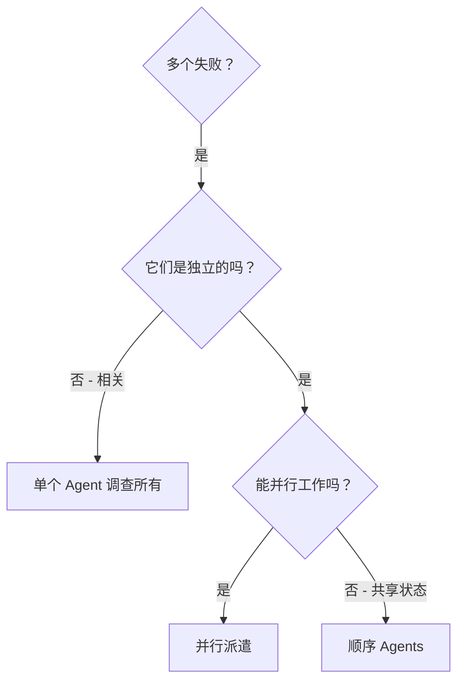

# 并行派遣 Agent

## 概述

当你有多个不相关的故障（不同的测试文件、不同的子系统、不同的 Bug）时，按顺序调查它们会浪费时间。每个调查都是独立的，可以并行进行。

**核心原则：** 每个独立的问题域派遣一个 Agent，让它们并发工作。

## 何时使用



**使用时机：**
- 3+ 个测试文件因不同根本原因而失败
- 多个子系统独立损坏
- 每个问题都可以在不依赖其他问题上下文的情况下理解
- 调查之间没有共享状态

**不要使用：**
- 故障相关（修复一个可能会修复其他）
- 需要理解完整的系统状态
- Agent 会相互干扰

## 模式

### 1. 识别独立域

按故障内容对失败进行分组：
- 文件 A 测试：工具审批流程
- 文件 B 测试：批量完成行为
- 文件 C 测试：中止功能

每个域都是独立的——修复工具审批不会影响中止测试。

### 2. 创建专注的 Agent 任务

每个 Agent 获得：
- **特定范围：** 一个测试文件或子系统
- **明确目标：** 让这些测试通过
- **约束条件：** 不要更改其他代码
- **预期输出：** 总结你发现和修复的内容

### 3. 并行派遣

```typescript
// 在 AI 环境中
Task("Fix agent-tool-abort.test.ts failures")
Task("Fix batch-completion-behavior.test.ts failures")
Task("Fix tool-approval-race-conditions.test.ts failures")
// 三个任务并发运行
```

### 4. 审查和集成

当 Agent 返回时：
- 阅读每个总结
- 验证修复没有冲突
- 运行完整测试套件
- 集成所有更改

## Agent 提示结构

好的 Agent 提示具有以下特点：
1. **专注** - 一个清晰的问题域
2. **自包含** - 理解问题所需的全部上下文
3. **明确的输出要求** - Agent 应该返回什么？

```markdown
修复 src/agents/agent-tool-abort.test.ts 中的 3 个失败测试：

1. "should abort tool with partial output capture" - 期望消息中包含 'interrupted at'
2. "should handle mixed completed and aborted tools" - 快速工具被中止而不是完成
3. "should properly track pendingToolCount" - 期望 3 个结果但得到 0

这些是时序/竞态条件问题。你的任务：

1. 阅读测试文件并理解每个测试验证的内容
2. 识别根本原因——是时序问题还是实际 Bug？
3. 通过以下方式修复：
   - 将任意超时替换为基于事件的等待
   - 如果发现中止实现的 Bug 则进行修复
   - 如果测试的是已更改的行为则调整测试期望

不要只是增加超时时间——找到真正的问题。

返回：总结你发现的内容和你修复的内容。
```

## 常见错误

**❌ 范围太广：** "修复所有测试" - Agent 会迷失方向
**✅ 具体：** "修复 agent-tool-abort.test.ts" - 范围聚焦

**❌ 没有上下文：** "修复竞态条件" - Agent 不知道在哪里
**✅ 有上下文：** 粘贴错误消息和测试名称

**❌ 没有约束：** Agent 可能会重构所有内容
**✅ 有约束：** "不要更改生产代码" 或 "仅修复测试"

**❌ 输出模糊：** "修复它" - 你不知道更改了什么
**✅ 明确：** "返回根本原因和更改的总结"

## 何时不使用

**相关故障：** 修复一个可能会修复其他——先一起调查
**需要完整上下文：** 理解需要查看整个系统
**探索性调试：** 你还不知道哪里坏了
**共享状态：** Agent 会相互干扰（编辑相同文件、使用相同资源）

## 会话中的真实示例

**场景：** 重大重构后 3 个文件中有 6 个测试失败

**故障：**
- agent-tool-abort.test.ts：3 个失败（时序问题）
- batch-completion-behavior.test.ts：2 个失败（工具未执行）
- tool-approval-race-conditions.test.ts：1 个失败（执行计数 = 0）

**决策：** 独立域——中止逻辑与批量完成和竞态条件分离

**派遣：**
```
Agent 1 → 修复 agent-tool-abort.test.ts
Agent 2 → 修复 batch-completion-behavior.test.ts
Agent 3 → 修复 tool-approval-race-conditions.test.ts
```

**结果：**
- Agent 1：将超时替换为基于事件的等待
- Agent 2：修复了事件结构 Bug（threadId 位置错误）
- Agent 3：添加了异步工具执行完成的等待

**集成：** 所有修复都是独立的，没有冲突，完整套件通过

**节省时间：** 3 个问题并行解决 vs 顺序解决

## 主要优势

1. **并行化** - 多个调查同时发生
2. **专注** - 每个 Agent 范围狭窄，需要跟踪的上下文更少
3. **独立性** - Agent 不会相互干扰
4. **速度** - 3 个问题在 1 个时间内解决

## 验证

Agent 返回后：
1. **审查每个总结** - 了解更改了什么
2. **检查冲突** - Agent 是否编辑了相同的代码？
3. **运行完整套件** - 验证所有修复一起工作
4. **抽查** - Agent 可能会犯系统性错误

## 实际影响

来自调试会话（2025-10-03）：
- 3 个文件中有 6 个失败
- 3 个 Agent 并行派遣
- 所有调查并发完成
- 所有修复成功集成
- Agent 更改之间零冲突
