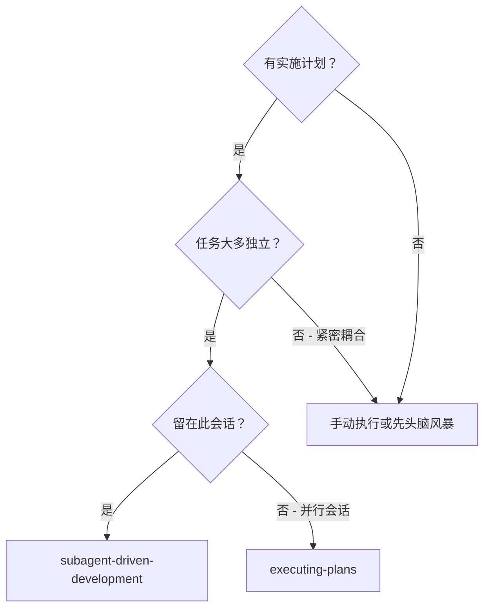
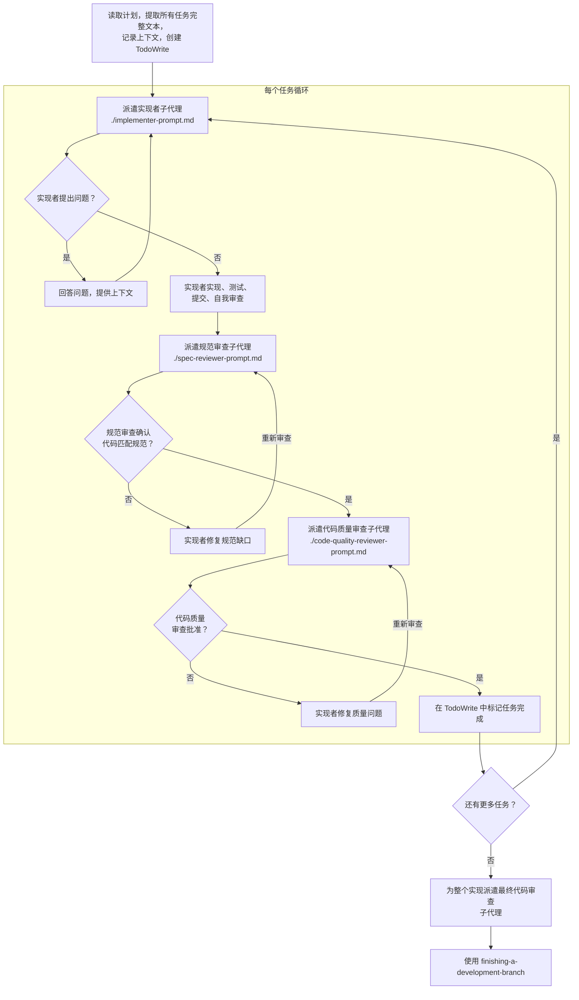

# 子代理驱动开发

通过为每个任务分派全新的子代理来执行计划，每个任务后进行两阶段审查：首先是规范合规性审查，然后是代码质量审查。

**核心原则：** 每个任务使用全新子代理 + 两阶段审查（规范然后质量）= 高质量、快速迭代

## 何时使用



**与 Executing Plans（并行会话）的区别：**
- 同一会话（无需上下文切换）
- 每个任务使用全新子代理（无上下文污染）
- 每个任务后进行两阶段审查：首先是规范合规性，然后是代码质量
- 更快的迭代（任务之间无需人工介入）

## 流程



## 提示模板

- `./implementer-prompt.md` - 分派实现者子代理
- `./spec-reviewer-prompt.md` - 分派规范合规性审查子代理
- `./code-quality-reviewer-prompt.md` - 分派代码质量审查子代理

## 工作流示例

```
You: 我正在使用子代理驱动开发来执行此计划。

[Read plan file once: docs/plans/feature-plan.md]
[Extract all 5 tasks with full text and context]
[Create TodoWrite with all tasks]

Task 1: Hook installation script

[Get Task 1 text and context (already extracted)]
[Dispatch implementation subagent with full task text + context]

Implementer: "在开始之前——应该在用户级别还是系统级别安装 hook？"

You: "用户级别 (~/.config/superpowers/hooks/)"

Implementer: "明白了。现在开始实现……"
[Later] Implementer:
  - 实现了 install-hook 命令
  - 添加了测试，5/5 通过
  - 自我审查：发现漏掉了 --force 标志，已添加
  - 已提交

[Dispatch spec compliance reviewer]
Spec reviewer: ✅ 规范合规——满足所有需求，没有额外内容

[Get git SHAs, dispatch code quality reviewer]
Code reviewer: 优点：测试覆盖良好，代码清晰。问题：无。已批准。

[Mark Task 1 complete]

Task 2: Recovery modes

[Get Task 2 text and context (already extracted)]
[Dispatch implementation subagent with full task text + context]

Implementer: [No questions, proceeds]
Implementer:
  - 添加了 verify/repair 模式
  - 8/8 测试通过
  - 自我审查：一切正常
  - 已提交

[Dispatch spec compliance reviewer]
Spec reviewer: ❌ 问题：
  - 缺失：进度报告（规范要求"每 100 个项目报告一次"）
  - 多余：添加了 --json 标志（未请求）

[Implementer fixes issues]
Implementer: 移除了 --json 标志，添加了进度报告

[Spec reviewer reviews again]
Spec reviewer: ✅ 现在符合规范

[Dispatch code quality reviewer]
Code reviewer: 优点：扎实。问题（重要）：魔法数字（100）

[Implementer fixes]
Implementer: 提取了 PROGRESS_INTERVAL 常量

[Code reviewer reviews again]
Code reviewer: ✅ 已批准

[Mark Task 2 complete]

...

[After all tasks]
[Dispatch final code-reviewer]
Final reviewer: 满足所有需求，准备合并

Done!
```

## 优势

**与手动执行相比：**
- 子代理自然地遵循 TDD
- 每个任务都有全新的上下文（无混淆）
- 并行安全（子代理不会互相干扰）
- 子代理可以提问（工作前和工作期间）

**与 Executing Plans 相比：**
- 同一会话（无需交接）
- 持续进展（无需等待）
- 自动审查检查点

**效率提升：**
- 无文件读取开销（控制器提供完整文本）
- 控制器精确策划所需上下文
- 子代理预先获得完整信息
- 问题在工作开始前浮出水面（而非之后）

**质量关卡：**
- 自我审查在交接前发现问题
- 两阶段审查：规范合规性，然后是代码质量
- 审查循环确保修复真正有效
- 规范合规性防止过度/不足构建
- 代码质量确保实现构建良好

**成本：**
- 更多的子代理调用（每个任务需要实现者 + 2 个审查者）
- 控制器需要做更多准备工作（预先提取所有任务）
- 审查循环增加迭代次数
- 但早期发现问题（比后期调试更便宜）

## 危险信号

**永远不要：**
- **在 main/master 分支上开始实现**（关键 - 先使用 using-git-worktrees）
- 跳过审查（规范合规性 OR 代码质量）
- 在问题未修复的情况下继续
- 并行分派多个实现子代理（冲突）
- 让子代理读取计划文件（提供完整文本替代）
- 跳过场景设置上下文（子代理需要了解任务所处的位置）
- 忽略子代理的问题（在让他们继续之前回答）
- 在规范合规性上接受"差不多就行"（审查者发现问题 = 未完成）
- 跳过审查循环（审查者发现问题 = 实现者修复 = 再次审查）
- 让实现者的自我审查替代实际审查（两者都需要）
- **在规范合规性通过 ✅ 之前开始代码质量审查**（顺序错误）
- 在任一审查有未解决问题时进入下一个任务
- **在每个任务后跳过推送提交**（备份 + 实现干净的 PR 工作流）

**如果子代理提问：**
- 清晰完整地回答
- 如需要，提供额外上下文
- 不要急于让他们进入实现阶段

**如果审查者发现问题：**
- 实现者（同一个子代理）修复它们
- 审查者再次审查
- 重复直到批准
- 不要跳过重新审查

**如果子代理任务失败：**
- 分派修复子代理并给出具体指示
- 不要尝试手动修复（上下文污染）

## 集成

**必需的工作流技能：**
- **using-git-worktrees** - 必需：在开始之前设置隔离工作区
- **writing-plans** - 创建此技能执行的计划
- **requesting-code-review** - 用于审查子代理的代码审查模板
- **finishing-a-development-branch** - 所有任务完成后完成开发

**子代理应使用：**
- **test-driven-development** - 子代理为每个任务遵循 TDD

**替代工作流：**
- **executing-plans** - 用于并行会话而非同一会话执行
