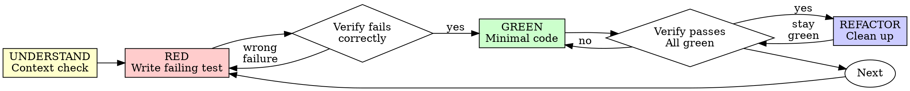

# Test-Driven Development (TDD)

## Overview

Write the test first. Watch it fail. Write minimal code to pass.

**Core principle:** If you didn't watch the test fail, you don't know if it tests the right thing.

**Violating the letter of the rules is violating the spirit of the rules.**

## When to Use

**Always:**
- New features
- Bug fixes
- Refactoring
- Behavior changes

**Exceptions (ask your human partner):**
- Throwaway prototypes
- Generated code
- Configuration files

Thinking "skip TDD just this once"? Stop. That's rationalization.

## The Iron Law

```
NO PRODUCTION CODE WITHOUT A FAILING TEST FIRST
```

Write code before the test? Delete it. Start over.

**No exceptions:**
- Don't keep it as "reference"
- Don't "adapt" it while writing tests
- Don't look at it
- Delete means delete

Implement fresh from tests. Period.

## Before RED Phase - Understand Context

**BEFORE writing your first test, understand what you're building:**

### Quick Context Checklist (2-3 minutes)

- [ ] **Read existing code** - Are there similar features? What patterns do they use?
- [ ] **Search for utilities** - Does validation/error handling/formatting already exist?
- [ ] **Check data flow** - How does data enter/exit this part of the system?
- [ ] **Review constraints** - What requirements, edge cases, or limitations exist?

**Why this matters:** Writing tests without context = testing the wrong thing or duplicating existing code.

**Example:**
```typescript
// ❌ BAD: Jump straight to test without checking codebase
test('validates email format', () => {
  expect(isValidEmail('test@example.com')).toBe(true);
});
// Codebase already has EmailValidator class you didn't find!

// ✅ GOOD: After 2-min search, found existing validator
test('validates email using EmailValidator', () => {
  const validator = new EmailValidator();
  expect(validator.isValid('test@example.com')).toBe(true);
});
// Consistent with codebase patterns
```

**When to skip:** Greenfield projects with no existing code. Otherwise, always understand context first.

---

## Implementation Discipline

**After writing tests and minimal code, maintain quality through these practices:**

### Consistency and Patterns

| Principle | Guideline | Example |
|-----------|-----------|---------|
| **Follow established patterns** | Match existing code style, structure, organization | ✅ Use same error handling pattern as rest of codebase ❌ Introduce new error pattern |
| **Maintain consistency** | Same naming conventions, file structure, module organization | ✅ `getUserById()` matches `getPostById()` ❌ `fetchUser()` when others use `get*()` |
| **Keep functions focused** | Single responsibility, one clear purpose | ✅ `validateEmail()` ❌ `validateAndSaveEmail()` |
| **Prefer autonomous methods** | Methods that don't rely on external state | ✅ Pure functions when possible ❌ Hidden dependencies |

### Completion Checklist

After implementing each feature:

- [ ] **Verify tests pass** - Run full test suite, not just new tests
- [ ] **Update TODO/CHANGELOG** - Mark task complete, document change
- [ ] **Update documentation** - README, API docs, inline comments (WHY not WHAT)
- [ ] **Check consistency** - Does new code match existing patterns?
- [ ] **Review dependencies** - No unnecessary coupling introduced?

### Redundancy Elimination

**Avoid redundant work by understanding upfront:**

| Type | Avoid | Instead |
|------|-------|---------|
| **Comments** | Explain WHAT code does (readable from code) | Explain WHY (business logic, tradeoffs, gotchas) |
| **Tests** | Multiple tests for same behavior | Consolidate similar tests, use parameterized tests |
| **Code** | Duplicate implementations | Understand constraints first, write once correctly |
| **Rewrites** | Multiple attempts due to misunderstanding | Read existing code, clarify requirements BEFORE coding |

**Example:**
```typescript
// ❌ BAD: Comment explains WHAT (redundant with code)
// Check if user is authenticated
if (user.token && user.token.expiresAt > Date.now()) {
  // ...
}

// ✅ GOOD: Comment explains WHY (adds context)
// Must check token expiry here, not in middleware, because
// admin routes bypass middleware but still need validation
if (user.token && user.token.expiresAt > Date.now()) {
  // ...
}
```

**Test consolidation:**
```typescript
// ❌ BAD: Redundant tests
test('validates email with @', () => { /*...*/ });
test('validates email with domain', () => { /*...*/ });
test('validates email with TLD', () => { /*...*/ });

// ✅ GOOD: Parameterized test
test.each([
  ['valid@example.com', true],
  ['missing-at.com', false],
  ['no-domain@', false],
  ['no-tld@example', false],
])('validates email format: %s → %s', (email, expected) => {
  expect(isValidEmail(email)).toBe(expected);
});
```

---

## Red-Green-Refactor



### RED - Write Failing Test

Write one minimal test showing what should happen.

<Good>
```typescript
test('retries failed operations 3 times', async () => {
  let attempts = 0;
  const operation = () => {
    attempts++;
    if (attempts < 3) throw new Error('fail');
    return 'success';
  };

  const result = await retryOperation(operation);

  expect(result).toBe('success');
  expect(attempts).toBe(3);
});
```
Clear name, tests real behavior, one thing
</Good>

<Bad>
```typescript
test('retry works', async () => {
  const mock = jest.fn()
    .mockRejectedValueOnce(new Error())
    .mockRejectedValueOnce(new Error())
    .mockResolvedValueOnce('success');
  await retryOperation(mock);
  expect(mock).toHaveBeenCalledTimes(3);
});
```
Vague name, tests mock not code
</Bad>

**Requirements:**
- One behavior
- Clear name
- Real code (no mocks unless unavoidable)

### Verify RED - Watch It Fail

**MANDATORY. Never skip.**

```bash
npm test path/to/test.test.ts
```

Confirm:
- Test fails (not errors)
- Failure message is expected
- Fails because feature missing (not typos)

**Test passes?** You're testing existing behavior. Fix test.

**Test errors?** Fix error, re-run until it fails correctly.

### GREEN - Minimal Code

Write simplest code to pass the test.

<Good>
```typescript
async function retryOperation<T>(fn: () => Promise<T>): Promise<T> {
  for (let i = 0; i < 3; i++) {
    try {
      return await fn();
    } catch (e) {
      if (i === 2) throw e;
    }
  }
  throw new Error('unreachable');
}
```
Just enough to pass
</Good>

<Bad>
```typescript
async function retryOperation<T>(
  fn: () => Promise<T>,
  options?: {
    maxRetries?: number;
    backoff?: 'linear' | 'exponential';
    onRetry?: (attempt: number) => void;
  }
): Promise<T> {
  // YAGNI
}
```
Over-engineered
</Bad>

Don't add features, refactor other code, or "improve" beyond the test.

### Verify GREEN - Watch It Pass

**MANDATORY.**

```bash
npm test path/to/test.test.ts
```

Confirm:
- Test passes
- Other tests still pass
- Output pristine (no errors, warnings)

**Test fails?** Fix code, not test.

**Other tests fail?** Fix now.

### REFACTOR - Clean Up

After green only:
- Remove duplication
- Improve names
- Extract helpers

Keep tests green. Don't add behavior.

### Repeat

Next failing test for next feature.

## Good Tests

| Quality | Good | Bad |
|---------|------|-----|
| **Minimal** | One thing. "and" in name? Split it. | `test('validates email and domain and whitespace')` |
| **Clear** | Name describes behavior | `test('test1')` |
| **Shows intent** | Demonstrates desired API | Obscures what code should do |

## Testing Philosophy

**Test data should mirror production reality:**

### Production-Quality Test Data

| Principle | Guideline | Example |
|-----------|-----------|---------|
| **Mirrors production** | Use realistic data structures, values, formats | ✅ `{email: "user@example.com", age: 28}` ❌ `{email: "x", age: 1}` |
| **Full transformation chain** | Test data through entire processing pipeline | ✅ Input → validate → transform → store → retrieve ❌ Test only transform step |
| **Satisfies all constraints** | Data passes ALL validation rules | ✅ Check required fields, formats, ranges ❌ Only test happy path |
| **Includes edge cases** | Empty strings, nulls, boundary values, special chars | ✅ `["", null, 0, -1, "🔥"]` ❌ Only `"test"` |

**Why this matters:** Tests with toy data (x, y, foo, bar) pass but real data fails. Production-quality test data catches real bugs.

**Example:**
```typescript
// ❌ BAD: Toy data that doesn't reflect reality
test('processes user', () => {
  const user = { name: 'x', email: 'y' };
  expect(process(user)).toBeTruthy();
});
// Missing: age validation, email format, required fields

// ✅ GOOD: Production-realistic data
test('processes valid user through full pipeline', () => {
  const user = {
    name: 'Alice Smith',
    email: 'alice.smith@example.com',
    age: 28,
    preferences: { newsletter: true }
  };
  
  const result = process(user);
  
  expect(result.id).toMatch(/^usr_[a-z0-9]+$/);
  expect(result.name).toBe('Alice Smith');
  expect(result.email).toBe('alice.smith@example.com');
});

test('rejects user with invalid email format', () => {
  const user = {
    name: 'Bob Jones',
    email: 'not-an-email',  // Edge case: malformed
    age: 35
  };
  
  expect(() => process(user)).toThrow('Invalid email format');
});

test('handles edge cases in user data', () => {
  const edgeCases = [
    { name: '', email: 'test@example.com', age: 18 },      // Empty name
    { name: 'Test', email: '', age: 18 },                  // Empty email  
    { name: 'Test', email: 'test@example.com', age: 0 },   // Boundary age
    { name: 'Test', email: 'test@example.com', age: null }, // Null age
  ];
  
  edgeCases.forEach(user => {
    expect(() => process(user)).toThrow();
  });
});
```

### Test Coverage Checklist

- [ ] **Happy path** - Valid data through full flow
- [ ] **Validation** - Each constraint violation caught
- [ ] **Edge cases** - Empty, null, zero, boundary values
- [ ] **Error cases** - Invalid formats, missing fields, out-of-range
- [ ] **Data transformation** - Input → output verified at each step
- [ ] **State changes** - Side effects (DB writes, API calls) verified

## Why Order Matters

**"I'll write tests after to verify it works"**

Tests written after code pass immediately. Passing immediately proves nothing:
- Might test wrong thing
- Might test implementation, not behavior
- Might miss edge cases you forgot
- You never saw it catch the bug

Test-first forces you to see the test fail, proving it actually tests something.

**"I already manually tested all the edge cases"**

Manual testing is ad-hoc. You think you tested everything but:
- No record of what you tested
- Can't re-run when code changes
- Easy to forget cases under pressure
- "It worked when I tried it" ≠ comprehensive

Automated tests are systematic. They run the same way every time.

**"Deleting X hours of work is wasteful"**

Sunk cost fallacy. The time is already gone. Your choice now:
- Delete and rewrite with TDD (X more hours, high confidence)
- Keep it and add tests after (30 min, low confidence, likely bugs)

The "waste" is keeping code you can't trust. Working code without real tests is technical debt.

**"TDD is dogmatic, being pragmatic means adapting"**

TDD IS pragmatic:
- Finds bugs before commit (faster than debugging after)
- Prevents regressions (tests catch breaks immediately)
- Documents behavior (tests show how to use code)
- Enables refactoring (change freely, tests catch breaks)

"Pragmatic" shortcuts = debugging in production = slower.

**"Tests after achieve the same goals - it's spirit not ritual"**

No. Tests-after answer "What does this do?" Tests-first answer "What should this do?"

Tests-after are biased by your implementation. You test what you built, not what's required. You verify remembered edge cases, not discovered ones.

Tests-first force edge case discovery before implementing. Tests-after verify you remembered everything (you didn't).

30 minutes of tests after ≠ TDD. You get coverage, lose proof tests work.

## Common Rationalizations

| Excuse | Reality |
|--------|---------|
| "Too simple to test" | Simple code breaks. Test takes 30 seconds. |
| "I'll test after" | Tests passing immediately prove nothing. |
| "Tests after achieve same goals" | Tests-after = "what does this do?" Tests-first = "what should this do?" |
| "Already manually tested" | Ad-hoc ≠ systematic. No record, can't re-run. |
| "Deleting X hours is wasteful" | Sunk cost fallacy. Keeping unverified code is technical debt. |
| "Keep as reference, write tests first" | You'll adapt it. That's testing after. Delete means delete. |
| "Need to explore first" | Fine. Throw away exploration, start with TDD. |
| "Test hard = design unclear" | Listen to test. Hard to test = hard to use. |
| "TDD will slow me down" | TDD faster than debugging. Pragmatic = test-first. |
| "Manual test faster" | Manual doesn't prove edge cases. You'll re-test every change. |
| "Existing code has no tests" | You're improving it. Add tests for existing code. |

## Red Flags - STOP and Start Over

- Code before test
- Test after implementation
- Test passes immediately
- Can't explain why test failed
- Tests added "later"
- Rationalizing "just this once"
- "I already manually tested it"
- "Tests after achieve the same purpose"
- "It's about spirit not ritual"
- "Keep as reference" or "adapt existing code"
- "Already spent X hours, deleting is wasteful"
- "TDD is dogmatic, I'm being pragmatic"
- "This is different because..."

**All of these mean: Delete code. Start over with TDD.**

## Example: Bug Fix

**Bug:** Empty email accepted

**RED**
```typescript
test('rejects empty email', async () => {
  const result = await submitForm({ email: '' });
  expect(result.error).toBe('Email required');
});
```

**Verify RED**
```bash
$ npm test
FAIL: expected 'Email required', got undefined
```

**GREEN**
```typescript
function submitForm(data: FormData) {
  if (!data.email?.trim()) {
    return { error: 'Email required' };
  }
  // ...
}
```

**Verify GREEN**
```bash
$ npm test
PASS
```

**REFACTOR**
Extract validation for multiple fields if needed.

## Verification Checklist

Before marking work complete:

- [ ] Every new function/method has a test
- [ ] Watched each test fail before implementing
- [ ] Each test failed for expected reason (feature missing, not typo)
- [ ] Wrote minimal code to pass each test
- [ ] All tests pass
- [ ] Output pristine (no errors, warnings)
- [ ] Tests use real code (mocks only if unavoidable)
- [ ] Edge cases and errors covered

Can't check all boxes? You skipped TDD. Start over.

## When Stuck

| Problem | Solution |
|---------|----------|
| Don't know how to test | Write wished-for API. Write assertion first. Ask your human partner. |
| Test too complicated | Design too complicated. Simplify interface. |
| Must mock everything | Code too coupled. Use dependency injection. |
| Test setup huge | Extract helpers. Still complex? Simplify design. |

## Debugging Integration

Bug found? Write failing test reproducing it. Follow TDD cycle. Test proves fix and prevents regression.

Never fix bugs without a test.

## Testing Anti-Patterns

When adding mocks or test utilities, read testing-anti-patterns.md to avoid common pitfalls:
- Testing mock behavior instead of real behavior
- Adding test-only methods to production classes
- Mocking without understanding dependencies

## Final Rule

```
Production code → test exists and failed first
Otherwise → not TDD
```

No exceptions without your human partner's permission.
