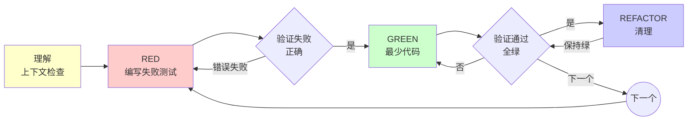

# 测试驱动开发 (TDD)

## 概述

先写测试。观察它失败。编写最简代码使其通过。

**核心原则：** 如果你没有观察到测试失败，你就无法确定它测试的是正确的东西。

**违反规则的字面意思就是违反规则的精神。**

## 何时使用

**始终适用：**
- 新功能
- Bug 修复
- 重构
- 行为变更

**例外情况（询问你的合作伙伴）：**
- 一次性原型
- 生成的代码
- 配置文件

想着"这次就跳过 TDD"？停下。这是合理化借口。

## 铁律

```
没有失败的测试，就不写生产代码
```

先写代码再写测试？删除它。重新开始。

**没有例外：**
- 不要保留它作为"参考"
- 不要在写测试时"适配"它
- 不要看它
- 删除就是删除

完全根据测试来重新实现。就这样。

## RED 阶段之前 - 理解上下文

**在写第一个测试之前，理解你要构建什么：**

### 快速上下文检查清单（2-3 分钟）

- [ ] **阅读现有代码** - 是否有类似的功能？它们使用什么模式？
- [ ] **搜索工具函数** - 验证/错误处理/格式化是否已存在？
- [ ] **检查数据流** - 数据如何进入/离开系统的这部分？
- [ ] **审查约束条件** - 有什么需求、边界情况或限制？

**为什么这很重要：** 没有上下文就写测试 = 测试错误的东西或重复现有代码。

**示例：**
```typescript
// ❌ 错误：不检查代码库就直接跳到测试
test('validates email format', () => {
  expect(isValidEmail('test@example.com')).toBe(true);
});
// 代码库中已经存在 EmailValidator 类，你没发现！

// ✅ 正确：经过 2 分钟搜索后，发现已有验证器
test('validates email using EmailValidator', () => {
  const validator = new EmailValidator();
  expect(validator.isValid('test@example.com')).toBe(true);
});
// 与代码库模式保持一致
```

**何时跳过：** 没有现有代码的全新项目。否则，始终先理解上下文。

---

## 实现纪律

**编写测试和最简代码后，通过这些实践保持质量：**

### 一致性和模式

| 原则 | 指南 | 示例 |
|-----------|-----------|---------|
| **遵循既定模式** | 匹配现有代码风格、结构、组织 | ✅ 使用与代码库其余部分相同的错误处理模式 ❌ 引入新的错误模式 |
| **保持一致性** | 相同的命名约定、文件结构、模块组织 | ✅ `getUserById()` 匹配 `getPostById()` ❌ `fetchUser()` 当其他使用 `get*()` |
| **保持函数专注** | 单一职责，一个明确的目的 | ✅ `validateEmail()` ❌ `validateAndSaveEmail()` |
| **优先使用自治方法** | 不依赖外部状态的方法 | ✅ 尽可能使用纯函数 ❌ 隐藏依赖 |

### 完成检查清单

实现每个功能后：

- [ ] **验证测试通过** - 运行完整测试套件，不只是新测试
- [ ] **更新 TODO/CHANGELOG** - 标记任务完成，记录变更
- [ ] **更新文档** - README、API 文档、内联注释（说明 WHY 而非 WHAT）
- [ ] **检查一致性** - 新代码是否匹配现有模式？
- [ ] **审查依赖** - 没有引入不必要的耦合？

### 冗余消除

**通过预先理解来避免重复工作：**

| 类型 | 避免 | 替代方案 |
|------|-------|---------|
| **注释** | 解释代码做什么（可从代码中读取） | 解释 WHY（业务逻辑、权衡、陷阱） |
| **测试** | 同一行为的多个测试 | 合并相似测试，使用参数化测试 |
| **代码** | 重复实现 | 先理解约束条件，一次写对 |
| **重写** | 因误解而多次尝试 | 在编码前阅读现有代码、澄清需求 |

**示例：**
```typescript
// ❌ 错误：注释解释 WHAT（与代码重复）
// Check if user is authenticated
if (user.token && user.token.expiresAt > Date.now()) {
  // ...
}

// ✅ 正确：注释解释 WHY（添加上下文）
// Must check token expiry here, not in middleware, because
// admin routes bypass middleware but still need validation
if (user.token && user.token.expiresAt > Date.now()) {
  // ...
}
```

**测试合并：**
```typescript
// ❌ 错误：冗余测试
test('validates email with @', () => { /*...*/ });
test('validates email with domain', () => { /*...*/ });
test('validates email with TLD', () => { /*...*/ });

// ✅ 正确：参数化测试
test.each([
  ['valid@example.com', true],
  ['missing-at.com', false],
  ['no-domain@', false],
  ['no-tld@example', false],
])('validates email format: %s → %s', (email, expected) => {
  expect(isValidEmail(email)).toBe(expected);
});
```

---

## 红-绿-重构



### RED - 编写失败的测试

编写一个最简测试来说明应该发生什么。

<Good>
```typescript
test('retries failed operations 3 times', async () => {
  let attempts = 0;
  const operation = () => {
    attempts++;
    if (attempts < 3) throw new Error('fail');
    return 'success';
  };

  const result = await retryOperation(operation);

  expect(result).toBe('success');
  expect(attempts).toBe(3);
});
```
名称清晰，测试真实行为，一个关注点
</Good>

<Bad>
```typescript
test('retry works', async () => {
  const mock = jest.fn()
    .mockRejectedValueOnce(new Error())
    .mockRejectedValueOnce(new Error())
    .mockResolvedValueOnce('success');
  await retryOperation(mock);
  expect(mock).toHaveBeenCalledTimes(3);
});
```
名称模糊，测试的是 mock 而非代码
</Bad>

**要求：**
- 一个行为
- 名称清晰
- 真实代码（除非不可避免，否则不使用 mock）

### 验证 RED - 观察它失败

**强制要求。永远不要跳过。**

```bash
npm test path/to/test.test.ts
```

确认：
- 测试失败（而非错误）
- 失败消息是预期的
- 失败是因为功能缺失（而非拼写错误）

**测试通过了？** 你在测试现有行为。修复测试。

**测试出错了？** 修复错误，重新运行直到正确失败。

### GREEN - 最简代码

编写最简单的代码使测试通过。

<Good>
```typescript
async function retryOperation<T>(fn: () => Promise<T>): Promise<T> {
  for (let i = 0; i < 3; i++) {
    try {
      return await fn();
    } catch (e) {
      if (i === 2) throw e;
    }
  }
  throw new Error('unreachable');
}
```
刚好足够通过
</Good>

<Bad>
```typescript
async function retryOperation<T>(
  fn: () => Promise<T>,
  options?: {
    maxRetries?: number;
    backoff?: 'linear' | 'exponential';
    onRetry?: (attempt: number) => void;
  }
): Promise<T> {
  // YAGNI
}
```
过度设计
</Bad>

不要添加功能、重构其他代码，或"改进"超出测试范围。

### 验证 GREEN - 观察它通过

**强制要求。**

```bash
npm test path/to/test.test.ts
```

确认：
- 测试通过
- 其他测试仍通过
- 输出干净（无错误、警告）

**测试失败？** 修复代码，而非测试。

**其他测试失败？** 立即修复。

### REFACTOR - 清理

仅在变绿后：
- 移除重复
- 改进名称
- 提取辅助函数

保持测试绿色。不要添加行为。

### 重复

下一个功能的下一个失败测试。

## 好的测试

| 质量 | 好的 | 坏的 |
|---------|------|-----|
| **最小化** | 一个关注点。名称中有"and"？拆分它。 | `test('validates email and domain and whitespace')` |
| **清晰** | 名称描述行为 | `test('test1')` |
| **展示意图** | 展示期望的 API | 掩盖代码应该做什么 |

## 测试哲学

**测试数据应该反映生产现实：**

### 生产级测试数据

| 原则 | 指南 | 示例 |
|-----------|-----------|---------|
| **反映生产环境** | 使用真实的数据结构、值、格式 | ✅ `{email: "user@example.com", age: 28}` ❌ `{email: "x", age: 1}` |
| **完整的转换链** | 通过整个处理管道测试数据 | ✅ 输入 → 验证 → 转换 → 存储 → 检索 ❌ 仅测试转换步骤 |
| **满足所有约束** | 数据通过所有验证规则 | ✅ 检查必填字段、格式、范围 ❌ 仅测试正常路径 |
| **包括边界情况** | 空字符串、null、边界值、特殊字符 | ✅ `["", null, 0, -1, "🔥"]` ❌ 仅 `"test"` |

**为什么这很重要：** 使用玩具数据（x、y、foo、bar）的测试通过了，但真实数据会失败。生产级测试数据能捕获真实 bug。

**示例：**
```typescript
// ❌ 错误：不反映现实的玩具数据
test('processes user', () => {
  const user = { name: 'x', email: 'y' };
  expect(process(user)).toBeTruthy();
});
// 缺失：年龄验证、邮箱格式、必填字段

// ✅ 正确：生产级真实数据
test('processes valid user through full pipeline', () => {
  const user = {
    name: 'Alice Smith',
    email: 'alice.smith@example.com',
    age: 28,
    preferences: { newsletter: true }
  };
  
  const result = process(user);
  
  expect(result.id).toMatch(/^usr_[a-z0-9]+$/);
  expect(result.name).toBe('Alice Smith');
  expect(result.email).toBe('alice.smith@example.com');
});

test('rejects user with invalid email format', () => {
  const user = {
    name: 'Bob Jones',
    email: 'not-an-email',  // 边界情况：格式错误
    age: 35
  };
  
  expect(() => process(user)).toThrow('Invalid email format');
});

test('handles edge cases in user data', () => {
  const edgeCases = [
    { name: '', email: 'test@example.com', age: 18 },      // 空名称
    { name: 'Test', email: '', age: 18 },                  // 空邮箱
    { name: 'Test', email: 'test@example.com', age: 0 },   // 边界年龄
    { name: 'Test', email: 'test@example.com', age: null }, // Null 年龄
  ];
  
  edgeCases.forEach(user => {
    expect(() => process(user)).toThrow();
  });
});
```

### 测试覆盖检查清单

- [ ] **正常路径** - 有效数据通过完整流程
- [ ] **验证** - 每个约束违反都被捕获
- [ ] **边界情况** - 空、null、零、边界值
- [ ] **错误情况** - 无效格式、缺失字段、超出范围
- [ ] **数据转换** - 输入 → 输出在每一步都被验证
- [ ] **状态变更** - 副作用（数据库写入、API 调用）被验证

## 为什么顺序很重要

**"我会之后写测试来验证它是否有效"**

事后编写的测试立即通过。立即通过证明不了什么：
- 可能测试错误的东西
- 可能测试实现，而非行为
- 可能遗漏你忘记的边界情况
- 你从未看到它捕获 bug

测试优先迫使你看到测试失败，证明它确实测试了某些东西。

**"我已经手动测试了所有边界情况"**

手动测试是临时的。你认为你测试了所有东西，但：
- 没有测试记录
- 代码变更时无法重新运行
- 压力下容易忘记情况
- "我试的时候有效" ≠ 全面

自动化测试是系统性的。它们每次都以相同的方式运行。

**"删除 X 小时的工作是浪费"**

沉没成本谬误。时间已经过去了。你现在的选择：
- 删除并使用 TDD 重写（X 更多小时，高信心）
- 保留它并在之后添加测试（30 分钟，低信心，可能有 bug）

"浪费"的是保留你无法信任的代码。没有真实测试的工作代码是技术债务。

**"TDD 是教条主义，实用主义意味着适应"**

TDD 是实用的：
- 在提交前发现 bug（比之后调试更快）
- 防止回归（测试立即捕获破坏）
- 记录行为（测试展示如何使用代码）
- 启用重构（自由变更，测试捕获破坏）

"实用"捷径 = 生产环境调试 = 更慢。

**"事后测试实现相同目标 - 是精神而非仪式"**

不。事后测试回答"这段代码做什么？"测试优先回答"这段代码应该做什么？"

事后测试受你的实现影响。你测试你构建的，而非所需的。你验证记住的边界情况，而非发现的边界情况。

测试优先在实现前强制发现边界情况。事后测试验证你是否记住了所有东西（你没有）。

30 分钟的事后测试 ≠ TDD。你获得了覆盖率，失去了测试有效的证明。

## 常见合理化借口

| 借口 | 现实 |
|--------|---------|
| "太简单了，不需要测试" | 简单代码也会崩溃。测试只需 30 秒。 |
| "我之后会测试" | 测试立即通过证明不了什么。 |
| "事后测试实现相同目标" | 事后测试 = "这段代码做什么？" 测试优先 = "这段代码应该做什么？" |
| "已经手动测试过了" | 临时 ≠ 系统性。没有记录，无法重新运行。 |
| "删除 X 小时是浪费" | 沉没成本谬误。保留未验证代码是技术债务。 |
| "保留作为参考，先写测试" | 你会适配它。那是事后测试。删除就是删除。 |
| "需要先探索" | 可以。丢弃探索，使用 TDD 开始。 |
| "测试难 = 设计不清晰" | 倾听测试。难以测试 = 难以使用。 |
| "TDD 会拖慢我" | TDD 比调试更快。实用主义 = 测试优先。 |
| "手动测试更快" | 手动测试证明不了边界情况。每次变更你都要重新测试。 |
| "现有代码没有测试" | 你在改进它。为现有代码添加测试。 |

## 红旗 - 停止并重新开始

- 先写代码再写测试
- 实现后写测试
- 测试立即通过
- 无法解释测试为什么失败
- 测试"稍后"添加
- 合理化"就这一次"
- "我已经手动测试过了"
- "事后测试实现相同目的"
- "是精神而非仪式"
- "保留作为参考"或"适配现有代码"
| "已经花了 X 小时，删除是浪费" |
| "TDD 是教条主义，我在实用主义" |
| "这次不同，因为..." |

**所有这些意味着：删除代码。使用 TDD 重新开始。**

## 示例：Bug 修复

**Bug：** 接受空邮箱

**RED**
```typescript
test('rejects empty email', async () => {
  const result = await submitForm({ email: '' });
  expect(result.error).toBe('Email required');
});
```

**验证 RED**
```bash
$ npm test
FAIL: expected 'Email required', got undefined
```

**GREEN**
```typescript
function submitForm(data: FormData) {
  if (!data.email?.trim()) {
    return { error: 'Email required' };
  }
  // ...
}
```

**验证 GREEN**
```bash
$ npm test
PASS
```

**REFACTOR**
如果需要，为多字段提取验证。

## 验证检查清单

标记工作完成前：

- [ ] 每个新函数/方法都有测试
- [ ] 在实现前观察到每个测试失败
- [ ] 每个测试因预期原因失败（功能缺失，而非拼写错误）
- [ ] 编写最简代码使每个测试通过
- [ ] 所有测试通过
- [ ] 输出干净（无错误、警告）
- [ ] 测试使用真实代码（除非不可避免，否则不使用 mock）
- [ ] 覆盖边界情况和错误情况

无法勾选所有框？你跳过了 TDD。重新开始。

## 卡住时

| 问题 | 解决方案 |
|---------|----------|
| 不知道如何测试 | 编写期望的 API。先写断言。询问你的合作伙伴。 |
| 测试太复杂 | 设计太复杂。简化接口。 |
| 必须 mock 所有东西 | 代码耦合度太高。使用依赖注入。 |
| 测试设置庞大 | 提取辅助函数。仍然复杂？简化设计。 |

## 调试集成

发现 Bug？编写失败的测试来重现它。遵循 TDD 循环。测试证明修复并防止回归。

永远不要没有测试就修复 bug。

## 测试反模式

添加 mock 或测试工具时，阅读 testing-anti-patterns.md 以避免常见陷阱：
- 测试 mock 行为而非真实行为
- 向生产类添加仅测试使用的方法
- 在不理解依赖的情况下进行 mock

## 最终规则

```
生产代码 → 测试存在且先失败
否则 → 不是 TDD
```

未经合作伙伴许可，没有例外。
