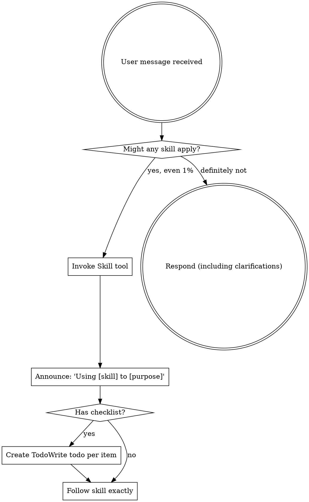

<EXTREMELY-IMPORTANT>
如果你认为某个技能有哪怕 1% 的可能性适用于你正在做的事情，你**绝对必须**调用该技能。

如果某个技能适用于你的任务，你别无选择。**你必须使用它**。

这没有商量的余地。这不是可选的。你无法通过合理化来逃避这一点。
</EXTREMELY-IMPORTANT>

## 如何访问技能

**在 Claude Code 中：** 使用 `Skill` 工具。当你调用技能时，其内容会被加载并呈现给你——直接遵循它。永远不要使用 Read 工具来读取技能文件。

**在其他环境中：** 查看你所用平台的文档，了解如何加载技能。

# 使用技能

## 规则

**在做出任何回应或采取行动之前，先调用相关或被请求的技能。** 即使某个技能只有 1% 的可能性适用，你也应该调用该技能来检查。如果调用的技能最终不适用于当前情况，你不需要使用它。

## 危险信号

这些想法意味着**停止**——你正在合理化：

| 想法 | 现实 |
|---------|---------|
| "这只是个简单的问题" | 问题也是任务。检查是否有适用的技能。 |
| "我需要先了解更多上下文" | 技能检查**优先于**澄清性问题。 |
| "让我先探索一下代码库" | 技能会告诉你**如何**探索。先检查。 |
| "我可以快速查看 git/文件" | 文件缺乏对话上下文。检查是否有适用的技能。 |
| "让我先收集信息" | 技能会告诉你**如何**收集信息。 |
| "这不需要正式的技能" | 如果技能存在，就使用它。 |
| "我记得这个技能" | 技能会进化。阅读当前版本。 |
| "这不算任务" | 行动 = 任务。检查是否有适用的技能。 |
| "这个技能大材小用了" | 简单的事会变复杂。使用它。 |
| "我先做这一件事" | 在做**任何事**之前先检查。 |
| "这感觉很有效率" | 无纪律的行动浪费时间。技能可以防止这一点。 |
| "我知道那是什么意思" | 知道概念 ≠ 使用技能。调用它。 |

## 技能优先级

当多个技能可能适用时，按以下顺序使用：

1. **流程技能优先**（brainstorming、debugging）——这些决定**如何**处理任务
2. **实现技能其次**（frontend-design、mcp-builder）——这些指导执行

"让我们构建 X" → 先用 brainstorming，然后使用实现技能。
"修复这个 bug" → 先用 debugging，然后使用领域特定技能。

## 技能类型

**严格型**（TDD、debugging）：严格遵循。不要偏离纪律。

**灵活型**（patterns）：根据上下文调整原则。

技能本身会告诉你属于哪种类型。

## 用户指令

指令说明**做什么**，而不是**如何做**。"添加 X" 或 "修复 Y" 并不意味着跳过工作流程。
