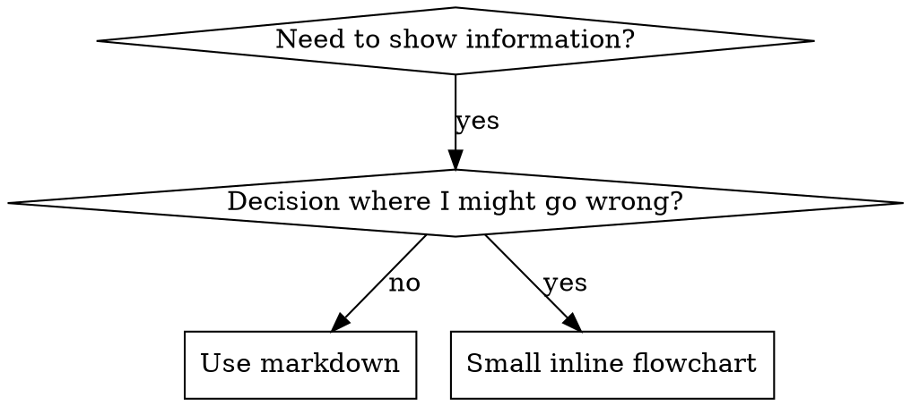

# 编写技能

## 概述

**编写技能就是将测试驱动开发应用于流程文档。**

**个人技能存放在代理特定的目录中（通常为 `~/.config/agents/skills` 或由您的 AI 代理配置）**

你编写测试用例（带压力场景的子代理测试），观察它们失败（基线行为），编写技能（文档），观察测试通过（代理遵守），然后重构（关闭漏洞）。

**核心原则：** 如果你没有看到代理在没有技能的情况下失败，你就不知道技能是否教对了东西。

**必需背景：** 在使用本技能之前，你必须理解测试驱动开发。该技能定义了 RED-GREEN-REFACTOR 循环的基础。本技能将 TDD 适配到文档编写。

**官方指南：** 关于 Anthropic 官方的技能编写最佳实践，请参阅 anthropic-best-practices.md。本文档提供了补充 TDD 方法的额外模式和指南。

## 什么是技能？

**技能**是经过验证的技术、模式或工具的参考指南。技能帮助未来的 AI 代理实例找到并应用有效的方法。

**技能是：** 可复用的技术、模式、工具、参考指南

**技能不是：** 关于你如何一次性解决某个问题的叙述

## 技能的 TDD 映射

| TDD 概念 | 技能创建 |
|----------|----------|
| **测试用例** | 带压力场景的子代理测试 |
| **生产代码** | 技能文档 (SKILL.md) |
| **测试失败 (RED)** | 没有技能时代理违反规则（基线） |
| **测试通过 (GREEN)** | 有技能时代理遵守规则 |
| **重构** | 在保持遵守的同时关闭漏洞 |
| **先写测试** | 在编写技能之前运行基线场景 |
| **观察失败** | 记录代理使用的精确辩解 |
| **最少代码** | 编写针对特定违规的技能 |
| **观察通过** | 验证代理现在是否遵守 |
| **重构循环** | 发现新的辩解 → 修复 → 重新验证 |

整个技能创建过程遵循 RED-GREEN-REFACTOR。

## 何时创建技能

**在以下情况创建：**
- 技术对你来说不够直观
- 你会在多个项目中引用它
- 模式应用广泛（非项目特定）
- 其他人会受益

**不要在以下情况创建：**
- 一次性解决方案
- 其他地方已充分记录的标准实践
- 项目特定约定（放入 CLAUDE.md）
- 机械约束（如果可以用正则/验证强制执行，就自动化它——文档用于判断调用）

## 技能类型

### 技术
具有可遵循步骤的具体方法（基于条件的等待、根本原因追踪）

### 模式
思考问题的方式（使用标志扁平化、测试不变量）

### 参考
API 文档、语法指南、工具文档（Office 文档）

## 目录结构


```
skills/
  skill-name/
    SKILL.md              # 主要参考（必需）
    supporting-file.*     # 仅在需要时
```

**扁平命名空间** - 所有技能在一个可搜索的命名空间中

**分离文件用于：**
1. **重型参考**（100+ 行）- API 文档、综合语法
2. **可复用工具** - 脚本、工具、模板

**保持内联：**
- 原则和概念
- 代码模式（< 50 行）
- 其他所有内容

## SKILL.md 结构

**Frontmatter (YAML)：**
- 仅支持两个字段：`name` 和 `description`
- 总共最多 1024 个字符
- `name`：仅使用字母、数字和连字符（无括号、特殊字符）
- `description`：第三人称，仅描述何时使用（而非其功能）
  - 以 "Use when..." 开头，聚焦于触发条件
  - 包括具体症状、情况和上下文
  - **永远不要总结技能的过程或工作流程**（原因见 CSO 部分）
  - 尽可能保持在 500 个字符以内

```markdown
---
name: Skill-Name-With-Hyphens
description: Use when [specific triggering conditions and symptoms]
---

# Skill Name

## Overview
这是什么？1-2 句核心原则。

## When to Use
[如果决策不明显，放小型内联流程图]

带症状和使用场景的要点列表
何时不使用

## Core Pattern (for techniques/patterns)
前后代码对比

## Quick Reference
表格或要点，用于扫描常用操作

## Implementation
简单模式使用内联代码
链接到文件用于重型参考或可复用工具

## Common Mistakes
出错内容 + 修复方法

## Real-World Impact (optional)
具体结果
```

## 双语支持（英文 + 中文）

**每个技能都必须为人类读者提供中文版本**，但在**单独的文件**中以避免消耗 AI 代理的令牌。

### 文件命名约定

对文档文件（仅 Markdown）使用 `$filename.zh-CN.md` 模式：

```
skills/
  skill-name/
    SKILL.md              # 仅英文（AI 代理读取此文件）
    SKILL.zh-CN.md        # 中文版本（人类读取此文件）
    example.py            # 代码文件 - 仅英文，不需要中文版本
```

### 规则

1. **英文文档**：仅英文。永远不要在这里放中文内容 - AI 代理读取这些文件，每个令牌都很重要。
2. **中文文档**：使用 `SKILL.zh-CN.md` 命名模式。内容必须与英文结构完全相同但翻译成中文。
3. **程序文件**：不需要中文版本。保持代码、脚本和可执行文件仅使用英文。
4. **保持同步**：修改 SKILL.md 时，用相同更改更新 SKILL.zh-CN.md。
5. **不要交叉引用**：不要在英文文件中提及或链接到中文版本 - AI 代理不应该知道它们。

### SKILL.zh-CN.md 结构示例

```markdown
# Skill Name

## 概述
技能核心原则的中文说明。

## 何时使用
- 使用场景1
- 使用场景2

## 速查参考
| 方法 | 适用场景 |
|------|----------|
| 方法A | 场景1 |

## 常见错误
常见错误及修复方法的中文说明。
```

**记住**：只有 Markdown 文档文件需要中文版本。程序文件（代码、脚本）保持仅英文。不同步的翻译是一个维护缺陷。


## Claude 搜索优化 (CSO)

**对发现至关重要：** 未来的代理 需要找到你的技能

### 1. 丰富的描述字段

**目的：** 代理读取描述来决定为给定任务加载哪些技能。让它回答："我现在应该阅读这个技能吗？"

**格式：** 以 "Use when..." 开头，聚焦于触发条件

**关键：描述 = 何时使用，而非技能做什么**

描述应仅描述触发条件。不要在描述中总结技能的过程或工作流程。

**这很重要：** 测试表明，当描述总结技能的工作流程时，Claude 可能会遵循描述而不是阅读完整的技能内容。一个说"任务之间进行代码审查"的描述导致 Claude 只做了一次审查，即使技能的流程图清楚地显示了两个审查（规范合规性然后代码质量）。

当描述改为仅"Use when executing implementation plans with independent tasks"（无工作流程摘要）时，Claude 正确阅读了流程图并遵循了两阶段审查过程。

**陷阱：** 总结工作流程的描述创建了一个 Claude 会采取的捷径。技能主体变成了 Claude 跳过的文档。

```yaml
# ❌ 不好：总结工作流程 - Claude 可能遵循此描述而不是阅读技能
description: Use when executing plans - dispatches subagent per task with code review between tasks

# ❌ 不好：太多流程细节
description: Use for TDD - write test first, watch it fail, write minimal code, refactor

# ✅ 好：仅触发条件，无工作流程摘要
description: Use when executing implementation plans with independent tasks in the current session

# ✅ 好：仅触发条件
description: Use when implementing any feature or bugfix, before writing implementation code
```

**内容：**
- 使用具体触发器、症状和表明此技能适用的情况
- 描述*问题*（竞态条件、不一致行为）而非*语言特定症状*（setTimeout、sleep）
- 除非技能本身是技术特定的，否则保持触发器与技术无关
- 如果技能是技术特定的，在触发器中明确说明
- 用第三人称写作（注入系统提示）
- **永远不要总结技能的过程或工作流程**

```yaml
# ❌ 不好：太抽象、模糊，不包括何时使用
description: For async testing

# ❌ 不好：第一人称
description: I can help you with async tests when they're flaky

# ❌ 不好：提及技术但技能不特定于它
description: Use when tests use setTimeout/sleep and are flaky

# ✅ 好：以 "Use when" 开头，描述问题，无工作流程
description: Use when tests have race conditions, timing dependencies, or pass/fail inconsistently

# ✅ 好：技术特定技能及明确触发器
description: Use when using React Router and handling authentication redirects
```

### 2. 关键词覆盖

使用 代理会搜索的词：
- 错误消息："Hook timed out"、"ENOTEMPTY"、"race condition"
- 症状："flaky"、"hanging"、"zombie"、"pollution"
- 同义词："timeout/hang/freeze"、"cleanup/teardown/afterEach"
- 工具：实际命令、库名称、文件类型

### 3. 描述性命名

**使用主动语态，动词优先：**
- ✅ `creating-skills` 而非 `skill-creation`
- ✅ `condition-based-waiting` 而非 `async-test-helpers`

### 4. 令牌效率（关键）

**问题：** getting-started 和频繁引用的技能加载到每个对话中。每个令牌都很重要。

**目标字数：**
- getting-started 工作流程：每个 <150 字
- 频繁加载的技能：总共 <200 字
- 其他技能：<500 字（仍然要简洁）

**技术：**

**将细节移到工具帮助中：**
```bash
# ❌ 不好：在 SKILL.md 中记录所有标志
search-conversations supports --text, --both, --after DATE, --before DATE, --limit N

# ✅ 好：引用 --help
search-conversations supports multiple modes and filters. Run --help for details.
```

**使用交叉引用：**
```markdown
# ❌ 不好：重复工作流程细节
When searching, dispatch subagent with template...
[20 lines of repeated instructions]

# ✅ 好：引用其他技能
Always use subagents (50-100x context savings). REQUIRED: Use [other-skill-name] for workflow.
```

**压缩示例：**
```markdown
# ❌ 不好：冗长示例（42 字）
your human partner: "How did we handle authentication errors in React Router before?"
You: I'll search past conversations for React Router authentication patterns.
[Dispatch subagent with search query: "React Router authentication error handling 401"]

# ✅ 好：最少示例（20 字）
Partner: "How did we handle auth errors in React Router?"
You: Searching...
[Dispatch subagent → synthesis]
```

**消除冗余：**
- 不要重复交叉引用技能中的内容
- 不要解释从命令中显而易见的内容
- 不要包含同一模式的多个示例

**验证：**
```bash
wc -w skills/path/SKILL.md
# getting-started 工作流程：目标 <150 每个
# 其他频繁加载的：目标 <200 总共
```

**按你做什么或核心洞察命名：**
- ✅ `condition-based-waiting` > `async-test-helpers`
- ✅ `using-skills` not `skill-usage`
- ✅ `flatten-with-flags` > `data-structure-refactoring`
- ✅ `root-cause-tracing` > `debugging-techniques`

**动名词（-ing）对流程很有效：**
- `creating-skills`、`testing-skills`、`debugging-with-logs`
- 主动的，描述你正在采取的行动

### 4. 交叉引用其他技能

**在编写引用其他技能的文档时：**

仅使用技能名称，带有明确要求标记：
- ✅ 好：`**REQUIRED SUB-SKILL:** Use test-driven-development`
- ✅ 好：`**REQUIRED BACKGROUND:** You MUST understand systematic-debugging`
- ❌ 不好：`See skills/testing/test-driven-development`（不清楚是否必需）
- ❌ 不好：`@skills/testing/test-driven-development/SKILL.md`（强制加载，消耗上下文）

**为什么不使用 @ 链接：** `@` 语法立即强制加载文件，在需要之前消耗 200k+ 上下文。

## 流程图使用



**仅在以下情况使用流程图：**
- 不明显的决策点
- 你可能过早停止的流程循环
- "何时使用 A 与 B" 决策

**永远不要将流程图用于：**
- 参考材料 → 表格、列表
- 代码示例 → Markdown 块
- 线性指令 → 编号列表
- 无语义意义的标签（step1、helper2）

请参阅 graphviz-conventions.dot 了解 graphviz 样式规则。

**为你的人类伙伴可视化：** 使用此目录中的 `render-graphs.js` 将技能的流程图渲染为 SVG：
```bash
./render-graphs.js ../some-skill           # 每个图表单独
./render-graphs.js ../some-skill --combine # 所有图表在一个 SVG 中
```

## 代码示例

**一个优秀的示例胜过多个平庸的示例**

选择最相关的语言：
- 测试技术 → TypeScript/JavaScript
- 系统调试 → Shell/Python
- 数据处理 → Python

**好的示例：**
- 完整且可运行
- 注释良好，解释原因
- 来自真实场景
- 清晰显示模式
- 准备好适应（非通用模板）

**不要：**
- 用 5+ 种语言实现
- 创建填空模板
- 编写人为的示例

你擅长移植 - 一个很好的示例就足够了。

## 文件组织

### 自包含技能
```
defense-in-depth/
  SKILL.md    # 所有内容内联
```
何时：所有内容适合，不需要重型参考

### 带可复用工具的技能
```
condition-based-waiting/
  SKILL.md    # 概述 + 模式
  example.ts  # 可适应的工作辅助工具
```
何时：工具是可复用代码，不仅仅是叙述

### 带重型参考的技能
```
pptx/
  SKILL.md       # 概述 + 工作流程
  pptxgenjs.md   # 600 行 API 参考
  ooxml.md       # 500 行 XML 结构
  scripts/       # 可执行工具
```
何时：参考材料太大不适合内联

## 铁律（与 TDD 相同）

```
NO SKILL WITHOUT A FAILING TEST FIRST
```

这适用于新技能和对现有技能的编辑。

在测试之前编写技能？删除它。重新开始。
在没有测试的情况下编辑技能？同样的违规。

**没有例外：**
- 不适用于"简单添加"
- 不适用于"只是添加一个部分"
- 不适用于"文档更新"
- 不要将未经测试的更改作为"参考"保留
- 不要在运行测试时"适应"
- 删除意味着删除

**必需背景：** test-driven-development 技能解释了为什么这很重要。相同的原则适用于文档。

## 测试所有技能类型

不同类型的技能需要不同的测试方法：

### 纪律执行技能（规则/要求）

**示例：** TDD、verification-before-completion、designing-before-coding

**用以下方式测试：**
- 学术问题：他们理解规则吗？
- 压力场景：他们在压力下遵守吗？
- 多重压力组合：时间 + 沉没成本 + 疲惫
- 识别辩解并添加明确的反驳

**成功标准：** 代理在最大压力下遵循规则

### 技术技能（操作指南）

**示例：** condition-based-waiting、root-cause-tracing、defensive-programming

**用以下方式测试：**
- 应用场景：他们能正确应用技术吗？
- 变化场景：他们处理边缘情况吗？
- 缺失信息测试：指令有缺口吗？

**成功标准：** 代理成功将技术应用于新场景

### 模式技能（心智模型）

**示例：** reducing-complexity、information-hiding concepts

**用以下方式测试：**
- 识别场景：他们识别模式何时适用吗？
- 应用场景：他们能使用心智模型吗？
- 反例：他们知道何时不适用吗？

**成功标准：** 代理正确识别何时/如何应用模式

### 参考技能（文档/API）

**示例：** API 文档、命令参考、库指南

**用以下方式测试：**
- 检索场景：他们能正确找到信息吗？
- 应用场景：他们能正确使用找到的内容吗？
- 缺口测试：常见用例被覆盖了吗？

**成功标准：** 代理找到并正确应用参考信息

## 跳过测试的常见辩解

| 借口 | 现实 |
|------|------|
| "技能显然很清楚" | 对你清楚 ≠ 对其他代理清楚。测试它。 |
| "这只是参考" | 参考可能有缺口、不清楚的部分。测试检索。 |
| "测试是过度杀伤" | 未经测试的技能有问题。总是。15 分钟测试节省数小时。 |
| "如果出现问题我会测试" | 问题 = 代理无法使用技能。在部署之前测试。 |
| "测试太乏味" | 测试不如在生产环境中调试坏技能乏味。 |
| "我确信它是好的" | 过度自信保证有问题。还是要测试。 |
| "学术审查就够了" | 阅读 ≠ 使用。测试应用场景。 |
| "没时间测试" | 部署未经测试的技能会浪费更多时间以后修复它。 |

**所有这些都意味着：在部署之前测试。没有例外。**

## 使技能防弹以抵抗辩解

执行纪律的技能（如 TDD）需要抵抗辩解。代理很聪明，会在压力下找到漏洞。

**心理学说明：** 理解说服技巧为什么有效有助于你系统地应用它们。请参阅 persuasion-principles.md 了解研究基础（Cialdini, 2021; Meincke et al., 2025）关于权威、承诺、稀缺、社会认同和统一原则。

### 明确关闭每个漏洞

不要只是陈述规则 - 禁止特定变通方法：

<不好>
```markdown
Write code before test? Delete it.
```
</不好>

<好>
```markdown
Write code before test? Delete it. Start over.

**No exceptions:**
- Don't keep it as "reference"
- Don't "adapt" it while writing tests
- Don't look at it
- Delete means delete
```
</好>

### 解决"精神与字面"争论

尽早添加基础原则：

```markdown
**Violating the letter of the rules is violating the spirit of the rules.**
```

这切断了整个"我在遵循精神"辩解类别。

### 构建辩解表

从基线测试中捕获辩解（见下面的测试部分）。代理提出的每个借口都放入表中：

```markdown
| Excuse | Reality |
|--------|---------|
| "Too simple to test" | Simple code breaks. Test takes 30 seconds. |
| "I'll test after" | Tests passing immediately prove nothing. |
| "Tests after achieve same goals" | Tests-after = "what does this do?" Tests-first = "what should this do?" |
```

### 创建红旗列表

让代理在辩解时容易自我检查：

```markdown
## Red Flags - STOP and Start Over

- Code before test
- "I already manually tested it"
- "Tests after achieve the same purpose"
- "It's about spirit not ritual"
- "This is different because..."

**All of these mean: Delete code. Start over with TDD.**
```

### 为违规症状更新 CSO

添加到描述：你即将违反规则的症状：

```yaml
description: use when implementing any feature or bugfix, before writing implementation code
```

## 技能的 RED-GREEN-REFACTOR

遵循 TDD 循环：

### RED：编写失败的测试（基线）

在没有技能的情况下运行带压力场景的子代理。记录确切行为：
- 他们做了什么选择？
- 他们使用了什么辩解（逐字）？
- 哪些压力触发了违规？

这是"观察测试失败" - 你必须在编写技能之前看到代理自然会做什么。

### GREEN：编写最少技能

编写针对那些特定辩解的技能。不要为假设的情况添加额外内容。

使用技能运行相同场景。代理现在应该遵守。

### REFACTOR：关闭漏洞

代理找到新的辩解？添加明确的反驳。重新测试直到防弹。

**测试方法：** 请参阅 testing-skills-with-subagents.md（完整方法请参阅文件） 了解完整的测试方法：
- 如何编写压力场景
- 压力类型（时间、沉没成本、权威、疲惫）
- 系统地堵塞漏洞
- 元测试技术

## 反模式

### ❌ 叙述示例
"在 2025-10-03 的会话中，我们发现空 projectDir 导致..."
**为什么不好：** 太具体，不可复用

### ❌ 多语言稀释
example-js.js、example-py.py、example-go.go
**为什么不好：** 质量平庸，维护负担

### ❌ 流程图中的代码
```dot
step1 [label="import fs"];
step2 [label="read file"];
```
**为什么不好：** 无法复制粘贴，难以阅读

### ❌ 通用标签
helper1、helper2、step3、pattern4
**为什么不好：** 标签应具有语义意义

## 停止：在转向下一个技能之前

**编写任何技能后，你必须停止并完成部署过程。**

**不要：**
- 批量创建多个技能而不测试每个
- 在当前技能验证之前转向下一个技能
- 跳过测试，因为"批处理更高效"

**下面的部署清单对每个技能都是强制性的。**

部署未经测试的技能 = 部署未经测试的代码。它违反了质量标准。

## 技能创建清单（TDD 适配）

**重要：使用 TodoWrite 为下面的每个清单项创建待办事项。**

**RED 阶段 - 编写失败的测试：**
- [ ] 创建压力场景（纪律技能 3+ 组合压力）
- [ ] 在没有技能的情况下运行场景 - 逐字记录基线行为
- [ ] 识别辩解/失败中的模式

**GREEN 阶段 - 编写最少技能：**
- [ ] 名称仅使用字母、数字、连字符（无括号/特殊字符）
- [ ] YAML frontmatter 仅含 name 和 description（最多 1024 字符）
- [ ] Description 以 "Use when..." 开头并包括具体触发器/症状
- [ ] Description 用第三人称写作
- [ ] 关键词贯穿始终用于搜索（错误、症状、工具）
- [ ] 清晰的概述与核心原则
- [ ] 解决 RED 中识别的具体基线失败
- [ ] 代码内联或链接到单独文件
- [ ] 一个优秀示例（非多语言）
- [ ] 使用技能运行场景 - 验证代理现在是否遵守

**REFACTOR 阶段 - 关闭漏洞：**
- [ ] 从测试中识别新的辩解
- [ ] 添加明确反驳（如果是纪律技能）
- [ ] 从所有测试迭代构建辩解表
- [ ] 创建红旗列表
- [ ] 重新测试直到防弹

**质量检查：**
- [ ] 仅当决策不明显时才使用小型流程图
- [ ] 快速参考表
- [ ] 常见错误部分
- [ ] 无叙述故事
- [ ] 仅用于工具或重型参考的支持文件

**部署：**
- [ ] 将技能提交到 git 并推送到你的 fork（如果已配置）
- [ ] 考虑通过 PR 回馈（如果广泛有用）

## 发现工作流程

未来的代理 如何找到你的技能：

1. **遇到问题**（"测试不稳定"）
3. **找到技能**（描述匹配）
4. **扫描概述**（这相关吗？）
5. **阅读模式**（快速参考表）
6. **加载示例**（仅在实现时）

**为此流程优化** - 尽早并经常放置可搜索的术语。

## 底线

**创建技能就是流程文档的 TDD。**

相同的铁律：没有失败的测试优先，就没有技能。
相同的循环：RED（基线）→ GREEN（编写技能）→ REFACTOR（关闭漏洞）。
相同的好处：更好的质量、更少的惊喜、防弹结果。

如果你遵循代码的 TDD，就遵循技能的 TDD。它是应用于文档的相同纪律。
