# Mermaid Flowchart Conventions for Skills

## Why Mermaid

**GitHub renders Mermaid natively** - No SVG generation scripts needed. Agents parse both Mermaid and Graphviz equally well (both are plaintext graph structures).

**Advantages:**
- Simpler syntax than Graphviz
- Native GitHub rendering for humans
- More token-efficient
- No build artifacts to maintain

## Basic Syntax

### Flowchart Direction

**Top-Down (default, use for most diagrams):**
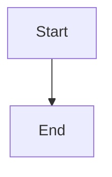

**Left-Right (use for wide/horizontal flows):**
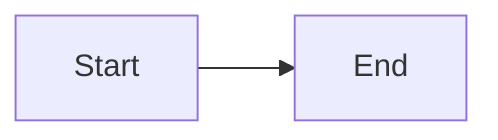

### Node Shapes

| Shape | Syntax | Use For |
|-------|--------|---------|
| Rectangle | `[Text]` | Actions, steps, processes |
| Diamond | `{Text}` | Decisions, conditional branches |
| Round | `(Text)` | Start/end points (alternative) |
| Double Circle | `((Text))` | Terminal states (start/end) |
| Stadium | `([Text])` | Subprocess, grouped action |

### Edges (Arrows)

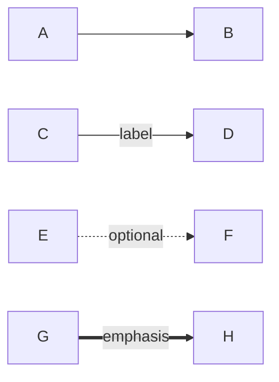

**Syntax:**
- `-->` Simple arrow
- `-->|label|` Arrow with label
- `-.->|label|` Dotted arrow (optional/alternate path)
- `==>|label|` Thick arrow (emphasis)

## Style Conventions

### Decision Points

**Use diamonds `{}` for all yes/no or multi-choice decisions:**

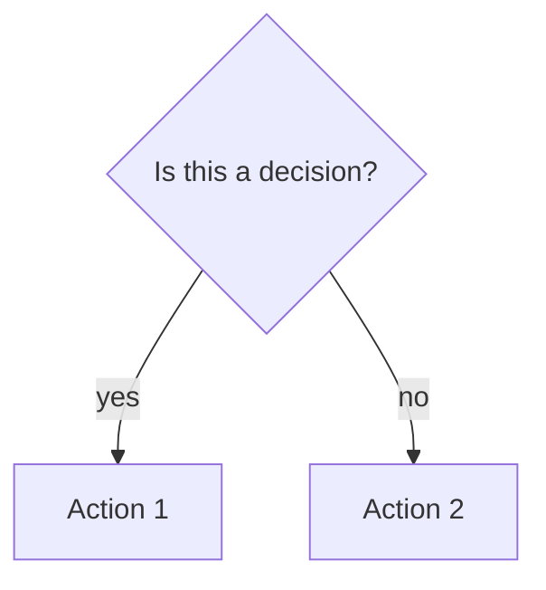

### Actions vs States

- **Rectangle `[]`**: Actions the agent takes
- **Double circle `(())`**: Terminal states or milestones

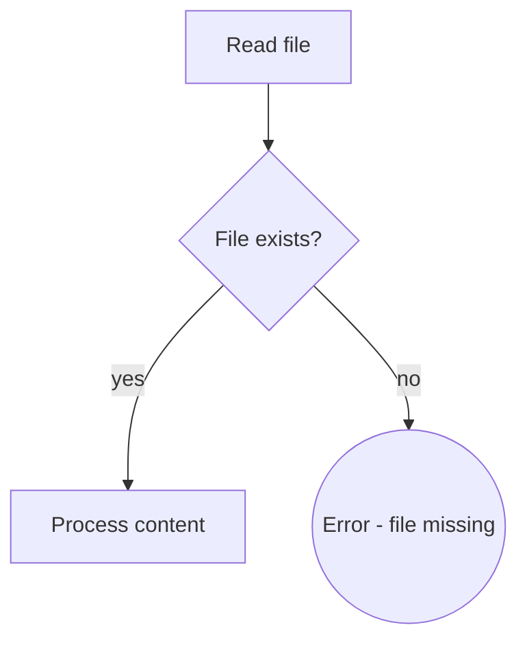

### Highlighting Important Nodes

Use `style` directive for special emphasis:

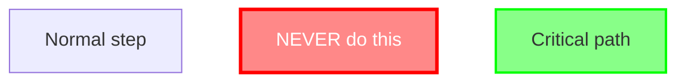

**Color guidance:**
- Red (`#f88`, `#f00`): Forbidden actions, anti-patterns
- Green (`#8f8`, `#0f0`): Recommended path, critical success
- Yellow (`#ff8`, `#f80`): Warnings, caution needed

## Common Patterns

### Simple Binary Decision

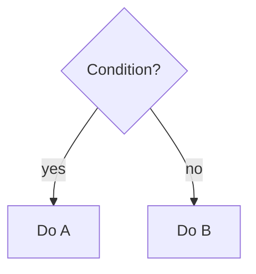

### Loop Pattern

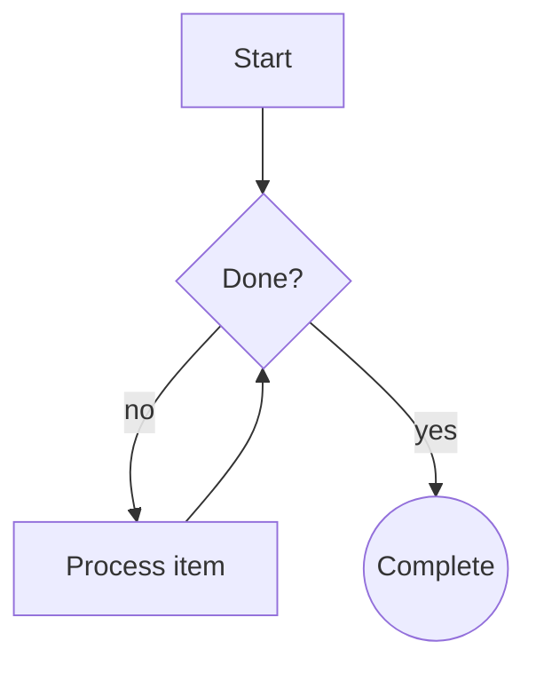

### Multi-Branch Decision

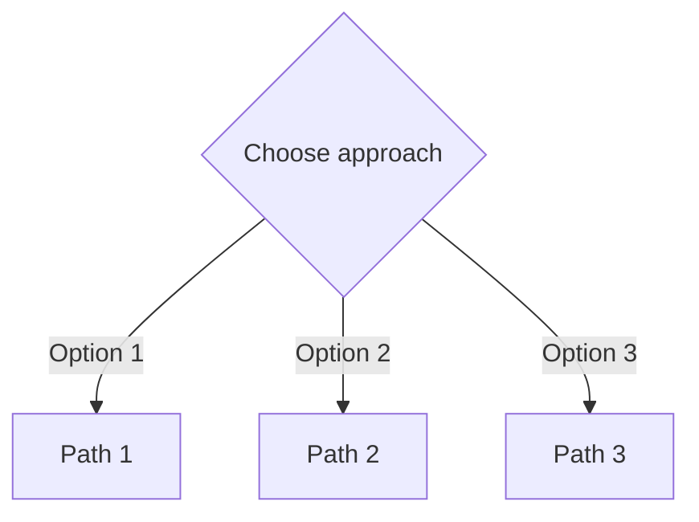

## Semantic Labels - CRITICAL

**NEVER use generic labels** like `step1`, `helper2`, `pattern4`.

❌ **Bad:**
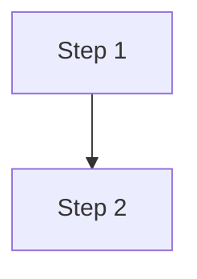

✅ **Good:**
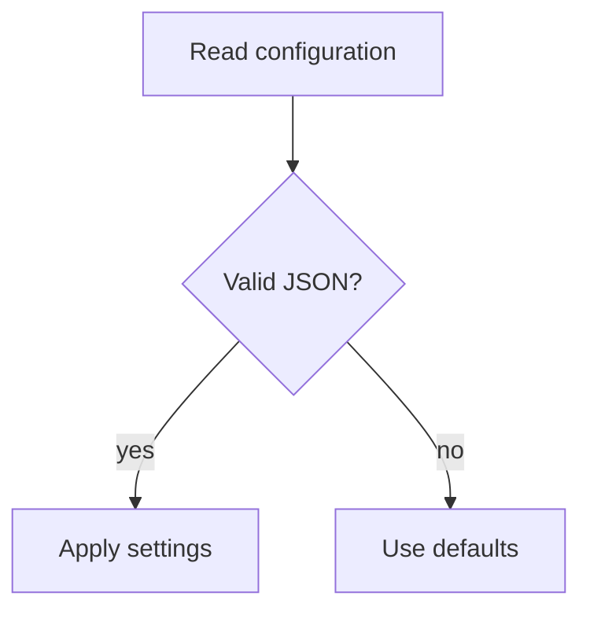

**Labels should describe WHAT happens, not numbering.**

## When NOT to Use Flowcharts

Flowcharts are for **non-obvious decision logic**. Don't use flowcharts for:

- **Reference material** → Use tables or bullet lists
- **Code examples** → Use markdown code blocks
- **Linear steps** → Use numbered lists
- **API documentation** → Use tables with parameters/return values

**Test:** If your flowchart is just a straight line with no branches, use a numbered list instead.

## Example: Good Flowchart

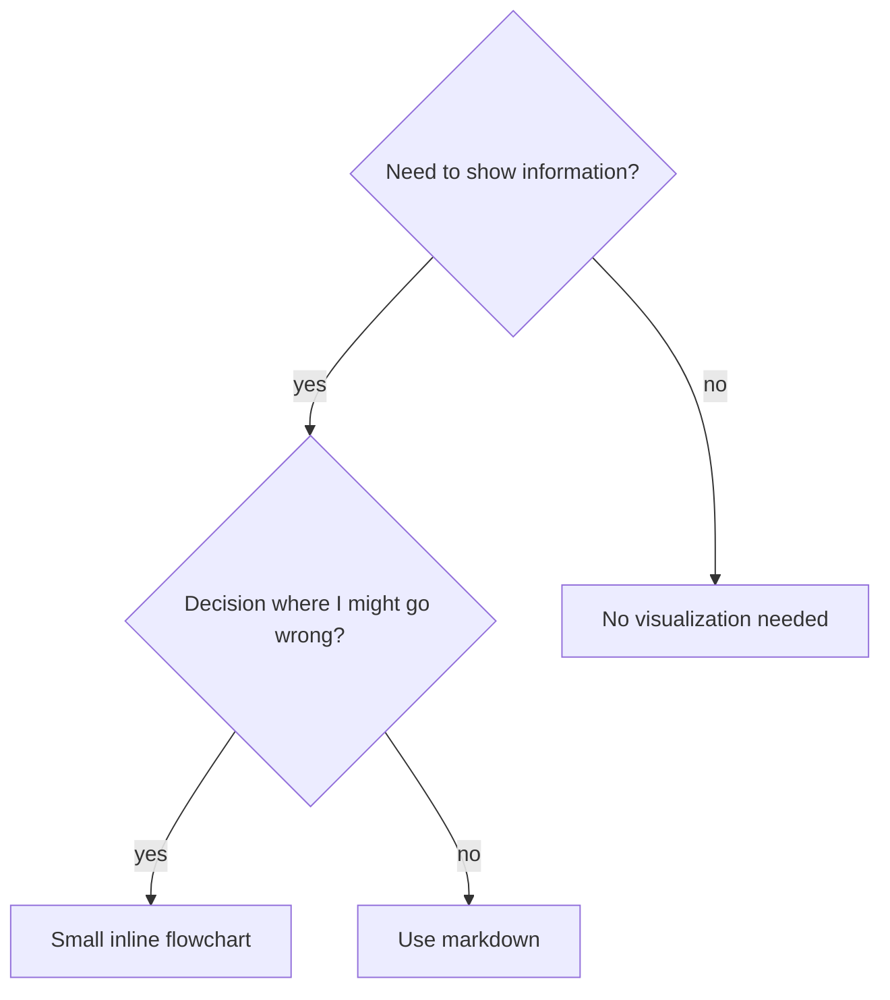

**Why good:**
- Clear semantic labels (not node1/node2)
- Represents actual decision logic
- Shows branching paths agent might take
- Helps prevent mistakes

## Rendering

**On GitHub:** Mermaid blocks render automatically in markdown files.

**For Agents:** Agents parse the plaintext syntax - they understand structure without rendering visuals.

**For Testing:** View on GitHub, or use a Mermaid live editor like:
- https://mermaid.live/
- VS Code extension: "Markdown Preview Mermaid Support"

## Migration from Graphviz

| Graphviz | Mermaid |
|----------|---------|
| `digraph name {` | `flowchart TD` or `flowchart LR` |
| `shape=diamond` | `{Label}` |
| `shape=box` | `[Label]` |
| `shape=doublecircle` | `((Label))` |
| `shape=ellipse` | `(Label)` or `([Label])` |
| `A -> B [label="text"]` | `A -->|text| B` |
| `fillcolor=red` | `style Node fill:#f88` |
| `// comment` | `%% comment` |

## Further Reading

- [Mermaid Flowchart Documentation](https://mermaid.js.org/syntax/flowchart.html)
- [GitHub Mermaid Support](https://docs.github.com/en/get-started/writing-on-github/working-with-advanced-formatting/creating-diagrams)
