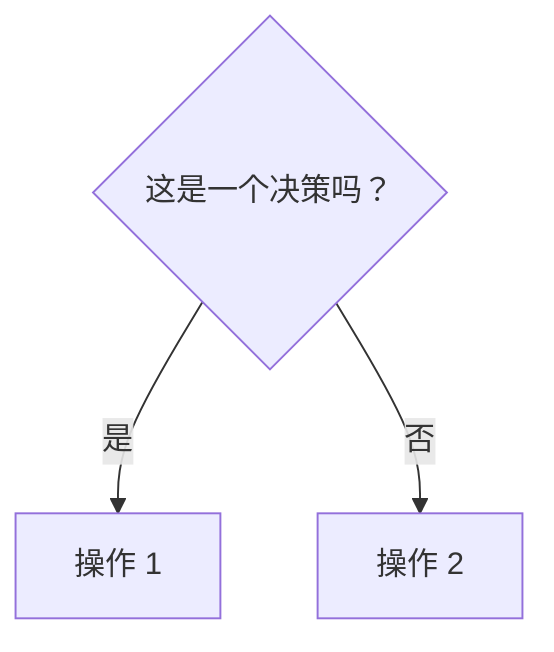
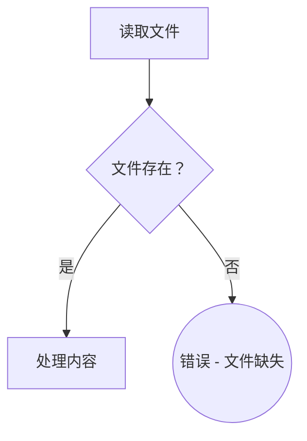
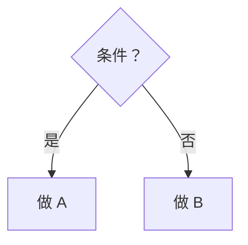
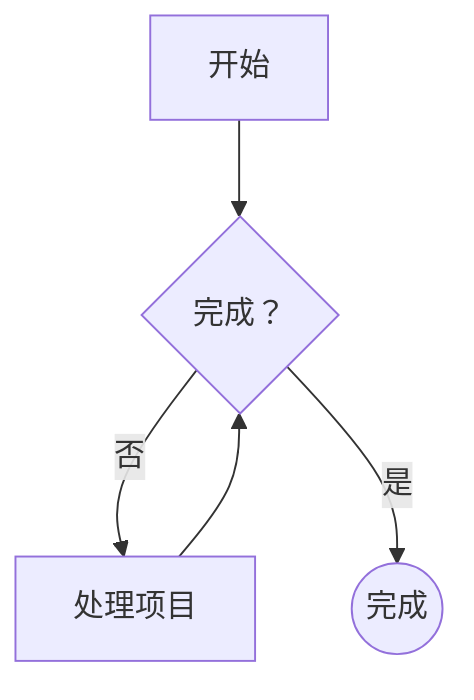
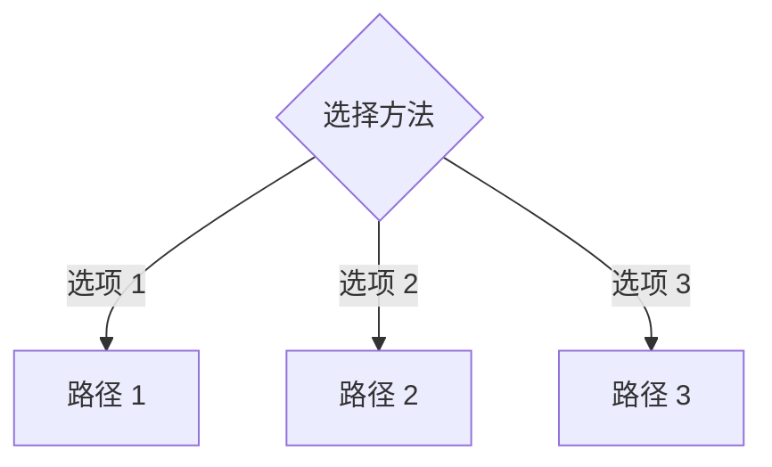
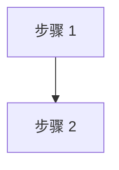
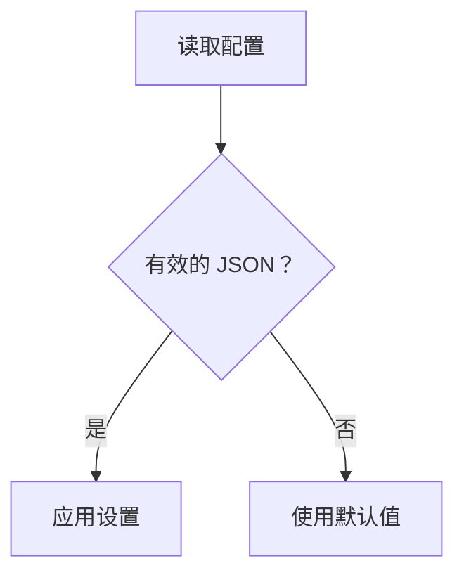
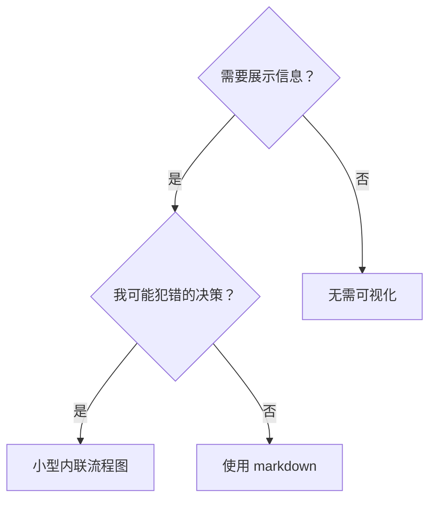

# Skill Mermaid 流程图规范

## 为什么使用 Mermaid

**GitHub 原生渲染 Mermaid** - 无需 SVG 生成脚本。AI 代理对 Mermaid 和 Graphviz 的解析效果一样好（两者都是纯文本图结构）。

**优势：**
- 比 Graphviz 语法更简单
- GitHub 为人类提供原生渲染
- 更高的 token 效率
- 无需维护构建产物

## 基本语法

### 流程图方向

```mermaid
flowchart TD    %% Top-Down 上到下（默认，大多数图使用此方向）
flowchart LR    %% Left-Right 左到右（用于宽/水平流程）
```

### 节点形状

| 形状 | 语法 | 用途 |
|-------|--------|---------|
| 矩形 | `[文本]` | 操作、步骤、流程 |
| 菱形 | `{文本}` | 决策、条件分支 |
| 圆形 | `(文本)` | 开始/结束点（替代方案） |
| 双圆 | `((文本))` | 终止状态（开始/结束） |
| 体育场形 | `([文本])` | 子流程、分组操作 |

### 边（箭头）

```mermaid
A --> B           %% 简单箭头
A -->|标签| B     %% 带标签的箭头
A -.->|标签| B    %% 虚线箭头（可选/替代路径）
A ==>|标签| B     %% 粗箭头（强调）
```

## 样式规范

### 决策点

**对所有是/否或多选决策使用菱形 `{}`：**



### 操作 vs 状态

- **矩形 `[]`**：代理执行的操作
- **双圆 `(())`**：终止状态或里程碑



### 突出显示重要节点

使用 `style` 指令进行特殊强调：


**颜色指南：**
- 红色（`#f88`、`#f00`）：禁止操作、反模式
- 绿色（`#8f8`、`#0f0`）：推荐路径、关键成功
- 黄色（`#ff8`、`#f80`）：警告、需谨慎

## 常见模式

### 简单二元决策



### 循环模式



### 多分支决策



## 语义标签 - 关键

**永远不要使用**通用标签如 `step1`、`helper2`、`pattern4`。

❌ **错误：**


✅ **正确：**


**标签应描述发生了什么，而不是编号。**

## 何时不使用流程图

流程图用于**非显而易见的决策逻辑**。不要将流程图用于：

- **参考材料** → 使用表格或项目列表
- **代码示例** → 使用 markdown 代码块
- **线性步骤** → 使用编号列表
- **API 文档** → 使用带参数/返回值的表格

**测试：** 如果你的流程图只是一条没有分支的直线，请改用编号列表。

## 示例：好的流程图



**为什么好：**
- 清晰的语义标签（不是 node1/node2）
- 表示实际决策逻辑
- 显示代理可能采取的分支路径
- 有助于防止错误

## 渲染

**在 GitHub 上：** Mermaid 块在 markdown 文件中自动渲染。

**对于代理：** 代理解析纯文本语法 - 它们理解结构而无需渲染视觉效果。

**用于测试：** 在 GitHub 上查看，或使用 Mermaid 在线编辑器，如：
- https://mermaid.live/
- VS Code 扩展："Markdown Preview Mermaid Support"

## 从 Graphviz 迁移

| Graphviz | Mermaid |
|----------|---------|
| `digraph name {` | `flowchart TD` 或 `flowchart LR` |
| `shape=diamond` | `{标签}` |
| `shape=box` | `[标签]` |
| `shape=doublecircle` | `((标签))` |
| `shape=ellipse` | `(标签)` 或 `([标签])` |
| `A -> B [label="文本"]` | `A -->|文本| B` |
| `fillcolor=red` | `style Node fill:#f88` |
| `// 注释` | `%% 注释` |

## 进一步阅读

- [Mermaid 流程图文档](https://mermaid.js.org/syntax/flowchart.html)
- [GitHub Mermaid 支持](https://docs.github.com/zh/get-started/writing-on-github/working-with-advanced-formatting/creating-diagrams)
