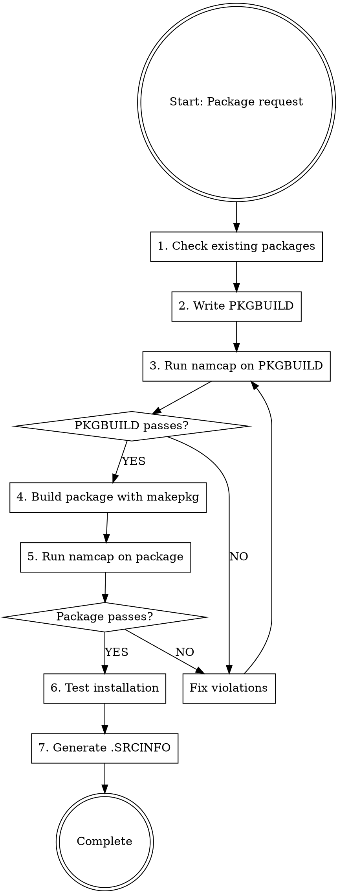

# Arch Linux PKGBUILD Creation

## Overview

**PKGBUILD files are Arch Linux package build scripts with strict validation requirements.** This skill ensures compliance with Arch package guidelines, FHS (Filesystem Hierarchy Standard), and mandatory namcap testing.

**Core principle:** Every PKGBUILD MUST pass namcap validation for both the PKGBUILD file AND the generated package before deployment.

## Sub-Skills Available

This skill is split into specialized sub-skills for different package types:

| Sub-Skill | Use When |
|-----------|----------|
| **archlinux-pkgbuild/vcs-packages** | Creating VCS packages (Git, SVN, CVS, Mercurial, Bazaar) with pkgver() functions |
| **archlinux-pkgbuild/systemd-services** | Working with systemd services, user management (DynamicUser vs sysusers.d), tmpfiles.d cleanup, service sandboxing, converting non-systemd init scripts |
| **archlinux-pkgbuild/compiled-languages** | Packaging compiled languages (Go, Rust, Haskell, OCaml, Free Pascal, Java) with language-specific build flags and installation patterns |
| **archlinux-pkgbuild/interpreted-languages** | Packaging interpreted languages (Node.js, Python, Ruby, PHP, Perl, R, Shell scripts, Lisp) with package managers and module installations |
| **archlinux-pkgbuild/build-systems** | Working with CMake or Meson build systems - CMAKE_INSTALL_PREFIX, CMAKE_BUILD_TYPE, RPATH handling, meson setup/compile patterns |
| **archlinux-pkgbuild/cross-platform** | Packaging cross-platform compatibility layers (Wine, MinGW, Electron, CLR/.NET) with WINEPREFIX, mingw-w64, electron-builder, Mono runtime |
| **archlinux-pkgbuild/desktop-integration** | Packaging desktop environment integrations (GNOME, KDE, Eclipse, Font packages) with GSettings schemas, KDE frameworks, fontconfig |
| **archlinux-pkgbuild/system-packages** | Packaging system-level components (DKMS modules, kernel modules, lib32, nonfree software, web apps, split packages) with specialized installation requirements |

**Load sub-skills as needed** using the skill tool when working with these specialized package types.

## Mandatory Workflow



## PKGBUILD Structure Template

```bash
# Maintainer: Your Name <your.email at domain dot com>
pkgname=example
pkgver=1.0.0
pkgrel=1
pkgdesc="Brief package description (~80 chars, no self-reference)"
arch=('x86_64')  # or ('any') for architecture-independent
url="https://example.com"
license=('GPL')  # Use SPDX identifiers
depends=(
    'dependency1'
    'dependency2>=1.0'
)
makedepends=(
    'git'
    'cmake'
)
optdepends=(
    'optional-pkg: description of optional feature'
)
source=("$pkgname-$pkgver.tar.gz::https://example.com/releases/$pkgname-$pkgver.tar.gz")
sha256sums=('SKIP')  # Use updpkgsums to generate

prepare() {
    cd "$srcdir/$pkgname-$pkgver"
    # Patching, fixing paths goes here
}

build() {
    cd "$srcdir/$pkgname-$pkgver"
    ./configure --prefix=/usr
    make
}

check() {
    cd "$srcdir/$pkgname-$pkgver"
    make test
}

package() {
    cd "$srcdir/$pkgname-$pkgver"
    make DESTDIR="$pkgdir" install
    
    # Install documentation
    install -Dm644 README.md "$pkgdir/usr/share/doc/$pkgname/README.md"
    install -Dm644 LICENSE "$pkgdir/usr/share/licenses/$pkgname/LICENSE"
}
```

## Quick Reference: Critical Requirements

| Requirement | Rule | Violation Example |
|-------------|------|-------------------|
| **Paths** | NEVER /usr/local/, ALWAYS /usr/ | /usr/local/bin → /usr/bin |
| **System locations** | Vendor config to /usr/lib/, NOT /etc/ | /etc/sysusers.d/ → /usr/lib/sysusers.d/ |
| **File naming** | Use package name in system configs | device.rules → 99-$pkgname.rules |
| **Dependencies** | List ALL direct deps (no transitives) | Missing runtime library dep |
| **Architecture** | 'x86_64' or 'any' | Missing arch= field |
| **Checksums** | Use sha256sums or sha512sums | Using md5sums only |
| **optdepends** | Format: 'pkg: description' | 'pkg' without description |
| **pkgdesc** | ~80 chars, no package name | "example is a tool..." |
| **Validation** | namcap PKGBUILD + package (required), namcap -i (recommended) | Skipping namcap tests |
| **Variables** | Quote: "$pkgdir" "$srcdir" | $pkgdir/usr (unquoted) |
| **License** | SPDX format | 'GPLv3' instead of 'GPL3' |
| **Email** | Obfuscate in comments | user@domain.com → user at domain dot com |
| **Config files** | List in backup=() array | User modifications get overwritten on upgrade |

## Step-by-Step Implementation

### Step 1: Check for Existing Packages

**BEFORE creating any PKGBUILD:**

```bash
# Check official repositories
pacman -Ss package-name

# Check AUR
yay -Ss package-name  # or paru -Ss
# Or visit: https://aur.archlinux.org/packages/?K=package-name
```

**If package exists:**
- Official repo: DO NOT create PKGBUILD (use existing)
- AUR exists: Check if you can improve it or use different name with conflicts=()

### Step 2: Create PKGBUILD

**Mandatory fields:**
- pkgname, pkgver, pkgrel, arch, pkgdesc, url, license
- source, checksums (sha256sums or sha512sums)
- depends (if any runtime dependencies)
- package() function

**Package naming conventions:**
- VCS packages: suffix -git, -svn, -hg, -bzr, -cvs, -darcs (see **archlinux-pkgbuild/vcs-packages** sub-skill)
- Prebuilt binaries: suffix -bin (when sources available)
- Python packages: python-pkgname (see **archlinux-pkgbuild/language-ecosystems** sub-skill)
- Language-specific: See **archlinux-pkgbuild/language-ecosystems** sub-skill for naming conventions
- All lowercase, no leading hyphen/dot

**Dependency types:**
- `depends=()` : Runtime requirements (libraries, interpreters)
- `makedepends=()` : Build-time only (compilers, build tools)
- `checkdepends=()` : Test suite requirements
- `optdepends=()` : Optional features ('package: what it enables')

**Use tools to find dependencies:**
```bash
# Find library dependencies
find-libdeps /path/to/built/files

# Alternative: check with ldd
ldd /path/to/binary

# Find provided libraries
find-libprovides /path/to/built/files
```

### Step 3: FHS Compliance and System Package Locations

**Correct installation paths:**

| Content | Correct Path | WRONG Path |
|---------|-------------|------------|
| Binaries | /usr/bin | /usr/local/bin, /bin |
| Libraries | /usr/lib | /usr/local/lib, /lib |
| Headers | /usr/include | /usr/local/include |
| App modules | /usr/lib/$pkgname | /usr/libexec |
| Documentation | /usr/share/doc/$pkgname | /usr/doc |
| Licenses | /usr/share/licenses/$pkgname | /usr/share/doc |
| Man pages | /usr/share/man | /usr/man |
| App data | /usr/share/$pkgname | /usr/local/share |
| Config | /etc | /usr/etc |
| State data | /var/lib/$pkgname | /var/$pkgname |

**CRITICAL: System Package Locations (Vendor Config)**

**RULE: Vendor-provided configuration ALWAYS goes to `/usr/lib/`, NOT `/etc/`.**

| Config Type | System Package Location (CORRECT) | User Override Location | WRONG Path |
|-------------|-----------------------------------|------------------------|------------|
| systemd user definitions | `/usr/lib/sysusers.d/$pkgname.conf` | `/etc/sysusers.d/` | `/etc/sysusers.d/$pkgname.conf` |
| systemd tmpfiles config | `/usr/lib/tmpfiles.d/$pkgname.conf` | `/etc/tmpfiles.d/` | `/etc/tmpfiles.d/$pkgname.conf` |
| udev rules | `/usr/lib/udev/rules.d/$pkgname.rules` | `/etc/udev/rules.d/` | `/etc/udev/rules.d/$pkgname.rules` |
| systemd services | `/usr/lib/systemd/system/$pkgname.service` | `/etc/systemd/system/` | `/etc/systemd/system/$pkgname.service` |
| systemd network | `/usr/lib/systemd/network/$pkgname.network` | `/etc/systemd/network/` | `/etc/systemd/network/$pkgname.network` |
| modprobe.d | `/usr/lib/modprobe.d/$pkgname.conf` | `/etc/modprobe.d/` | `/etc/modprobe.d/$pkgname.conf` |
| modules-load.d | `/usr/lib/modules-load.d/$pkgname.conf` | `/etc/modules-load.d/` | `/etc/modules-load.d/$pkgname.conf` |
| PAM config | `/usr/lib/pam.d/$pkgname` | `/etc/pam.d/` | `/etc/pam.d/$pkgname` (sometimes valid) |
| environment.d | `/usr/lib/environment.d/$pkgname.conf` | `/etc/environment.d/` | `/etc/environment.d/$pkgname.conf` |

**WHY THIS MATTERS:**

1. **Separation of concerns**: `/etc/` is **EXCLUSIVELY for user modifications**, `/usr/lib/` is for **package-provided defaults**
2. **Update semantics**: System updates NEVER touch `/etc/` (protects user config), but can overwrite `/usr/lib/`
3. **Conflict prevention**: Two packages installing to same path in `/usr/lib/` is VALID (systemd merges), but in `/etc/` causes pacman conflicts
4. **Search order**: systemd/udev search `/etc/` first (user overrides), then `/usr/lib/` (package defaults)

**File Naming Convention for System Locations:**

**ALWAYS use package name as basename** to prevent conflicts:

```bash
# ✅ CORRECT: Package name as filename
install -Dm644 "$srcdir/myapp.sysusers" "$pkgdir/usr/lib/sysusers.d/myapp.conf"
install -Dm644 "$srcdir/myapp.tmpfiles" "$pkgdir/usr/lib/tmpfiles.d/myapp.conf"
install -Dm644 "$srcdir/myapp.rules" "$pkgdir/usr/lib/udev/rules.d/99-myapp.rules"

# ❌ WRONG: Generic or inconsistent names
install -Dm644 "$srcdir/myapp.sysusers" "$pkgdir/usr/lib/sysusers.d/users.conf"  # Conflicts!
install -Dm644 "$srcdir/myapp.tmpfiles" "$pkgdir/usr/lib/tmpfiles.d/cleanup.conf"  # Unclear ownership
install -Dm644 "$srcdir/myapp.rules" "$pkgdir/usr/lib/udev/rules.d/device.rules"  # Which package?
```

**If multiple related files needed, include package name:**

```bash
# ✅ CORRECT: Multiple configs with package prefix
/usr/lib/tmpfiles.d/myapp-runtime.conf
/usr/lib/tmpfiles.d/myapp-cache.conf
/usr/lib/sysusers.d/myapp-primary.conf
/usr/lib/sysusers.d/myapp-secondary.conf

# ❌ WRONG: No package identification
/usr/lib/tmpfiles.d/runtime.conf  # What package?
/usr/lib/tmpfiles.d/cache.conf    # Conflict risk
```

**Fix paths in prepare():**
```bash
prepare() {
    cd "$srcdir/$pkgname-$pkgver"
    
    # Fix Makefile paths
    sed -i 's|/usr/local/|/usr/|g' Makefile
    
    # Or use find for multiple files
    find . -type f -name "Makefile*" -exec sed -i \
        -e 's|/usr/local/bin|/usr/bin|g' \
        -e 's|/usr/local/lib|/usr/lib|g' \
        -e 's|/usr/local/share|/usr/share|g' \
        -e 's|/usr/local/include|/usr/include|g' \
        {} +
}
```

### Step 4: Checksums

**Generate checksums:**
```bash
# Easy way: auto-update checksums
updpkgsums

# Manual way: download and compute
makepkg -g >> PKGBUILD  # Append checksums
```

**Checksum types (prefer stronger):**
- `sha512sums` (best)
- `sha256sums` (good)
- `b2sums` (Blake2, also good)
- ~~`md5sums`~~ (weak, avoid)

**Use SKIP for VCS sources:**
```bash
source=("git+https://github.com/user/repo.git")
sha256sums=('SKIP')
```

### Step 5: Validation with namcap

**MANDATORY: Run namcap validation at TWO levels**

#### Level 1: Standard Validation (REQUIRED - must pass)

```bash
# 1. Check PKGBUILD file
namcap PKGBUILD
# Must show no errors or warnings (or document why safe to ignore)

# 2. Build package
makepkg -f

# 3. Check generated package
namcap *.pkg.tar.zst
# Must show no errors or warnings (or document why safe to ignore)
```

**CRITICAL: DO NOT proceed if standard namcap reports errors.**

#### Level 2: Detailed Validation (STRONGLY RECOMMENDED - fix what you can)

**After passing standard validation, run detailed checks:**

```bash
# 4. Detailed PKGBUILD analysis
namcap -i PKGBUILD
# Shows informational messages, style suggestions, potential improvements

# 5. Detailed package analysis  
namcap -i *.pkg.tar.zst
# Shows additional warnings about permissions, paths, best practices
```

**The `-i` flag reveals:**
- Style inconsistencies (not blocking but should fix)
- Potential improvements (optional dependencies, documentation)
- False positives (may show warnings for valid choices - use judgment)

**Approach to `-i` output:**
- Errors/Warnings: **Fix as many as practical**
- Informational: **Review and fix obvious issues**
- False positives: **Document why ignored** (not all `-i` output requires action)

**Example: `-i` output handling:**
```bash
# Example warning from namcap -i
W: Dependency included but no file depends on it (glibc)

# Evaluation:
# - If glibc is indirect dep: Remove from depends=()
# - If glibc provides runtime library: Keep and document
```

**Common namcap errors and fixes:**

| Error | Meaning | Fix |
|-------|---------|-----|
| missing-dependency | Runtime dep not listed | Add to depends=() |
| dependency-not-needed | Transitive dep listed | Remove (only direct deps) |
| insecure-rpath | Hardcoded library path | Fix build system |
| file-in-non-standard-dir | Wrong installation path | Fix paths in package() |
| missing-license | No license file | Install to /usr/share/licenses/$pkgname/ |
| incorrect-permissions | Wrong file mode | Use install -Dm644 (files) or -Dm755 (bins) |
| empty-directory | Empty dir in package | Add .gitkeep or use ! in front of rmdir |

**DO NOT proceed if namcap reports errors.** Fix them first.

### Step 6: Test Installation

```bash
# Install locally
sudo pacman -U *.pkg.tar.zst

# Test functionality
$pkgname --version
$pkgname --help

# Check installed files
pacman -Ql $pkgname

# Remove after testing
sudo pacman -R $pkgname
```

### Step 7: AUR Submission (if applicable)

**Generate .SRCINFO:**
```bash
makepkg --printsrcinfo > .SRCINFO
```

**Set up AUR SSH:**
```bash
# Add to ~/.ssh/config
Host aur.archlinux.org
    IdentityFile ~/.ssh/aur
    User aur
```

**Clone and commit:**
```bash
# Clone (empty for new packages)
git clone ssh://aur@aur.archlinux.org/pkgname.git
cd pkgname

# Add files
cp /path/to/PKGBUILD .
makepkg --printsrcinfo > .SRCINFO

# Commit
git add PKGBUILD .SRCINFO
git commit -m "Initial commit: pkgname $pkgver-$pkgrel"

# Push
git push origin master
```

## Common Mistakes and Red Flags

### Critical Errors (MUST FIX)

| Mistake | Why It's Wrong | Correct Approach |
|---------|---------------|------------------|
| Skipping namcap | Violates Arch packaging standards | Always run namcap on PKGBUILD and .pkg.tar.zst (required), plus namcap -i (recommended) |
| Using /usr/local/ | Breaks FHS compliance | Use /usr/ paths only |
| Vendor config in /etc/ | Wrong separation of concerns, conflict risk | Use /usr/lib/sysusers.d/, /usr/lib/tmpfiles.d/, /usr/lib/udev/rules.d/ |
| Generic filenames in system dirs | Package conflicts, unclear ownership | Always use package name: /usr/lib/sysusers.d/$pkgname.conf |
| Missing direct dependencies | Runtime failures | Use find-libdeps, ldd to find all direct deps |
| Including transitive deps | Violates packaging policy | Only list direct dependencies |
| Using 'SKIP' for non-VCS | Security risk | Generate real checksums with updpkgsums |
| Unquoted $pkgdir/$srcdir | Shell expansion errors | Always quote: "$pkgdir" "$srcdir" |
| Self-referencing pkgdesc | Redundant | "Tool for X" not "pkgname is a tool for X" |
| Hardcoded paths in source | Version bump requires edit | Use variables: $pkgname-$pkgver |

### Warning Signs (CHECK CAREFULLY)

| Pattern | Potential Issue | Investigation |
|---------|----------------|---------------|
| Custom configure flags | May override Arch defaults | Check Arch guidelines for standard flags |
| Stripping disabled | Debug symbols bloat | Only if upstream requires |
| Empty prepare() | May need path fixes | Check for /usr/local in build output |
| No check() function | Untested package | Run upstream tests if available |
| Many optdepends | Are they all optional? | Some may be required for core functionality |
| Version pinned deps | May break on updates | Use >= only when truly required |

## PKGBUILD Functions Reference

| Function | Required? | Purpose | Common Commands |
|----------|-----------|---------|-----------------|
| **prepare()** | Optional | Patch sources, fix paths | sed, patch, find |
| **pkgver()** | VCS only | Auto-update version | git rev-list, svnversion |
| **build()** | Usually | Compile sources | ./configure, make, cmake |
| **check()** | Optional | Run test suite | make test, make check |
| **package()** | **MANDATORY** | Install to $pkgdir | make install, install |

## Installation Commands Reference

```bash
# Install files with correct permissions
install -Dm644 file.txt "$pkgdir/usr/share/doc/$pkgname/file.txt"  # Regular file
install -Dm755 binary "$pkgdir/usr/bin/binary"                      # Executable
install -Dm644 LICENSE "$pkgdir/usr/share/licenses/$pkgname/LICENSE"  # License

# Create directories
install -dm755 "$pkgdir/usr/share/$pkgname"

# Copy entire directories
cp -r dir "$pkgdir/usr/share/$pkgname/"

# Remove unwanted files
rm -rf "$pkgdir/usr/share/doc"  # If upstream installs docs incorrectly
```

## Configuration File Handling

**User-modifiable config files MUST be listed in the backup=() array to prevent pacman from overwriting them.**

### backup=() Array Rule

**List ALL files in /etc that users might modify:**

```bash
# In PKGBUILD
backup=(
    'etc/myapp/main.conf'
    'etc/myapp/database.conf'
    'etc/myapp/logging.conf'
)
```

**CRITICAL: Paths in backup=() are relative to root, WITHOUT leading slash.**

✅ Correct: `'etc/myapp/main.conf'`  
❌ Wrong: `'/etc/myapp/main.conf'`

### Pacman Behavior with backup=()

| Scenario | Pacman Behavior | User Impact |
|----------|----------------|-------------|
| File NOT modified by user | Replaced with new version silently | Config updated automatically |
| File modified by user | Creates .pacnew with new version | User manually merges changes |
| File in backup=() on removal | Creates .pacsave backup | User config preserved after uninstall |

**Without backup=():** Pacman overwrites user modifications on every upgrade. Database credentials, custom settings, all lost.

### What to Include in backup=()

**INCLUDE:**
- Configuration files users customize (database settings, app config)
- Files containing credentials or secrets
- Files in /etc with site-specific settings

**EXCLUDE:**
- Read-only templates (/usr/share/...)
- Generated files (.cache, .pid)
- Files that should ALWAYS be updated (service files)

### Example PKGBUILD

```bash
pkgname=myapp
backup=(
    'etc/myapp/main.conf'      # Frequently customized
    'etc/myapp/db.conf'        # Contains credentials - MUST preserve
    'etc/myapp/logging.conf'   # Sometimes customized
)
# defaults.conf in /usr/share/ - NOT in backup (read-only template)

package() {
    # Config files in /etc
    install -Dm644 main.conf "$pkgdir/etc/myapp/main.conf"
    install -Dm644 db.conf "$pkgdir/etc/myapp/db.conf"
    install -Dm644 logging.conf "$pkgdir/etc/myapp/logging.conf"
    
    # Template in /usr/share (not in backup)
    install -Dm644 defaults.conf "$pkgdir/usr/share/myapp/defaults.conf"
}
```

### User Workflow with .pacnew Files

After upgrade with modified configs:

```bash
# Find .pacnew files
pacdiff

# Or manually
find /etc -name "*.pacnew"

# View differences
diff /etc/myapp/main.conf /etc/myapp/main.conf.pacnew

# Merge changes manually
# Then remove .pacnew file
rm /etc/myapp/main.conf.pacnew
```

**Resource:** https://man.archlinux.org/man/pacman.8.en (search "HANDLING CONFIG FILES")

## Specialized Package Types

**For specialized package types, load the appropriate sub-skill:**

- **VCS packages** (-git, -svn, -cvs): Use **archlinux-pkgbuild/vcs-packages**
- **Systemd services** (DynamicUser, tmpfiles.d, sandboxing, init conversion): Use **archlinux-pkgbuild/systemd-services**
- **Compiled languages** (Go, Rust, Haskell, OCaml, Free Pascal, Java): Use **archlinux-pkgbuild/compiled-languages**
- **Interpreted languages** (Node.js, Python, Ruby, PHP, Perl, R, Shell, Lisp): Use **archlinux-pkgbuild/interpreted-languages**
- **Build systems** (CMake, Meson): Use **archlinux-pkgbuild/build-systems**
- **Cross-platform** (Wine, MinGW, Electron, CLR): Use **archlinux-pkgbuild/cross-platform**
- **Desktop integration** (GNOME, KDE, Eclipse, Fonts): Use **archlinux-pkgbuild/desktop-integration**
- **System packages** (DKMS, kernel modules, lib32, nonfree, web apps, split): Use **archlinux-pkgbuild/system-packages**

## Final Checklist

Before submitting or deploying:

- [ ] Package name follows naming conventions (lowercase, appropriate suffix)
- [ ] All mandatory fields present (pkgname, pkgver, pkgrel, arch, pkgdesc, url, license, source, checksums)
- [ ] All paths use /usr/ not /usr/local/
- [ ] Direct runtime dependencies in depends=()
- [ ] Build dependencies in makedepends=()
- [ ] Checksums generated (not 'SKIP' unless VCS)
- [ ] User-modifiable config files listed in backup=() array
- [ ] `namcap PKGBUILD` passes with no errors (REQUIRED)
- [ ] `namcap -i PKGBUILD` reviewed and issues addressed (RECOMMENDED)
- [ ] `makepkg -f` builds successfully
- [ ] `namcap *.pkg.tar.zst` passes with no errors (REQUIRED)
- [ ] `namcap -i *.pkg.tar.zst` reviewed and issues addressed (RECOMMENDED)
- [ ] Package installs and runs correctly
- [ ] .SRCINFO generated and matches PKGBUILD
- [ ] License file installed to /usr/share/licenses/$pkgname/
- [ ] Documentation installed to /usr/share/doc/$pkgname/
- [ ] System config files use /usr/lib/* paths (NOT /etc/* for vendor configs)
- [ ] System config files named with package name (e.g., $pkgname.conf, not generic names)

**For systemd services:**
- [ ] Evaluated DynamicUser=yes vs systemd-sysusers.d (prefer DynamicUser when possible)
- [ ] If persistent state needed: Used StateDirectory= or sysusers.d (NOT .install scripts)
- [ ] tmpfiles.d used for directory management and cleanup (NOT separate timers)
- [ ] tmpfiles.d Age field used for automatic cleanup (NOT custom scripts)
- [ ] Comprehensive sandboxing applied (run through sandboxing checklist)
- [ ] Converted non-systemd init scripts properly (OpenRC/sysvinit → systemd)
- [ ] `systemd-analyze security myapp.service` reviewed

## Resources

- Arch Package Guidelines: https://wiki.archlinux.org/title/Arch_package_guidelines
- PKGBUILD(5) man page: https://man.archlinux.org/man/PKGBUILD.5
- FHS specification: https://man.archlinux.org/man/file-hierarchy.7
- AUR submission: https://wiki.archlinux.org/title/AUR_submission_guidelines
- namcap: https://wiki.archlinux.org/title/Namcap
