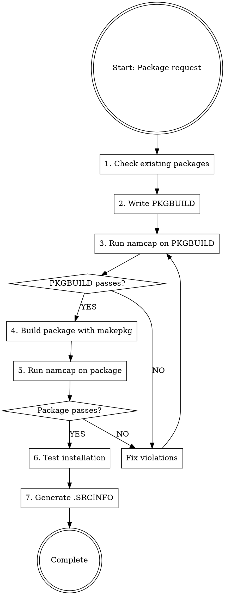

# Arch Linux PKGBUILD Creation

## Overview

**PKGBUILD files are Arch Linux package build scripts with strict validation requirements.** This skill ensures compliance with Arch package guidelines, FHS (Filesystem Hierarchy Standard), and mandatory namcap testing.

**Core principle:** Every PKGBUILD MUST pass namcap validation for both the PKGBUILD file AND the generated package before deployment.

## Sub-Skills Available

This skill is split into specialized sub-skills for different package types:

| Sub-Skill | Use When |
|-----------|----------|
| **archlinux-pkgbuild/vcs-packages** | Creating VCS packages (Git, SVN, CVS, Mercurial, Bazaar) with pkgver() functions |
| **archlinux-pkgbuild/language-ecosystems** | Packaging language-specific projects (Node.js, Python, Perl, Ruby, Go, Rust, Haskell, OCaml, Java, R, Lisp, Free Pascal) |
| **archlinux-pkgbuild/specialized-packages** | Specialized package types (Wine, Electron, Fonts, Web apps, DKMS, CMake, MinGW, Kernel modules, Eclipse, Meson, KDE, CLR, Init systems) |

**Load sub-skills as needed** using the skill tool when working with these specialized package types.

## Mandatory Workflow



## PKGBUILD Structure Template

```bash
# Maintainer: Your Name <your.email at domain dot com>
pkgname=example
pkgver=1.0.0
pkgrel=1
pkgdesc="Brief package description (~80 chars, no self-reference)"
arch=('x86_64')  # or ('any') for architecture-independent
url="https://example.com"
license=('GPL')  # Use SPDX identifiers
depends=(
    'dependency1'
    'dependency2>=1.0'
)
makedepends=(
    'git'
    'cmake'
)
optdepends=(
    'optional-pkg: description of optional feature'
)
source=("$pkgname-$pkgver.tar.gz::https://example.com/releases/$pkgname-$pkgver.tar.gz")
sha256sums=('SKIP')  # Use updpkgsums to generate

prepare() {
    cd "$srcdir/$pkgname-$pkgver"
    # Patching, fixing paths goes here
}

build() {
    cd "$srcdir/$pkgname-$pkgver"
    ./configure --prefix=/usr
    make
}

check() {
    cd "$srcdir/$pkgname-$pkgver"
    make test
}

package() {
    cd "$srcdir/$pkgname-$pkgver"
    make DESTDIR="$pkgdir" install
    
    # Install documentation
    install -Dm644 README.md "$pkgdir/usr/share/doc/$pkgname/README.md"
    install -Dm644 LICENSE "$pkgdir/usr/share/licenses/$pkgname/LICENSE"
}
```

## Quick Reference: Critical Requirements

| Requirement | Rule | Violation Example |
|-------------|------|-------------------|
| **Paths** | NEVER /usr/local/, ALWAYS /usr/ | /usr/local/bin → /usr/bin |
| **Dependencies** | List ALL direct deps (no transitives) | Missing runtime library dep |
| **Architecture** | 'x86_64' or 'any' | Missing arch= field |
| **Checksums** | Use sha256sums or sha512sums | Using md5sums only |
| **optdepends** | Format: 'pkg: description' | 'pkg' without description |
| **pkgdesc** | ~80 chars, no package name | "example is a tool..." |
| **Validation** | namcap PKGBUILD + package | Skipping namcap tests |
| **Variables** | Quote: "$pkgdir" "$srcdir" | $pkgdir/usr (unquoted) |
| **License** | SPDX format | 'GPLv3' instead of 'GPL3' |
| **Email** | Obfuscate in comments | user@domain.com → user at domain dot com |

## Step-by-Step Implementation

### Step 1: Check for Existing Packages

**BEFORE creating any PKGBUILD:**

```bash
# Check official repositories
pacman -Ss package-name

# Check AUR
yay -Ss package-name  # or paru -Ss
# Or visit: https://aur.archlinux.org/packages/?K=package-name
```

**If package exists:**
- Official repo: DO NOT create PKGBUILD (use existing)
- AUR exists: Check if you can improve it or use different name with conflicts=()

### Step 2: Create PKGBUILD

**Mandatory fields:**
- pkgname, pkgver, pkgrel, arch, pkgdesc, url, license
- source, checksums (sha256sums or sha512sums)
- depends (if any runtime dependencies)
- package() function

**Package naming conventions:**
- VCS packages: suffix -git, -svn, -hg, -bzr, -cvs, -darcs (see **archlinux-pkgbuild/vcs-packages** sub-skill)
- Prebuilt binaries: suffix -bin (when sources available)
- Python packages: python-pkgname (see **archlinux-pkgbuild/language-ecosystems** sub-skill)
- Language-specific: See **archlinux-pkgbuild/language-ecosystems** sub-skill for naming conventions
- All lowercase, no leading hyphen/dot

**Dependency types:**
- `depends=()` : Runtime requirements (libraries, interpreters)
- `makedepends=()` : Build-time only (compilers, build tools)
- `checkdepends=()` : Test suite requirements
- `optdepends=()` : Optional features ('package: what it enables')

**Use tools to find dependencies:**
```bash
# Find library dependencies
find-libdeps /path/to/built/files

# Alternative: check with ldd
ldd /path/to/binary

# Find provided libraries
find-libprovides /path/to/built/files
```

### Step 3: FHS Compliance

**Correct installation paths:**

| Content | Correct Path | WRONG Path |
|---------|-------------|------------|
| Binaries | /usr/bin | /usr/local/bin, /bin |
| Libraries | /usr/lib | /usr/local/lib, /lib |
| Headers | /usr/include | /usr/local/include |
| App modules | /usr/lib/$pkgname | /usr/libexec |
| Documentation | /usr/share/doc/$pkgname | /usr/doc |
| Licenses | /usr/share/licenses/$pkgname | /usr/share/doc |
| Man pages | /usr/share/man | /usr/man |
| App data | /usr/share/$pkgname | /usr/local/share |
| Config | /etc | /usr/etc |
| State data | /var/lib/$pkgname | /var/$pkgname |

**Fix paths in prepare():**
```bash
prepare() {
    cd "$srcdir/$pkgname-$pkgver"
    
    # Fix Makefile paths
    sed -i 's|/usr/local/|/usr/|g' Makefile
    
    # Or use find for multiple files
    find . -type f -name "Makefile*" -exec sed -i \
        -e 's|/usr/local/bin|/usr/bin|g' \
        -e 's|/usr/local/lib|/usr/lib|g' \
        -e 's|/usr/local/share|/usr/share|g' \
        -e 's|/usr/local/include|/usr/include|g' \
        {} +
}
```

### Step 4: Checksums

**Generate checksums:**
```bash
# Easy way: auto-update checksums
updpkgsums

# Manual way: download and compute
makepkg -g >> PKGBUILD  # Append checksums
```

**Checksum types (prefer stronger):**
- `sha512sums` (best)
- `sha256sums` (good)
- `b2sums` (Blake2, also good)
- ~~`md5sums`~~ (weak, avoid)

**Use SKIP for VCS sources:**
```bash
source=("git+https://github.com/user/repo.git")
sha256sums=('SKIP')
```

### Step 5: Validation with namcap

**MANDATORY: Run namcap twice**

```bash
# 1. Check PKGBUILD file
namcap PKGBUILD
# Must show no errors or warnings (or document why safe to ignore)

# 2. Build package
makepkg -f

# 3. Check generated package
namcap *.pkg.tar.zst
# Must show no errors or warnings (or document why safe to ignore)
```

**Common namcap errors and fixes:**

| Error | Meaning | Fix |
|-------|---------|-----|
| missing-dependency | Runtime dep not listed | Add to depends=() |
| dependency-not-needed | Transitive dep listed | Remove (only direct deps) |
| insecure-rpath | Hardcoded library path | Fix build system |
| file-in-non-standard-dir | Wrong installation path | Fix paths in package() |
| missing-license | No license file | Install to /usr/share/licenses/$pkgname/ |
| incorrect-permissions | Wrong file mode | Use install -Dm644 (files) or -Dm755 (bins) |
| empty-directory | Empty dir in package | Add .gitkeep or use ! in front of rmdir |

**DO NOT proceed if namcap reports errors.** Fix them first.

### Step 6: Test Installation

```bash
# Install locally
sudo pacman -U *.pkg.tar.zst

# Test functionality
$pkgname --version
$pkgname --help

# Check installed files
pacman -Ql $pkgname

# Remove after testing
sudo pacman -R $pkgname
```

### Step 7: AUR Submission (if applicable)

**Generate .SRCINFO:**
```bash
makepkg --printsrcinfo > .SRCINFO
```

**Set up AUR SSH:**
```bash
# Add to ~/.ssh/config
Host aur.archlinux.org
    IdentityFile ~/.ssh/aur
    User aur
```

**Clone and commit:**
```bash
# Clone (empty for new packages)
git clone ssh://aur@aur.archlinux.org/pkgname.git
cd pkgname

# Add files
cp /path/to/PKGBUILD .
makepkg --printsrcinfo > .SRCINFO

# Commit
git add PKGBUILD .SRCINFO
git commit -m "Initial commit: pkgname $pkgver-$pkgrel"

# Push
git push origin master
```

## Common Mistakes and Red Flags

### Critical Errors (MUST FIX)

| Mistake | Why It's Wrong | Correct Approach |
|---------|---------------|------------------|
| Skipping namcap | Violates Arch packaging standards | Always run namcap on PKGBUILD and .pkg.tar.zst |
| Using /usr/local/ | Breaks FHS compliance | Use /usr/ paths only |
| Missing direct dependencies | Runtime failures | Use find-libdeps, ldd to find all direct deps |
| Including transitive deps | Violates packaging policy | Only list direct dependencies |
| Using 'SKIP' for non-VCS | Security risk | Generate real checksums with updpkgsums |
| Unquoted $pkgdir/$srcdir | Shell expansion errors | Always quote: "$pkgdir" "$srcdir" |
| Self-referencing pkgdesc | Redundant | "Tool for X" not "pkgname is a tool for X" |
| Hardcoded paths in source | Version bump requires edit | Use variables: $pkgname-$pkgver |

### Warning Signs (CHECK CAREFULLY)

| Pattern | Potential Issue | Investigation |
|---------|----------------|---------------|
| Custom configure flags | May override Arch defaults | Check Arch guidelines for standard flags |
| Stripping disabled | Debug symbols bloat | Only if upstream requires |
| Empty prepare() | May need path fixes | Check for /usr/local in build output |
| No check() function | Untested package | Run upstream tests if available |
| Many optdepends | Are they all optional? | Some may be required for core functionality |
| Version pinned deps | May break on updates | Use >= only when truly required |

## PKGBUILD Functions Reference

| Function | Required? | Purpose | Common Commands |
|----------|-----------|---------|-----------------|
| **prepare()** | Optional | Patch sources, fix paths | sed, patch, find |
| **pkgver()** | VCS only | Auto-update version | git rev-list, svnversion |
| **build()** | Usually | Compile sources | ./configure, make, cmake |
| **check()** | Optional | Run test suite | make test, make check |
| **package()** | **MANDATORY** | Install to $pkgdir | make install, install |

## Installation Commands Reference

```bash
# Install files with correct permissions
install -Dm644 file.txt "$pkgdir/usr/share/doc/$pkgname/file.txt"  # Regular file
install -Dm755 binary "$pkgdir/usr/bin/binary"                      # Executable
install -Dm644 LICENSE "$pkgdir/usr/share/licenses/$pkgname/LICENSE"  # License

# Create directories
install -dm755 "$pkgdir/usr/share/$pkgname"

# Copy entire directories
cp -r dir "$pkgdir/usr/share/$pkgname/"

# Remove unwanted files
rm -rf "$pkgdir/usr/share/doc"  # If upstream installs docs incorrectly
```

## Specialized Package Types

**For specialized package types, load the appropriate sub-skill:**

- **VCS packages** (-git, -svn, -cvs): Use **archlinux-pkgbuild/vcs-packages**
- **Language ecosystems** (Node.js, Python, Ruby, Go, etc.): Use **archlinux-pkgbuild/language-ecosystems**
- **Specialized types** (Wine, Electron, Fonts, DKMS, etc.): Use **archlinux-pkgbuild/specialized-packages**

## Final Checklist

Before submitting or deploying:

- [ ] Package name follows naming conventions (lowercase, appropriate suffix)
- [ ] All mandatory fields present (pkgname, pkgver, pkgrel, arch, pkgdesc, url, license, source, checksums)
- [ ] All paths use /usr/ not /usr/local/
- [ ] Direct runtime dependencies in depends=()
- [ ] Build dependencies in makedepends=()
- [ ] Checksums generated (not 'SKIP' unless VCS)
- [ ] `namcap PKGBUILD` passes with no errors
- [ ] `makepkg -f` builds successfully
- [ ] `namcap *.pkg.tar.zst` passes with no errors
- [ ] Package installs and runs correctly
- [ ] .SRCINFO generated and matches PKGBUILD
- [ ] License file installed to /usr/share/licenses/$pkgname/
- [ ] Documentation installed to /usr/share/doc/$pkgname/

## Resources

- Arch Package Guidelines: https://wiki.archlinux.org/title/Arch_package_guidelines
- PKGBUILD(5) man page: https://man.archlinux.org/man/PKGBUILD.5
- FHS specification: https://man.archlinux.org/man/file-hierarchy.7
- AUR submission: https://wiki.archlinux.org/title/AUR_submission_guidelines
- namcap: https://wiki.archlinux.org/title/Namcap
